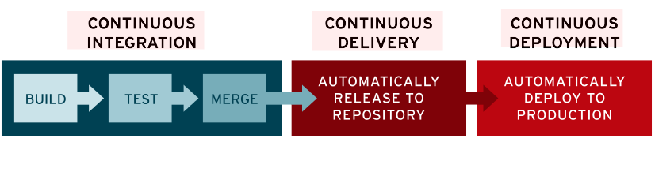
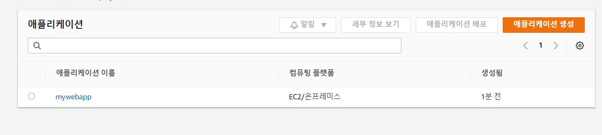
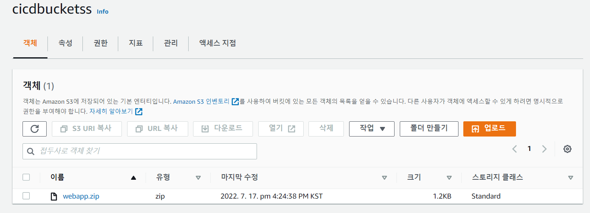

# CI/CD, Elastic-beanstalk
2022/07/17

## 1. CI/CD
### CI/CD 란 무엇인가?
[CI/CD(지속적 통합/지속적 제공): 개념, 방법, 장점, 구현 과정](https://www.redhat.com/ko/topics/devops/what-is-ci-cd)<br>
[CI/CD란 무엇인가](https://artist-developer.tistory.com/24)<br>



- AWS 는 4가지의 CICD 를 도와주는 툴을 제공한다.
  - code commit
    - AWS CodeCommit은 AWS 클라우드상의 Git 리포지토리를 비공개로 저장하고 관리할 수 있도록 지원하는 버전 제어 서비스입니다.
    - 코드를 저장할 수 있는 곳(git hub 보다 좀더 심플 - 사실걍 github 를 같은 역할)
    - https://docs.aws.amazon.com/ko_kr/codecommit/?id=docs_gateway
  - code deploy
    - AWS CodeDeploy는 개발자가 인스턴스에 대한 애플리케이션 배포를 자동화하고 필요에 따라 애플리케이션을 업데이트할 수 있는 배포 서비스입니다.
    - CI CD 역할
    - https://docs.aws.amazon.com/ko_kr/codedeploy/?id=docs_gateway
  - code build
    - AWS CodeBuild는 소스 코드를 컴파일하고 단위 테스트를 실행하며 배포할 준비가 완료된 아티팩트를 생성하는 완전 관리형 빌드 서비스입니다.
    - repository 에 있는 코드를 컴파일한다.
    - https://docs.aws.amazon.com/ko_kr/codebuild/?id=docs_gateway
  - code pipeline
    - AWS CodePipeline은 소프트웨어 릴리스에 필요한 단계를 모델링, 시각화 및 자동화하도록 해주는 지속적 전달 서비스입니다.
    - 위 모든 단계를 하나로 묶는것
    - https://docs.aws.amazon.com/ko_kr/codepipeline/?id=docs_gateway

### CodeCommit
- git repo 와 모든 기능이 동일하다
- repo 생성 코드 작성(추가) 
- 브랜치 생성
- pr 요청
- 이번에는 로컬에 있는 소스 파일을 s3 로 이동시킨 codedeploy 를 통해 ec2 로 배포해보자

### 배포 실습
1. 권한 설정
- IAM - 역할 - 역할 만들기 - EC2 선택(EC2 에서 S3 를 가져올 수 있도록 권한설정을 위해)
- 권한 추가 - AmazonS3FullAccess 권한 체크 - 생성
이번에는 codedeploy 에서 왔다갔다할 수 있는 권한을 추가로 만들자
- IAM - 역할 - 역할 만들기 - CodeDeploy 선택 - AWSCodeDeployRole 권한 추가 - 생성 

2. ec2 생성
- http 확인을 위해 퍼블릭 IP 자동 할당을 활성화한다.
- IAM 인스턴스 프로파일에 기존에 만든 첫번째 권한을 선택한다.
- 보안그룹에 http 80포트 를 추가한다.

3. 배포권한을 가지는 사용자를 만든다
- IAM - 사용자 - 사용자 추가
- 이름 작성 후 액세스 키 – 프로그래밍 방식 액세스 체크
- 권한 설정 에서 기존 정책 직접 연결 선택
- AWSCodeDeployFullAccess, AmazonS3FullAccess 체크
- 사용자 만들기
  - 액세스 키 ID 저장
  - 비밀 액세스 키 저장

4. ec2 접속
- command 로 접속
```ssh -i yong2.pem ec2-user@54.159.162.30```
- ec2 codedeploy 설치

```
sudo yum update
sudo yum install ruby
sudo yum install wget
wget [https://aws-codedeploy-ap-northeast-2.s3.amazonaws.com/latest/install](https://aws-codedeploy-ap-northeast-2.s3.amazonaws.com/latest/install)
chmod +x install
sudo ./install auto
sudo service codedeploy-agent status
```
- `The AWS CodeDeploy agent is running as PID 6625` 이 찍히면 성공이다.
- 이제 ec2 는 나가도 된다.

5. 사용자 계정으로 접속
- aws cli 설치
- `aws configure` 후 이전에 만든 사용자 엑세스 id 및 비밀 아이디 작성
- 나머지는 enter 
- 그러면 사용자 설정됨

6. S3 생성
- 기본 default 로 버킷 생성
- 이제 버킷에 소스코드를 올리면, 이것을 codedeploy 가 가져다가 ec2 서버에 배포할 것이다

7. 코드 배포
- 다시 5번에서 이어진다
- 사용자 설정 후 실습 파일을 다운로드한다.
- 실습파일이 올릴 코드이다.
- `vi appspec.yml` aws는 야믈 파일 설정을 통해 배포를 진행한다.
```yaml
version: 0.0
os: linux
files:
  - source: /index.html # index.html 을 올리겠다.
    destination: /var/www/html/ # 서버 설치시 기본 디렉토리 고지
hooks:
  BeforeInstall:
    - location: scripts/install_dependencies.sh # 웹서버 설치 shell 명령어 1줄
      timeout: 300
      runas: root
    - location: scripts/start_server.sh # 시작
      timeout: 300
      runas: root
  ApplicationStop:
    - location: scripts/stop_server.sh # 중지
      timeout: 300
      runas: root

```

```
aws deploy create-application --application-name mywebapp
```
- `You must specify a region. You can also configure your region by running "aws configure".` 오류가 뜬다
- 다시 `aws configure 에 들어가서`
```yaml
AWS Access Key ID [****************PCNP]: 
AWS Secret Access Key [****************jE4j]: 
Default region name [aws-region]: ap-northeast-2
Default output format [None]: json
```
- refion 과 format 을 적어주고 다시 실행시키면
- `"applicationId": "6a8dcc57-1766-4036-8e7b-93efab339c5e"`가 생성되는 것을 확인할 수 있다.
- 그 후 aws codedeploy - 배포 - 어플리케이션에 들어가면 app 이 존재함을 볼 수 있다.
- 이런 방식으로 codedeploy 가 인식을 하여 만든다.


---
```yaml
aws deploy push --application-name mywebapp --s3-location s3://cicdbucketss/webapp.zip --ignore-hidden-files
```
- 이떄 버킷 주소는 나의 버킷 주소를 적어주어야 한다.(`s3://cicdbucketss`)
- 위 명령어는 yaml 파일이 있는 주소에서 실행 시켜야 한다.
- 이제 설정이 전부 끝났다. s3 에 들어가면 파일이 올라간것을 확인할 수 있다.

---
- 이제 실제 배포를 해보자
- code deploy - 어플리케이션 - mywebapp 클릭 - 배포 그룹 생성
- 이름작성, 서비스 역할 선택
- 배포유형은 실무는 블루/그린을 쓰지만 현재는 테스트이므로 현재 위치 사용
- 환경 구성에서 Amazon EC2 인스턴스 선택후 해당 ec2 의 태그 키, 값 작성
- AWS System Manager 은 이전에 command 로 작성 하였으므로 안함 선택
- 배포 설정은 크기가 크지 않으므로 AllAtOnce
- 로드 밸런서는 사용하지 않으므로 비활성화
- 배포 그룹 생성

- 배포 생성 클릭
- 계정 위치에 s3 주소 선택
- 배포 만들기 클릭
- 배포 완료

### 정리
- 로컬 -> S3 -> codedeploy -> EC2

## 2. Elastic-beanstalk
- 다양한 서비스는 AWS 인프라 관리 방법의 유연성을 제공하는 반면에 어떤 서비스를 사용해야 하고 해당 서비스를 프로비저닝하는 방법을 파악하는 것이 까다로울 수 있습니다.
- Elastic Beanstalk를 사용하면 애플리케이션을 실행하는 인프라에 대해 자세히 알지 못해도 AWS 클라우드에서 애플리케이션을 신속하게 배포하고 관리할 수 있습니다. 
- Elastic Beanstalk를 사용하면 선택 또는 제어에 대한 제한 없이 관리 복잡성을 줄일 수 있습니다. 
- 애플리케이션을 업로드하기만 하면 Elastic Beanstalk에서 용량 프로비저닝, 로드 밸런싱, 조정, 애플리케이션 상태 모니터링에 대한 세부 정보를 자동으로 처리합니다.
- Elastic Beanstalk 콘솔, AWS Command Line Interface(AWS CLI) 또는 eb(Elastic Beanstalk를 위해 특별히 설계된 고급 CLI)을(를) 사용하여 Elastic Beanstalk와 상호 작용할 수 있습니다.

### 테스트 배포용 소스
https://github.com/kdevkr/beanstalk-deploy-sample.git

### 실습
- AWS Elastic Beanstalk 들어가 생성한다
- 이름 설정, 플랫폼 java 선택 코드는 샘플 애플리케이션 선택
- 소스 파일을 clone 하고 gradle - demo- task - other - zipBeanstalk 을 통해 zip 파일을 생성한다.
  - 예제 파일의 gradle.build 설정을 분석해 보자
  - procfile 은 프록시 파일로 같이 다운되며 메타데이터로 볼수있다.
- AWS Elastic Beanstalk 이 설치되면 그곳에 해당 zip 파일을 업로드한다
  - ec2 없이 서버 운영이 가능하다(ec2 에 인스턴스가 자동으로 추가된다)
  - 버전값은 건들면 안된다.
  - env - 구성 으로 가서 환경속성에 SERVER_PORT - 5000 을 꼭 추가해주자
  - Nginx 가 기본적으로 탑재되어있는데 설정이 8080 에서 5000으로 매핑되어있다.
  - nginx 80 -> forward -> 5000 따라서 5000 설정 필요


## 참고 사이트
https://www.redhat.com/ko/topics/devops/what-is-ci-cd

https://docs.aws.amazon.com/ko_kr/elasticbeanstalk/latest/dg/Welcome.html