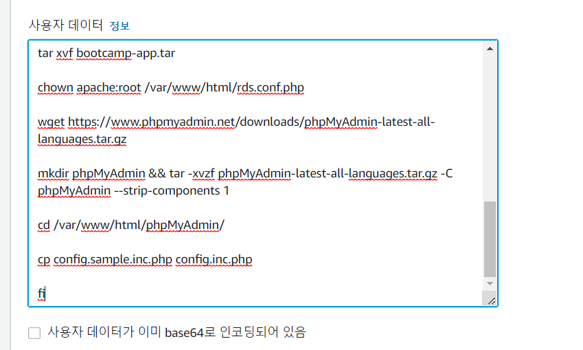
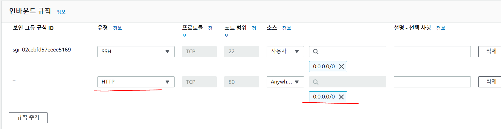
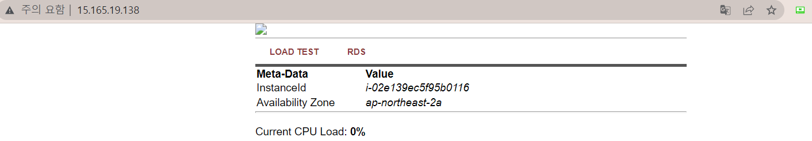
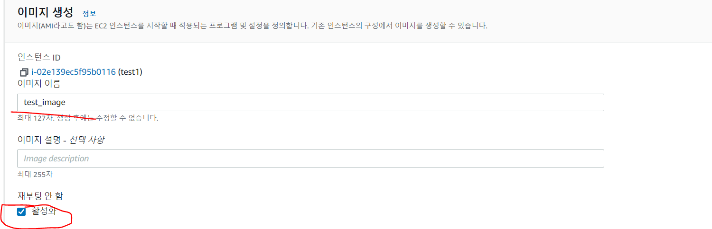
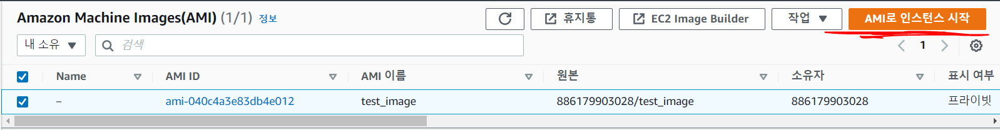
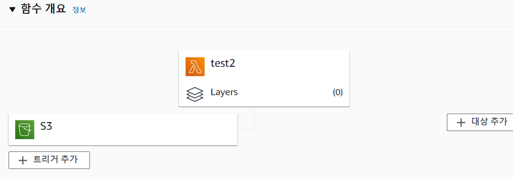
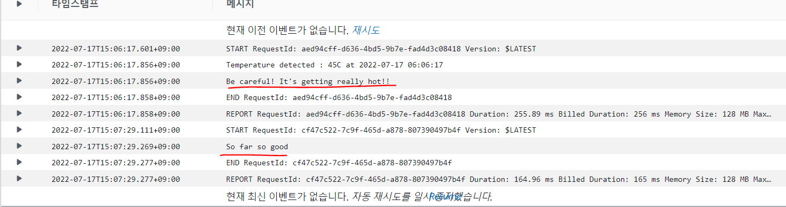

# CloudWatch, ELB, lambda
2022/07/15

## 1. CloudWatch
- Amazon CloudWatch는 Amazon Web Services(AWS) 리소스 및 AWS에서 실행되는 애플리케이션을 실시간으로 모니터링합니다. 
- CloudWatch를 사용하여 리소스 및 애플리케이션에 대해 측정할 수 있는 변수인 지표를 수집하고 추적할 수 있습니다.
- CloudWatch를 사용하면 시스템 전체의 리소스 사용률, 애플리케이션 성능, 운영 상태를 파악할 수 있습니다.


- CloudWatch 로 들어가면 각각의 인스턴스들을 감시하는 대시보드들을 볼 수 있다.

### 특정 용량이 초과되면 경고가 뜨는 그래프
- 실습을 해보자
1. 경보 - 경보 상태 - 경보 생성 - 지표 선택
2. 해당 ec2 가 특정용량이상이면 경보가 울리게 해보자
3. EBS - 볼륨별 지표 
   - 그 전에 EC2 인스턴스에 가서 Elastic Block Store 에 볼륨으로 간다.
   - 해당 EC2 인스턴스에 해당하는 볼륨 ID 를 얻을 수 있다.
4. 해당 볼륨 ID 에 VolumeWriteBytes 를 선택한다.
5. 임계값을 100000 으로 적고 다음을 누른다.
6. 새 주제 생성을 누른후 주제 이름을 작성한다.
7. 만약 이메일 주소를 적으면 해당 주소로 알람이 간다.
8. 만들면 해당 주소로 승인하냐고 오는데 승인한다. - 용량초과 되어 경보가 울리면 메일이 간다.

## 2. ELB
ELB 는 이중화를 시키는 것으로 로드 밸런싱을 통해 부하가 있거나 서버를 여러개 운영할 때 ELB 로드 밸런서를 통해 여러 서버에 분배시켜주는 역할을 한다.


### Elastic Load Balancing이란?
- Elastic Load Balancing은 둘 이상의 가용 영역에서 EC2 인스턴스, 컨테이너, IP 주소 등 여러 대상에 걸쳐 수신되는 트래픽을 자동으로 분산합니다. 
- 등록된 대상의 상태를 모니터링하면서 상태가 양호한 대상으로만 트래픽을 라우팅합니다. 
- Elastic Load Balancing은 수신 트래픽의 변화에 따라 로드 밸런서 용량을 자동으로 조정합니다.
- 로드 밸런서는 워크로드를 가상 서버와 같은 다수의 컴퓨팅 리소스로 분산합니다. 
- Elastic Load Balancing은 다음 유형의 로드 밸런서를 지원합니다.
  - Application Load Balancers
  - Network Load Balancer
  - Gateway Load Balancer
  - Classic Load Balancer
  


1. 리눅스 ec2 를 하나 띄운다 (이때 서브넷을 a 로 설정해준다.)
   - 이 떄 스크립트에 다음을 복사한다.(이래야 자동으로 적용된 서버가 생성된다.)
   
   - 생성 시 보안그룹에 http 접근을 테스트하기 위해 추가한다
   
```
#!/bin/bash

yum update -y

amazon-linux-extras install -y lamp-mariadb10.2-php7.2 php7.2

yum install -y httpd mariadb-server

systemctl start httpd

systemctl enable httpd

usermod -a -G apache ec2-user

chown -R ec2-user:apache /var/www

chmod 2775 /var/www

find /var/www -type d -exec chmod 2775 {} \;

find /var/www -type f -exec chmod 0664 {} \;

echo "<?php phpinfo(); ?>" > /var/www/html/phpinfo.php

if [ ! -f /var/www/html/bootcamp-app.tar.gz ]; then

cd /var/www/html

wget https://s3.amazonaws.com/immersionday-labs/bootcamp-app.tar

tar xvf bootcamp-app.tar

chown apache:root /var/www/html/rds.conf.php

wget https://www.phpmyadmin.net/downloads/phpMyAdmin-latest-all-languages.tar.gz

mkdir phpMyAdmin && tar -xvzf phpMyAdmin-latest-all-languages.tar.gz -C phpMyAdmin --strip-components 1

cd /var/www/html/phpMyAdmin/

cp config.sample.inc.php config.inc.php

fi
```



2. 다음과 같이 생성된것을 볼 수 있다.
3. 이제 1개 만들었으니 똑같은 서버로 AMI 이미지로 1개 더 만들어보자
4. 서버 선택 후 작업 - 이미지 - 이미지 생성 클릭


- 재부팅 시 운영서버의 경우 서버가 다운됬다가 올라가기 때문에 기본적으로 체크를 해주자
- 그 후 이미지를 생성하라
5. AMI 가면 이미지가 추가된것을 볼 수 있다.
6. 이제 AMI 를 가지고 ec2 인스턴스를 만들어보자


7. 생성시 서브넷은 c 로 지정하고 userdata 에 값을 추가할필요는 없다(이미 복사되었기 때문)
   - b 는 안된다. 서브넷이 무엇인지 추후 알아보자
8. 보안 그룹은 기존 보안그룹을 사용한다.
9. 이제 2개의 동일한 인스턴스가 생성되었다. 앞단에 로드밸런싱을 입혀보자!
10. 로드밸런서 - 로드밸런서 생성 - Application Load Balancer 선택
11. 이름 작성 - network mapping 에서 서브넷 a,c 선택
12. 보안 그룹은 새로 만들어서 TCP 80 으로 선택
13. 타켓 그룹에 기존에 만든 2개의 인스턴스를 추가하여 선택한다.
14. create load balancer
15. 생성된 로드밸런서의 DNS 를 통해 접속시 인스턴스가 2개 번갈아 가며 띄어지는것을 확인 할 수 있다.
16. 추가로 로드밸런서는 http 에 https 도 적용시키기 위해 설정을 추가하여 사용하기도 한다는 점을 알아 두자

> 근데 로드밸런서 DNS 접속했는데 접속이 안된다... ㅠㅠ

## 3. lambda
- Lambda는 서버를 프로비저닝하거나 관리하지 않고도 코드를 실행할 수 있게 해주는 컴퓨팅 서비스입니다. 
- Lambda는 고가용성 컴퓨팅 인프라에서 코드를 실행하고 서버와 운영 체제 유지 관리, 용량 프로비저닝 및 자동 조정, 코드 및 보안 패치 배포, 코드 모니터링 및 로깅 등 모든 컴퓨팅 리소스 관리를 수행합니다. 
- Lambda를 사용하면 거의 모든 유형의 애플리케이션 또는 백엔드 서비스에 대한 코드를 실행할 수 있습니다. 
- Lambda가 지원하는 언어 중 하나로 코드를 공급하기만 하면 됩니다.
- serverless 라고도 부른다. 즉 infra 에 코드만 작성해주고 이를 기반으로 서비스를 진행시킨다.
- Lambda 함수에 코드를 구성합니다. Lambda는 필요 시에만 함수를 실행한다.
- 빠르게 경량화 할때 lambda 를 사용한다고 볼 수 있다.

1. lambda 에 가서 함수 생성
2. 블루프린트(기본예제로 테스팅) - hello-world-python 선택 - 역할(기본적으로 cloudwatch 에 로그가 남겨진다)
3. 그 후 test 진행 후 cloudwatch 로 가면 실제 로그가 남은것을 확인할 수 있다.
---
1. 이번에는 새로 lambda 를 만드는데 
2. 새로작성 - 런타임(python) - 권한 - AWS 정책 템플릿에서 새 역할 생성 - 정책템플릿(Amazon S3 객체 읽기 전용 권한)
3. 을 통해 이번에는 S3 접근이 가능한 lambda 를 만든다.
- 코드를 수정한다
- S3 에 json 데이터 생성 시 체크하는 함수 - 그후 deploy 한다

import json
import boto3
from datetime import datetime

client = boto3.client('s3')

```python

def lambda_handler(event, context):
    what_time = datetime.now().strftime("%Y-%m-%d %H:%M:%S")
    bucket = event['Records'][0]['s3']['bucket']['name']
    key = event['Records'][0]['s3']['object']['key']
    try:
        response = client.get_object(Bucket=bucket, Key=key)
        
        text = response['Body'].read().decode()
        data = json.loads(text)
        
        if data['temperature'] > 40:
            print(f"Temperature detected : {data['temperature']}C at {what_time}")
            print("Be careful! It's getting really hot!!")
        else:
            print("So far so good")
    except Exception as e:
        print(e)
        raise e
```

4. 그 후 s3 버킷을 만든다
5. 해당 버킷 - 속성 - 이벤트 알림 생성 - 이벤트 유형에 객체 생성 전송 체크 - 대상 lambda 함수 체크 - lambda 함수에 만든 함수 체크
    - 이러면 s3 생성 시 해당 람다함수를 호출한다.
6. 이제 해당 bucket 에 json 파일을 추가한다.
```json
{
	"temperature":45
}
```

```json
{
	"temperature":23
}
```
7. lamda 에 가면 trigger 가 추가된것을 볼 수 있다


8. cloud watch log 를 보면 lambda 작동후 로그가 남은것을 볼 수 있다.


## 참고 사이트
https://docs.aws.amazon.com/ko_kr/elasticloadbalancing/latest/userguide/how-elastic-load-balancing-works.html

