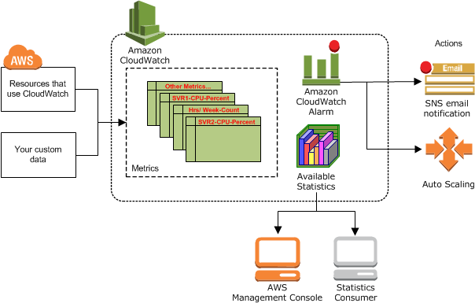
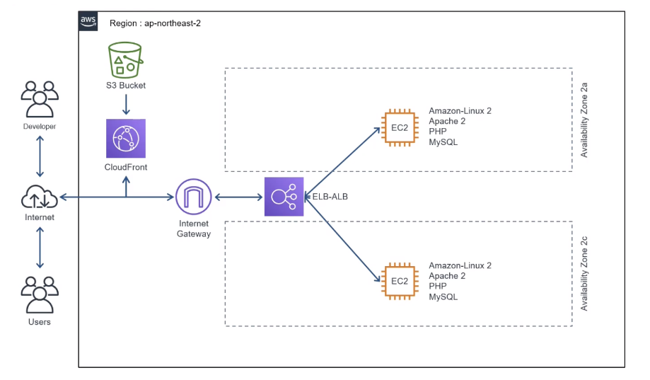
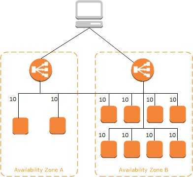

# CloudWatch, ELB, lambda
2022/07/15

## 1. CloudWatch
- Amazon CloudWatch는 Amazon Web Services(AWS) 리소스 및 AWS에서 실행되는 애플리케이션을 실시간으로 모니터링합니다. 
- CloudWatch를 사용하여 리소스 및 애플리케이션에 대해 측정할 수 있는 변수인 지표를 수집하고 추적할 수 있습니다.
- CloudWatch를 사용하면 시스템 전체의 리소스 사용률, 애플리케이션 성능, 운영 상태를 파악할 수 있습니다.

- CloudWatch 로 들어가면 각각의 인스턴스들을 감시하는 대시보드들을 볼 수 있다.

### 특정 용량이 초과되면 경고가 뜨는 그래프
- 실습을 해보자
1. 경보 - 경보 상태 - 경보 생성 - 지표 선택
2. 해당 ec2 가 특정용량이상이면 경보가 울리게 해보자
3. EBS - 볼륨별 지표 
   - 그 전에 EC2 인스턴스에 가서 Elastic Block Store 에 볼륨으로 간다.
   - 해당 EC2 인스턴스에 해당하는 볼륨 ID 를 얻을 수 있다.
4. 해당 볼륨 ID 에 VolumeWriteBytes 를 선택한다.
5. 임계값을 100000 으로 적고 다음을 누른다.
6. 새 주제 생성을 누른후 주제 이름을 작성한다.
7. 만약 이메일 주소를 적으면 해당 주소로 알람이 간다.
8. 만들면 해당 주소로 승인하냐고 오는데 승인한다. - 용량초과 되어 경보가 울리면 메일이 간다.

## 2. ELB
ELB 는 이중화를 시키는 것으로 로드 밸런싱을 통해 부하가 있거나 서버를 여러개 운영할 때 ELB 로드 밸런서를 통해 여러 서버에 분배시켜주는 역할을 한다.

### Elastic Load Balancing이란?
- Elastic Load Balancing은 둘 이상의 가용 영역에서 EC2 인스턴스, 컨테이너, IP 주소 등 여러 대상에 걸쳐 수신되는 트래픽을 자동으로 분산합니다. 
- 등록된 대상의 상태를 모니터링하면서 상태가 양호한 대상으로만 트래픽을 라우팅합니다. 
- Elastic Load Balancing은 수신 트래픽의 변화에 따라 로드 밸런서 용량을 자동으로 조정합니다.
- 로드 밸런서는 워크로드를 가상 서버와 같은 다수의 컴퓨팅 리소스로 분산합니다. 
- Elastic Load Balancing은 다음 유형의 로드 밸런서를 지원합니다.
  - Application Load Balancers
  - Network Load Balancer
  - Gateway Load Balancer
  - Classic Load Balancer
  - 

## 참고 사이트
https://docs.aws.amazon.com/ko_kr/elasticloadbalancing/latest/userguide/how-elastic-load-balancing-works.html