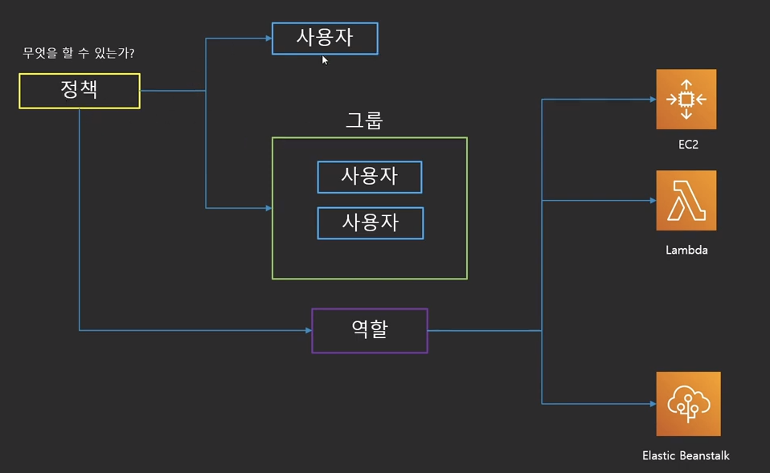
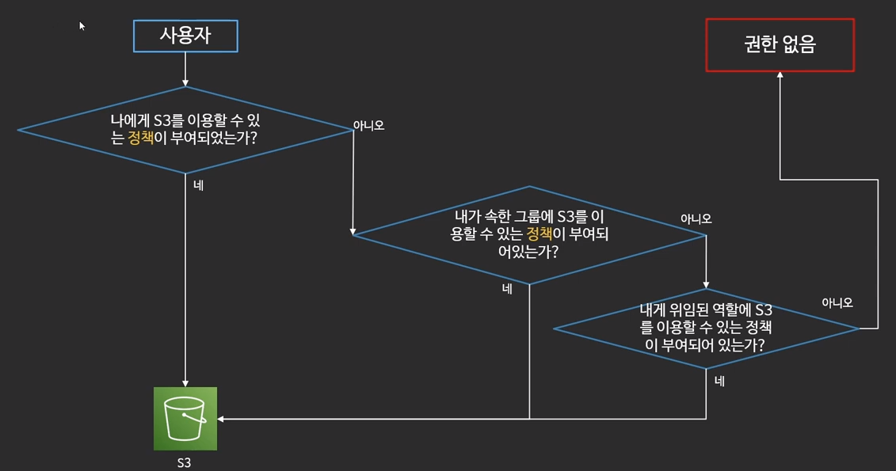

# Docker, IAM, VPC
2022/07/17

## 1. Docker
- [docker 명령어](https://luvstudy.tistory.com/106)
- dockerfile

## 2. IAM
IAM은 시스템에서 ID 및 액세스를 추적하는 서비스입니다. IAM은 [IAM](https://aws.amazon.com/iam/) 서비스라는 적절한 이름으로 AWS에서 관리됩니다. 액세스는 AWS 내에서 에이전트에 대한 액세스 경계를 적용하는 IAM 정책을 사용하여 관리됩니다. IAM 정책의 세 가지 기본 구성 요소는 다음과 같습니다.

- **주체**는 권한이 제공되는 대상을 지정합니다.
- **작업**은 수행되는 것을 지정합니다.
- **리소스**는 액세스되는 속성을 지정합니다.

IAM에 제로 트러스트 모델을 적용하는 것은 [최소 권한 원칙](https://en.wikipedia.org/wiki/Principle_of_least_privilege)을 사용하는 것을 의미합니다. 즉, 모든 에이전트에게는 기능을 수행하기 위해 **필요한 최소한의 권한**이 부여되어야 합니다.

IAM 정책은 AWS 주체 또는 AWS 리소스에 적용될 수 있습니다. 주체와 연관된 정책을 **ID 기반 정책**이라고 합니다. 리소스와 연관된 정책을 **리소스 기반 정책**이라고 합니다. 일부 서비스(예: S3, KMS, SES)에만 리소스 기반 정책이 적용됨에 유의하십시오.

주체가 특정 리소스에 대한 작업을 수행할 권한이 있는지의 여부는 주체의 ID 기반 정책이 이를 허용하는지의 여부 및 리소스의 리소스 기반 정책(있는 경우)이 이를 금지하지 않는지의 여부에 따라 다릅니다.

이것은 IAM 권한 모델을 매우 간소화한 것임에 유의하십시오. 액세스 허용 여부에 영향을 주는 여러 추가적인 정책 유형이 있습니다. 그러한 정책 유형으로는 [권한 경계](https://docs.aws.amazon.com/IAM/latest/UserGuide/access_policies.html#policies_bound), [조직 서비스 제어 정책](https://docs.aws.amazon.com/IAM/latest/UserGuide/access_policies.html#policies_scp), [액세스 제어 목록](https://docs.aws.amazon.com/IAM/latest/UserGuide/access_policies.html#policies_acl) 및 [세션 정책](https://docs.aws.amazon.com/IAM/latest/UserGuide/access_policies.html#policies_session) 등이 있습니다. 이러한 추가 정책 유형은 이 과정의 범위를 벗어납니다. 이와 관련한 자세한 내용은 이 모듈의 **추가 자료** 섹션에서 확인할 수 있습니다.

### **요점**

- IAM 정책은 AWS 내에서 엔터티의 액세스 경계를 명시합니다.
- IAM 정책은 주체, 작업 및 리소스로 구성됩니다.
- IAM 정책을 사용하여 주체에 최소 권한을 적용할 수 있습니다.
- IAM에는 ID 기반 및 리소스 기반 등 여러 정책 유형이 있습니다.
- IAM은 지정된 리스소에 적용할 수 있는 모든 정책 유형에 대한 평가를 기반으로 액세스를 평가합니다.

그룹(Group)

유저(User)

역할(Role)

정책(Policy)

정책은 그룹, 역할에 추가시킬 수 있다.

하나의 그룹 안에 다수의 유저가 존재 가능하다.

- IAM은 유니버설(Universal) 하다.
    - 지역설정이 필요 없다.(region X)

## 3. VPC
- Amazon Virtual Private Cloud(Amazon VPC)를 이용하면 사용자가 정의한 가상 네트워크로 AWS 리소스를 시작할 수 있습니다. 
- 이 가상 네트워크는 AWS의 확장 가능한 인프라를 사용한다는 이점과 함께 고객의 자체 데이터 센터에서 운영하는 기존 네트워크와 매우 유사합니다.

## 참고 사이트
https://docs.aws.amazon.com/ko_kr/vpc/latest/userguide/what-is-amazon-vpc.html

