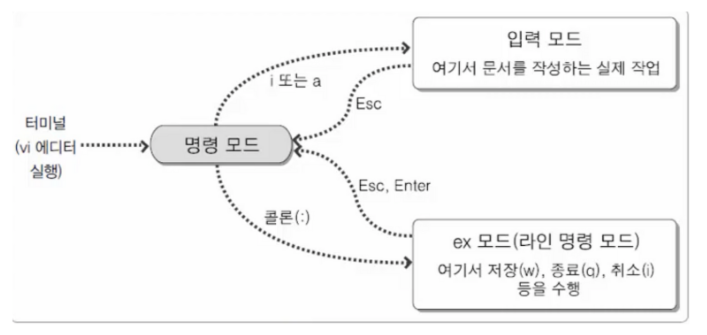
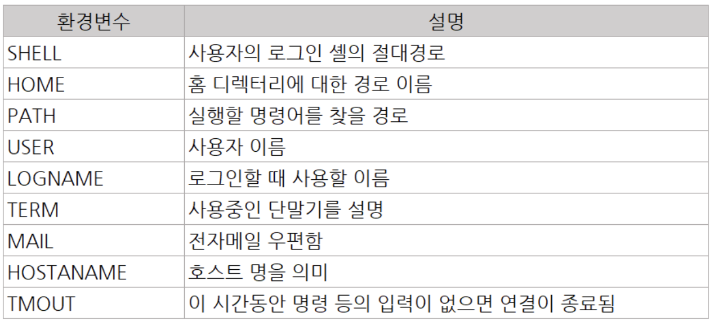

# EC2 생성, 탄력적IP, 네트워크 인터페이스, vi, shell
2022/07/15

## 1. ec2 다운
1. ec2 인스턴스를 설치한다
2. pem 을 다운받아 .ssh 에 저장한다
3. 해당 경로로 이동한 후
   chmod 400 yong.pem
   을 통해 읽기로 수준을 맞춘다.
4. pem 을 가지고 해당 ec2 로 ip 를 통해 접근한다.
   ssh -i yong.pem ec2-user@3.37.62.83 (리눅스 버전)
   ssh -i yong.pem ubuntu-user@3.37.62.83 (우분투 버전)

## 2. 탄력적 IP
- ec2 를 내렸다 다시 올리면 IP 가 변경된다.
- 따라서 탄력적 IP 를 통해 IP 를 고정시키자
1. 탄력적 IP 생성
2. 작업에서 인스턴스 연결

## 3. 네트워크 인터페이스
2개의 IP 가 하나의 인스턴스를 바라보게 해보자
1. 탄력적 IP 를 1개 더 만든다
2. 네트워크 인터페이스를 생성한다
- 이때 서브넷은 해당 인스턴스의 서브넷과 동일해야 한다.
- 보안그룹 또한 동일하게 설정
3. 그후 작업에서 연결을 눌러해당 인스턴스로 연결한다
4. 그후 작업에서 주소연결을 통해 탄력적 IP 를 연결한다.
5. 해당 인스턴스에 탄력적 IP 가 2개인것을 확인할 수 있다.
6. 접속한 후 ifconfig 를 통해 연결된 것을 확인할 수 있다.

## 4. Vi

1. 명령 모드(command mode)
처음 vi 명령어로 vi를 시작하게 되면 들어가게 됩니다. 여기서는**방향키를 이용하여 커서를 이동**할 수 있으며, **"dd" 나 "yy" 로 한 줄 삭제 및 한 줄 붙여넣기**, 또는 **"x"명령어로 글자 하나를 삭제** 할 수 있습니다.

2. 입력 모드(insert mode)
**명령모드에서 "i" 나 "a" 명령**을 통해서 입력 모드로 넘어 갈 수있습니다. 입력모드로 가게되면,**자유롭게**코드나 글을**작성**을 하시면 됩니다. **명령 모드로 다시 돌아오려면 "ESC"** 를 누르면 됩니다. ("i" 명령은 커서가 현재 위치한 부분에서 부터, "a"는 커서 바로 다음 부분부터)

3. 마지막 행 모드(Last line mode)
마지막행 모드는**명령모드에서":" (콜론) 을 입력**하면 화면 맨 밑단에 :______ 하며 입력을 할수 있는 공간이 나옵니다. 여기서 현재까지 내가 작성한 이 내용을 저장하고 vi를 종료(wq)할지, 그냥 종료(q, q!)할지 등을 입력할 수 있습니다.

[vi 명령어 모음](https://iamfreeman.tistory.com/entry/vi-vim-%ED%8E%B8%EC%A7%91%EA%B8%B0-%EB%AA%85%EB%A0%B9%EC%96%B4-%EC%A0%95%EB%A6%AC-%EB%8B%A8%EC%B6%95%ED%82%A4-%EB%AA%A8%EC%9D%8C-%EB%AA%A9%EB%A1%9D)

## 5. Shell
리눅스의 셸은 명령어와 프로그램을 실행할 때 사용하는 인터페이스입니다.

### shell의 기능
1. 사용자와 커널 사이에서 명령을 해석해 전달하는**명령어 해석기 기능**이 있다.
2. 셸은 자체 내에**프로그래밍 기능**이 있어서 프로그램을 작성있다.
3. **사용자 환경 설정의 기능**- 초기화 파일 기능을 이용해 사용자의 환경을 설정할 수 있다.

### Shell 환경변수
- 환경변수는 특정한 의미로 설정된 값을 의미한다.
- HOME 이라는 사용자 계정의 홈 디렉터리가 있을 때 이를 사용하려면 $HOME을 입력하면 된다.
- 유용하게 사용될 변수 및 설정해야 하는 값을 설정해 두는 것


### Shell 문법
- #으로 시작하는 단어와 행은 주석으로 처리 됨.
- $0은 스크립트 파일의 이름으로 확장됨.
    - source 명령으로 실행하는 경우 쉘의 이름(bash)으로 확장 됨.
- $1은 첫 번째 인수, $2는 두 번째 인수로 확장 됨
- 스크립트가 복잡하다면 적절한 echo 명령을 넣는 것이 좋음.
- **변수=값**을 사용하여 변수에 값을 지정하고**$변수**를 사용하여 값을 추출할 수 있음
    - 등호(=)의 좌우에 공백이 있으면 안됨
- **bash -x script_file**과 같이 실행하면 수행되는 명령을 확인할 수 있음.(디버깅 모드)

```shell
if [ 값1 조건식 값2 ];then
   수행문
fi
----------------------------
#!/bin/bash

val="hello"

if [ $val == "hello" ];then
  echo "hello"
fi
----------------------------
#!/bin/bash

val="hello"

if [ $val == "hello" ];then
  echo "hello"
fi
----------------------------
#!/bin/bash

for (( c=1; c<=5; c++ ))
do
  echo "value : $c"
done
----------------------------
#!/bin/bash

test_func() {
  echo "hello, world"
}

test_func
```
- $0 : 실행된 스크립트 이름
- $N : $1, $2 등 전달된 파라미터의 변수
- $# : 매게변수의 총 개수

### Shell 실행
./ex_shell

sh ex_shell

bash ex_shell
