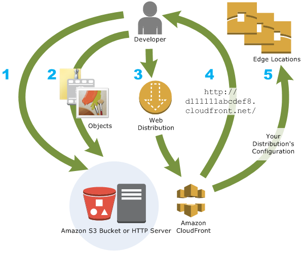

# RDS, S3
2022/07/15

## 1. RDS
- Amazon Relational Database Service(RDS)는 클라우드에서 간편하게 데이터베이스를 설치, 운영 및 확장할 수 있는 관리형 서비스 모음입니다.
- Amazon Aurora(MySQL 호환), Amazon Aurora(PostgreSQL 호환), MySQL, MariaDB, PostgreSQL, Oracle 및 SQL Server의 7가지 주요 엔진 중에서 선택하고
- Amazon RDS on AWS Outposts를 통해 온프레미스에 배포할 수 있습니다.

1. RDS 에 들어가 데이터베이스를 선택한 후 데이터베이스 생성을 누른다
2. MYSQL 선택후 프리티어를 선택한다
3. 설정에서 db 이름을 적고 admin 은 보통 유지하며 마스터 암호를 작성 후 기억한다
4. 연결에서 외부에서 접속할 수 있도록 퍼블릭 액세스를 예로 수정한다.
5. 데이터베이스 인증은 일단은 암호인증으로 선택한다.
6. 그 후 데이터베이스 생성을 눌러 생성한다.


### workbench 적용


- AWS 의 엔드포인트를 Hostname 에 작성한다.
- post 는 일반적으로 3306 이다
- Username 에 admin 을 작성한 후 비밀번호를 입력한다.

### Intellij Database 적용


- AWS 의 엔드포인트를 Hostname 에 작성한다.
- post 는 일반적으로 3306 이다
- Username 에 admin 을 작성한 후 비밀번호를 입력한다.

### 접속이 안되는 경우
- 해당 데이터베이스의 보안그룹에 들어가서 인바운드 규칙 편집에 MYSQL 에 자신의 IP 를 추가한다.
- 실제 실무에서도 특정 IP 에서만 작용되게 적용시킬 수 있다.


### 스냅샷
- 종료할 때 스냅샷 여부를 물어본다.
- 스냅샷을 남기는 경우 모든 기록을 남겨두었는데 스냅샷을 통해 복구할 수 있다.

## 2. S3
- Amazon Simple Storage Service(Amazon S3)는 업계 최고 수준의 확장성, 데이터 가용성, 보안 및 성능을 제공하는 객체 스토리지 서비스입니다. 
- 고객은 규모와 업종에 관계없이 원히는 양의 데이터를 저장하고 보호하여 데이터 레이크, 클라우드 네이티브 애플리케이션 및 모바일 앱과 같은 거의 모든 사용 사례를 지원할 수 있습니다. 
- 비용 효율적인 스토리지 클래스와 사용이 쉬운 관리 기능을 통해 비용을 최적화하고, 데이터를 정리하고, 세분화된 액세스 제어를 구성하여 특정 비즈니스, 조직 및 규정 준수 요구 사항을 충족할 수 있습니다.

### 요소
#### 버킷
- 버킷은 Amazon S3에 저장된 객체에 대한 컨테이너입니다. 
- 버킷에 저장할 수 있는 객체 수에는 제한이 없습니다. 
- 또한 계정에 버킷을 최대 100개까지 포함할 수 있습니다. 

#### 객체
- 객체는 Amazon S3에 저장되는 기본 개체입니다. 객체는 객체 데이터와 메타데이터로 구성됩니다. 
- 메타데이터는 객체를 설명하는 이름-값 페어의 집합입니다. 
- 여기에는 마지막으로 수정한 날짜와 같은 몇 가지 기본 메타데이터 및 Content-Type 같은 표준 HTTP 메타데이터가 포함됩니다.
- 객체는 키(이름) 및 버전 ID를 통해 버킷 내에서 고유하게 식별됩니다(버킷에서 S3 버전 관리가 사용 설정된 경우).

#### 키
- 객체 키(또는 키 이름)는 버킷 내 객체에 대한 고유한 식별자입니다. 
- 버킷 내 모든 객체는 정확히 하나의 키를 갖습니다.
- 킷, 객체 키 및 선택적으로 버전 ID(버킷에 대해 S3 버전 관리가 사용 설정된 경우)의 조합은 각 객체를 고유하게 식별합니다
- Amazon S3를 “버킷 + 키 + 버전”과 객체 자체 사이의 기본 데이터 맵으로 생각할 수 있습니다.
- Amazon S3 내 모든 객체는 웹 서비스 엔드포인트, 버킷 이름, 키, 그리고 선택 사항인 버전의 조합을 통해 고유하게 주소를 지정할 수 있습니다.

### AWS S3
1. AWS S3 로 들어간다
2. 버킷을 생성을 클릭한다.
3. 일단 모든 퍼블릭 엑세스 차단을 해제한다.(설정하기 위해)
4. ACL을 활성화한다(테스트용도 - 객체권한설정을 하기 위해)
5. 버킷을 생성한다
6. 생성된 버킷을 누른 후 이미지를 1개 테스트용으로 첨부한다.
7. 객체가 추가된후 객체 URL 이 생성된것을 확인할 수 있다.


8. 클릭하면 권한이 AccessDenied 된것을 볼 수 있다. 권한설정을 해보자
9. 객체에서 권한의 편집에 들어가서 모든 사람(퍼블릭 엑세스) 에 객체,객체 ACL 둘다 읽을 수 있게 변경한다.

10. 버킷에서 권한 설정을 할 수 있다.(버킷에서 권한 클릭) - 8번은 객체(파일) 에대한 권한이었고 이번에는 버킷에 대한 권한이다.
11. 버킷 정책 - 편집 - json 형태로 작성가능하다
    - 정책 예제를 눌러 다양한 예시들을 확인할 수 있다.
12. 정책 생성기를 누른다
    - S3 Bucket Policy 르 선택한다
    - Allow 를 선택한다.
    - Principal 로는 IAM 의 번호를 적을 수 있다.
      - 내 계정에서 계정ID 를 복사해 붙여넣는다.
      - *를 누르면 전체 접근 가능하다
      - Actions 를 선택하여 어떤 행동들을 허용할지 선택가능하다
      - ARN 은 해당 버킷 - 속성 들어가면 Amazon 리소스 이름(ARN) 이 존재하는데 그 값을 넣으면 된다.
      - 최종 클릭을 하면 json 을 얻을 수 있다.
      - 얻은 json 을 정책에 추가한다.
13. Resource 에 하위 리소스들도 볼 수 있게 * 을 추가한다.
```json
"Resource": "arn:aws:s3:::testtest232",
->
"Resource": "arn:aws:s3:::testtest232/*",
```
14. 그후 변경사항을 저장하면 정책이 적용된다.

### S3 정적 웹사이트 적용
15. 버킷 - 속성 - 정적 웹 사이트 호스팅 -편집 - 활성화
16. 인덱스 문서로 index.html 만 추가한다.
17. 정적 웹사이트를 만들고 싶으면 S3 에 올려서 서비스도 가능하다
18. 이제 CloudFront 를 적용해 보자

## CloudFront
- Amazon CloudFront는 .html, .css, .js 및 이미지 파일과 같은 정적 및 동적 웹 콘텐츠를 사용자에게 더 빨리 배포하도록 지원하는 웹 서비스입니다. 
- CloudFront는 엣지 로케이션이라고 하는 데이터 센터의 전 세계 네트워크를 통해 콘텐츠를 제공합니다. 
- CloudFront를 통해 서비스하는 콘텐츠를 사용자가 요청하면 지연 시간이 가장 낮은 엣지 로케이션으로 요청이 라우팅되므로 가능한 최고의 성능으로 콘텐츠가 제공됩니다.



1. cloudfront - 배포 생성 - 원본도메인 
2. 원본도메인 에서 내가 만든 S3 를 선택한다
3. 기본 설정을 따르는데 만약 HTTP로 접속해도 HTTPS 로 가고 싶을때는
   - 기본 캐시 동작 - 뷰어 에서 Redirect HTTP to HTTPS 를 선택한다.
4. 허용된 HTTP 방법도 선택 가능하다
5. 추가로 가격 분류에서 아시아에서만 서비스 된다면 북미, 아시아 를 클릭하면 충분하다
6. 또한 SSL 이 있으면 사용자 정의 SSL 인증서 에서 설정가능하다 (SSL 로 접근)
7. 그 후 배포 생성을 클릭한다.
8. 그러면 배포 도메인 이름을 통해 주소를 얻을 수 있다.
9. 기존의 정적 파일에서 url 을 통한 이미지를 띄우는게 있다면 그주소를 도에인 이름 주소로 바꾸면 캐싱을 이용훈 CloudFront 를 적용시킬수 있다.
10. 그 후 변경된 파일을 S3 에 업로드 한다.
```html
<html>
<head>My CloudFront Test</head>
<body>
<p>My text content goes here.</p>
<p>
</body>
</html>
```
