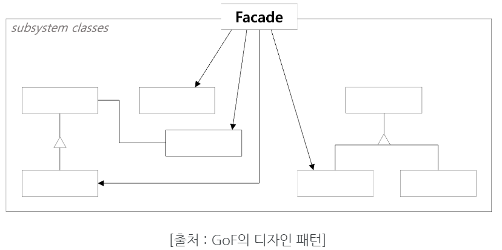

# controller 와 service 에서 의존성 관리는 누구의 책임일까?
2022/07/17

## 1. 포스팅 이유
controller 에서 여러 service 를 참조하면 controller가 너무 많은 책임을 가지게 된다. 그렇다면 service 가 다른 service 를 참조해야 될까?

controller 가 보통 controller 를 참조하지 않듯이 service 가 service 를 참조하지 않는다. 그렇다면 어디에서 복잡한 의존성을 해결할까?

## 2. service 에서 여러 repository 를 참조 하면 되지 않을까?
`controller -> Service -> Repository` 의존성의 방향이 Controller에서 Repository로 단방향으로 흐르는 것이 일반적이라면 service 에서 여러개의 repository 를 참조하는 것도 하나의 방법이 될것이다. 여기서 나는 비즈니스 로직은 service 에서 처리해야하기에 과도한 책임할당을 service 에 부여한 것이다.

하지만 발생하는 문제는 다음과 같다
- service 에 위치한 비즈니스 로직에는 데이터 유효성 검사 무결성 검사들이 포함되는데 바로 repository 에 접근하는 것은 데이터 무결성 보장을 해칠 수 있다.
- 비즈니스 로직을 포함해서 작성한다면 결국 여러 service 에서 코드 중복이 일어나게 된다.

## 3. 그렇다면 service 에서 service 를 참조 하면 되지 않을까?
서비스계층의 본연의 역할에 대해 생각해 보아야 한다. `controller -> Service -> Repository`  의존성의 방향에서 알 수 있듯이 controller 에서 필요한 비즈니스 로직을 담당하는 부분이다. 하지만 서비스를 위한 서비스 비즈니스 로직이 생기게 되면 서비스의 역할이 불분명해지면서 서비스 계층구조가 무너져 다른 사람들이 이햏하기 어려워 질 수 있다.

또한 하나의 service에 종속적인 service 가 생긴다면 그 서비스는 결국 재사용성을 잃게 되고 독립적인 테스트가 어려워진다. 종속성을 띈다는 것은 결국 모듈로 나눠야 하는 일이 생길때 어려움을 줄 수 있다

## 4. 결국 controller 에서 여러 service 를 사용하는 방법으로 돌아가는 것일까?
여러사람들의 관련 글들을 보면 service 의 return 값을 다른 service 에 넘겨주는 방식으로 쓰는것이 가장 효과적이라고 한다. 이렇게 하는 것이 service 의 책임을 하나로 할당하고 service 계층을 안정적으로 함으로써 재사용성과 중복코드 방지 확장성까지 좋아질 수 있다고 한다.

그럼에도 불구하고 이는 controller 에 너무 많은 책임을 부여하고 리턴값을 전달하는 로직이 controller 에 존재하게 된다.

## 4. 퍼사드 패턴
위와 같은 상황에서 하나의 해결법이 될 수 있는 디자인 패턴으로 팀원이 소개해 주었다.

Facade : 사용자의 요청을 서브시스템 객체에 전달하는 단순하고 일관된 통합 인터페이스

Subsystem Classes : Facade에 대한 정보를 가지지 않고, 서브시스템의 기능을 구현하는 클래스

낮은 결합도 : 클라이언트가 서브시스템의 코드를 모르더라도 Facade 클래스를 통해 사용 가능. 이를 통해 controller가 가지는 책임을 Facade 에게 위임할 수 있다.

서브 클래스 직접 접근 가능 : Facade 클래스를 통해 서브클래스를 사용할지, 서브클래스를 직접 사용할지 선택 가능

[퍼사드 패턴 git 사용예제]
(https://github.com/gregshiny/example-gift/blob/master/src/main/java/dev/practice/gift/interfaces/api/GiftApiController.java)

실제 퍼사드 패턴을 적용해 본 후 코드 첨부를 해야겠다. - msa 관련내용이라 layered 에는 적용가능할지 모르겠다. 경험부족

## 참고 사이트 및 다른 사람들의 생각
https://velog.io/@sumusb/Spring-Service-Layer%EC%97%90-%EB%8C%80%ED%95%9C-%EA%B3%A0%EC%B0%B0

https://datajoy.tistory.com/79