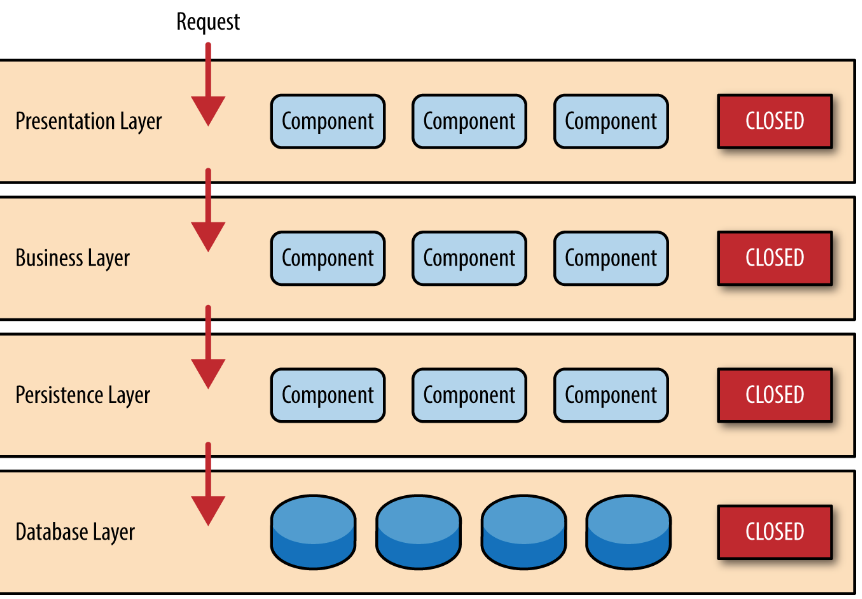
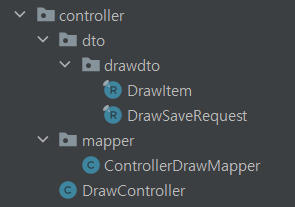
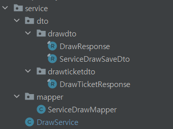

# 왜 layer 마다 dto 와 converter 를 두어야 할까?
2022/07/17

## 1. 포스팅 이유
엔티티를 controller 에 노출시키는 것은 controller 가 service 뿐만 아니라 repository 에서 다루는 entity 까지 의존관계를 가지게 되므로 controller 에 의존성이 너무 높아지게 된다. 그렇다면 어떻게 dto 를 설정하는 것이 좋을까?

#. layer architecture
기본적으로 3개의 계층으로 이루어져 있다.
1. 유저 + 브라우저와 상호작용하는 로직이 잇는 Presentation Layer
2. 요청에 맞는 비즈니스 로직을 수행하는 Business Layer
3. 데이터를 저장하고 관리하는 persistence Layer



화살표에 방향을 잘 보아야 한다.
`controller -> Service -> Repository` 의존성의 방향이 Controller에서 Repository로 단방향으로 흐르는 것이 일반적이다.

## 기존 개발 방식
- 일반적으로 우리는 controller 에서 dto 로 데이터를 받고 이를 바로 service 로 전달한다.
- 그 후 전달된 dto 를 service 에서 entity 로 변환한 후 repository 와 동작한다.
- repository 에서 나온 entity 는 response dto 로 변환되어 service 로 전달되고 다시 controller 로 전달된다.

### 문제
여기서 발생할 수 있는 문제는 바로
- service 계층이 controller 에서 사용하는 dto 를 알고 있다는 것이다.

이는 `controller -> Service -> Repository` 의존성의 방향에서 service 가 controller 를 바라보는 역방향을 나타나게 된다. 결국 service 가 받는 데이터 형태는 controller 에 의존하게 된다.
- 만약 service 레이어가 모듈로 분리되면 해당 데이터를 사용하기 어려워진다.
- 또한 controller 가 외부 API를 호출하면서 controller 에서 받은 dto 의 값이 변하게 되어 service 가 받는 dto 값이 달라지게 될 수도 있다고 한다.

- 결론적으로 의존성의 방향뿐만 아니라 확장성을 위하여 service 가 필요한 정확한 데이터만 담는 dto 를 servie 계층에서 다루는 것이 더 이상적이다.

## 해결법
- 각 계층마다 dto 와 converter 를 존재시킨다.
  controller는 자신의 dto 를 service layer 에 있는 dto 패키지의 requestDto 로 변환시켜 service 로 전달한다.(이를 통해 servise 가 controller 를 의존하는 경우를 차단한다)
- 그 후 service 는 entity 로 converter 한 후 repository 에 전달한다.
- response 를 전달하는 경우 의존성 방향과 맞으므로 굳이 layer 마다 dto 를 변환할 필요가 없다. controller 에서 필요로 하는 dto 로 변환한 후 controller 에게 전달하면 된다.

```java
@RestController
@RequestMapping("/api/v1")
@RequiredArgsConstructor
public class DrawController {
    private final DrawService drawService;
    private final DrawTicketService drawTicketService;
    private final ControllerDrawMapper controllerDrawMapper;

    @PostMapping("/draws")
    public ResponseEntity<DrawResponse> saveDraw(
            @Valid @RequestBody DrawSaveRequest saveRequest
    ) {
        ServiceDrawSaveDto serviceDrawSaveDto = controllerDrawMapper.convertToServiceDrawSaveDto(saveRequest);
        DrawResponse drawResponse = drawService.save(serviceDrawSaveDto);

        return ResponseEntity
                .ok()
                .body(drawResponse);
    }
```

```java
@Service
@RequiredArgsConstructor
@Transactional
public class DrawService {
    private final DrawRepository drawRepository;
    private final ServiceDrawMapper serviceDrawMapper;

    public DrawResponse save(ServiceDrawSaveDto drawSaveRequest) {
        Draw draw = serviceDrawMapper.convertoDraw(drawSaveRequest);
        Draw savedDraw = drawRepository.save(draw);
        return serviceDrawMapper.convertToDrawResponseDto(savedDraw.getId());
    }
}
```





## 정리
원칙은 없다 performance 와 개발속도 등 많은 것을 고려하여 결정할 것이다. 하지만 MSA 와 모듈 개발이 보편적인 지금 의존성을 최대한 줄여 확작성과 유지보수를 우선시 하는 것이 더 중요하다고 판단된다.

## 참고 사이트
https://techblog.woowahan.com/2711/

https://www.inflearn.com/questions/139564