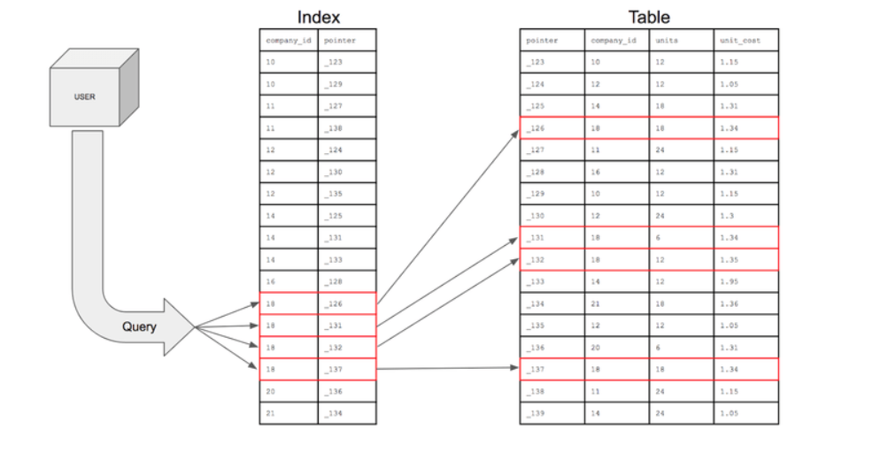
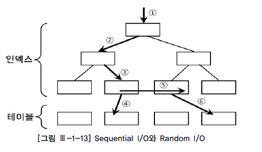
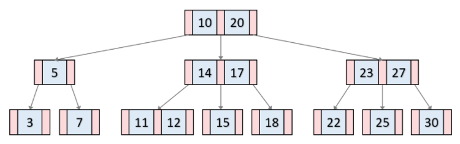
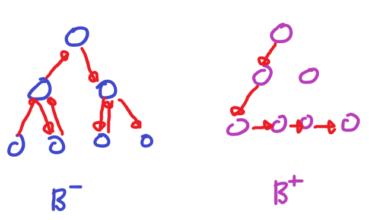

# index
2022/08/25

## 1. index 란?
- 인덱스(Index)는 데이터베이스의 테이블에 대한 검색 속도를 향상시켜주는 자료구조이다.
- 테이블의 특정 컬럼(Column)에 인덱스를 생성하면, 해당 컬럼의 데이터를 정렬한 후 별도의 메모리 공간에 데이터의 물리적 주소와 함께 저장된다.
- 컬럼의 값과 물리적 주소를 (key, value)의 한 쌍으로 저장한다.
- 데이터 = 책의 내용, 인덱스 = 책의 목차, 물리적 주소 = 책의 페이지 번호라고 생각할 수 있다.

1. SSD 와 HDD 의 차이점
컴퓨터에서 CPU나 메모리와 같은 주요 장치는 대부분 전자식 장치지만 디스크 드라이브는 기계식 장치입니다. 그래서 데이터베이스 서버에서는 항상 디스크 장치가 병목 지점이 됩니다. 이러한 기계식 디스크 드라이브를 대체하기 위해 전자식 저장 매체인 SSD(Solid State Drive)가 많이 출시되고 있씁니다.
디스크의 헤더를 움직이지 않고 한번에 많은 데이터를 읽는 순차 I/O에서는 SSD가 디스크 드라이브보다 조금 빠르거나 거의 비슷한 성능을 보이기도 합니다. 하지만 SSD의 장점은 기존의 디스크 드라이브보다 랜덤 I/O가 훨씬 빠르다는 것입니다. 데이터베이스 서버에 순차 I/O 작업은 그다지 비중이 크지 않고 랜덤 I/O를 통해 작은 데이터를 읽고 쓰는 작업이 대부분이므로 SSD의 장점은 DBMS용 스토리지에 최적이라고 볼 수 있습니다.

2. 랜덤 I/O 와 순차 I/O 의 차이점

   Sequential 액세스 방식 ([그림 Ⅲ-1-13]에서 ⑤번)
   Random 액세스 방식 ([그림 Ⅲ-1-13]에서 ①, ②, ③, ④, ⑥번)

3. 인덱스는 무엇인가요?
4. 인덱스의 장단점은 무엇인가요?

5. 어느 상황에서 인덱스를 사용하는 것이 좋을까요?
6. 결합 인덱스는 무엇인가요? - 다시보기 -클러스터 난 클러스터 다시 보기

7. 어느 상황에 결합 인덱스를 사용하고 장단점은 무엇인가요?
8. 인덱스 파일은 생성 후 insert, update, delete 등을 반복하다보면 성능이 저하됩니다. 생성된 인덱스는 트리구조를 가집니다. 
발생할 수 있는 문제점? 그리고 해결 방법? 삽입,수정,삭제등이 오랫동안 일어나다보면 트리의 한쪽이 무거워져 전체적으로 트리의 깊이가 깊어집니다.
   인덱스의 검색속도가 떨어지므로 주기적으로 리빌딩하는 작업을 거치는것이 좋습니다.(는 index 트리의 깊이가 4이상인 index를 조회하는 쿼리입니다. 해당 쿼리문을 실행하여 검색되는 index가 있다면 리빌딩을 하는것이 좋습니다. )
9. 성능 문제를 해소하기 위해 index 를 남발하면 좋지 않을거 같은데 어떤 문제가 발생하고 어떻게 대처하실건가요?
쿼리 자체의 성능 개선
   인덱스를 참조하는 하나의 쿼리문을 빠르게는 만들 수 있지만 전체적인 데이터베이스의 성능 부하를 초래합니다. 그렇기에 인덱스를 생성하는것 보다는 SQL문을 좀 더 효율적으로 짜는 방향으로 나가야합니다. 인덱스생성은 꼭 마지막 수단으로 강구해야 할 문제
10. primary 인덱스와 secondary 인덱스의 차이는 무엇인가요

11. 인덱스 컬럼의 로우를 업데이트 할때 어떤 일이 발생하는가?
12. 

## 2. B-Tree Index, Hash Index, InnoDB Adaptive Hash Index
### 이진트리
이진 트리 : 각각 노드개 최대 2개의 자식 노드를 가지는 트리 노드
- 탐색은 보통 O(logN) 의 검색 속도를 가지지만 최악의 경우 O(logN) 의 속도를 가지게 된다.
이를 방지하기 위해 균형 이진 트리가 사용되는데 이는 최악의 경우에도 O(logN) 의 검색속도를 보장시켜 준다.

균형 이진 탐색 트리의 일종이 바로 B-Trees 이다.

### B-Tree
- 이진 트리와 다르게 하나의 노드에 많은 정보를 가질 수 있다. -> 많은 데이터를 더 효율적으로 저장소에 담을 수 있게 되었다.
  - SSD 등 외부 기억장치는 블럭단위로 파일을 입출력 하는데 이때 입출력 비용은 파일의 크기와 상관없이 동일하다
  - 즉 하나의 블럭에 여러 데이터들을 동시에 저장한 다면 블럭을 더 효율적으로 사용할 수 있기에 B-Tree 를 애용한다.
- 최악의 경우에도 O(logN) 의 검색 성능을 보여준다

- 각 노드의 자료는 정렬되어 있습니다.
- 자료는 중복되지 않습니다.
- **모든 leaf node는 같은 레벨에 있습니다.**
  - red black 트리는 2개의 레벨 차이가 존재하는데 이 또한 데이터가 많아지면 성능이슈가 발생할 수있어 모두 같은 레벨에 있는 b-tree 가 유용하다
- root node는 자신이 leaf node가 되지 않는 이상 적어도 2개 이상의 자식을 가집니다.
- root node가 아닌 노드들은 적어도 M/2개의 자식 노드를 가지고 있습니다. (최대 M개)

### B+Tree
- B-Tree는 탐색을 위해서 노드를 찾아서 이동해야 한다는 단점을 가지고 있습니다.
- 이러한 단점을 해소하고자 B+Tree는 같은 레벨의 모든 키값들이 정렬되어 있고,
- 같은 레벨의 Sibiling node는 연결리스트 형태로 이어져 있습니다.
- (같은 레벨의 Sibiling node는 모두 연결되어 있어서 키값이 중복되지 않습니다!)
- 만약 특정 값을 찾아야 하는 상황이 된다면 leaf node에 모든 자료들이 존재하고, 그 자료들이 연결리스트로 연결되어 있으므로 탐색에 있어서 매우매우 유리합니다.

- leaf node가 아닌 자료는 인덱스 노드라고 부르고, leaf node 자료는 데이터 노드라고 부릅니다.
- 인덱스 노드의 Value값에는 다음 노드를 가리킬 수 있는 포인터 주소가 존재합니다.
- 데이터 노드의 Value값에 데이터가 존재하는 것이죠.
- 따라서 키값은 중복될 수 있고 (인덱스 노드와 데이터 노드에서 동시에 등장 가능!!!), 데이터 검색을 위해서는 반드시 leaf node까지 내려가야 한다는 특징을 가지고 있습니다.

### Hash Index, InnoDB Adaptive Hash Index
- 해시 인덱스는 동등 비교 검색에는 최적화돼 있지만 범위를 검색한다거나 정렬된 결과를 가져오는 목적으로는 사용할 수 없습니다.
- 일반적인 DBMS에서 해시 인덱스는 메모리 기반의 테이블에 주로 구현돼 있으며 디스크 기반의 대용량 테이블용으로는 거의 사용되지 않는다는 특징이 있습니다.
- 해시 인덱스 알고리즘은 테이블의 인덱스뿐 아니라 InnoDB의 버퍼 풀에서 빠른 레코드 검색을 위한 어댑티브 해시 인덱스(Adaptive Hash Index)로 사용되기도 하고, 오라클과 같은 DBMS에서는 조인에 사용되기도 합니다

### 장점
- 실제 키값과는 관계없이 인덱스 크기가 작고 검색이 빠르다는 것입니다
- 해시 인덱스는 트리 형태의 구조가 아니므로 검색하고자 하는 값을 주면 해시 함수를 거쳐서 찾고자 하는 키값이 포함된 버켓을 알아낼 수 있습니다. 그리고 그 버켓 하나만 읽어서 비교해보면 실제 레코드가 저장된 위치를 바로 알 수 있습니다.
- 그래서 트리 내에서 여러 노드를 읽어야 하지만 레코드의 주소를 알아 낼 수 있는 B-Tree보다 상당히 빨리 결과를 가져올 수 있습니다.
- 해시 인덱스는 원래의 키값을 저장하는 것이 아니라 해시 함수의 결과(일반적으로는 단순 숫자값)만을 저장하므로 키 컬럼의 값이 아무리 길어도 실제 해시 인덱스에 저장되는 값은 4~8바이트 수준으로 상당히 줄어듭니다.

## 4. 인덱스 레인지 스캔, 인덱스 풀 스캔
1. 인덱스 레인지 스캔

쿼리 : SELECT * FROM emp WHERE FIRST_NAME BETWEEN 'EBBE' AND 'GAD';

인덱스 레인지 스캔은 루트 노드로부터 비교를 시작해 리프노드에 도달하여, 리프노드의 시작위치부터 순차적으로 읽는 방식이다. 그리고 범위에 마지막에 해당하는

데이터의 주소를 찾을 때까지 스캔하는 방식이다. 최종적인 데이터까지 스캔을 하면 데이터를 사용자에게 반환하고 쿼리를 종료한다. 리프노드에서 최종 데이터의 주소를 발견하면

주소를 통해 데이터 파일을 읽어온다. 그리고 데이터를 파일에서 데이터를 읽는 것은 랜덤 I/O 이다. 만약 최종적으로 찾는 데이터가 5개라면, 5번의 랜덤I/O가 발생하는 것이다.

인덱스를 통해 해당 데이터의 주소를 찾는 것이 비용이 많이 들지는 않지만, 랜덤 I/O에는 비용이 많이 발생한다.

그렇기 때문에 앞서 인덱스를 통해 찾으려는 데이터 레코드가 20 ~ 25%를 넘으면 랜덤 I/O 때문에 전체 데이터를 읽고 필터링 하는 것이 빠르다는 것이다!

인덱스 레인지 스캔은 특정 범위에 해당하는 데이터만을 읽는 방식이지만, 인덱스 풀 스캔은 처음부터 끝까지 모두 읽는 방식을 인덱스 풀 스캔이라고 한다.

예를들어  WHERE NAME='A' AND AGE ='20' AND DEPT = 'IT" 조건으로 검색할 때, 세 개의 칼럼이 모두 인덱스일 때 사용된다. (조건문이 인덱스만으로 구성될 때)

이럴 때는 전체 레코드를 검색하는 것보다는 인덱스를 통해서만 검색하는 것이 더 빠르기 때문에 빠르다.

2. 인덱스 풀 스캔
3. 루스 인덱스 스캔

앞서 언급된 인덱스 레인지 스캔과 풀 스캔은 시작부터 끝까지 모든 데이터를 읽었는데, 이를 타이트 인덱스 스캔 이라고도 한다. 그리고 반대적인 것이 루스 인덱스 스캔인데,

루스 인덱스 스캔은 전체 데이터를 읽는 것이 아니라 스캔하는 과정에서 필요하지 않는 인덱스 키값은 무시하고 넘어가는 스캔 방식을 의미한다.

데이터베이스에 옵티마이저는 WHERE 조건문을 통해 필요한 데이토와 불필요한 데이터를 구분할 수 있기 때문에 조건게 만족하지 인덱스는 무시하고 넘긴다.

루스 인덱스 스캔은 Group by 또는  max, min 과 같은 집합함수에서 많이 사용된다.

쿼리 : SELECT DEPT_NO, MIN(EMP_NO) FROM DEPT_NO BETWEEN '001' AND '002' GROUP BY DEPT_NO

위와 같은 쿼리에서는 인덱스는 정렬되어 있기 때문에 가장 작은 값 하나만 읽고 뒷 부분은 모두 스킵하는 방식으로 동작할 것이다.(모두 스캔하는 것이 아닌)

4. 인덱스 스캔 방향

쿼리 : SELECT * FROM WHERE DEPT = '100' ORDER BY DETP;

인덱스는 정렬되었기 때문에 인덱스를 재정렬한 후, 읽은 데이터를 반환하는 것이 아닌, 인덱스를 읽는 방향을 역순으로 바꿈으로서 인덱스를 읽어 데이터를 반환한다.

결국 정렬방법에 따라 인덱스를 읽는 방향이 결정되는 것이다.

## 5. 클러스터링 인덱스, 논 클러스터링 인덱스
클러스터 인덱스

물리적으로 행을 재배열한다.
PK설정 시 그 칼럼은 자동으로 클러스터드 인덱스가 만들어진다.
인덱스 자체의 리프 페이지가 곧 데이터이다. 즉 테이블 자체가 인덱스이다. (따로 인덱스 페이지를 만들지 않는다.)
데이터 입력, 수정, 삭제 시 항상 정렬 상태를 유지한다.
비 클러스형 인덱스보다 검색 속도는 더 빠르다. 하지만 데이터의 입력. 수정, 삭제는 느리다.
30% 이내에서 사용해야 좋은 선택도를 가진다.

테이블당 1개씩만 허용된다.
넌 클러스터 인덱스

테이블당 약 240개의 인덱스를 만들 수 있다.
인덱스 페이지는 로그파일에 저장된다.
레코드의 원본은 정렬되지 않고, 인덱스 페이지만 정렬된다.
인덱스 자체의 리프 페이지는 데이터가 아니라 데이터가 위치하는 포인터(RID)이기 때문에 클러스터형보다 검색 속도는 더 느리지만 데이터의 입력, 수정, 삭제는 더 빠르다.
인덱스를 생성할 때 데이터 페이지는 그냥 둔 상태에서 별도의 인덱스 페이지를 따로 만들기 때문에 용량을 더 차지한다
3% 이내에서 사용해야 좋은 선택도를 가진다.

쉽게 책에 비유하자면 클러스터 인덱스는 페이지를 알기 때문에 바로 그 페이지를 펴는 것이고, 넌 클러스터 인덱스는 뒤에 목차에서 찾고자 하는 내용의 페이지를 찾고 그 페이지로 이동하는 것과 같습니다. 테이블 스캔은 처음부터 한 장씩 넘기면서 내용을 찾는 것과 같습니다.

## 6. MySQL 에서 PK 를 인조키로 사용하고 Auto_Increment 를 사용하는 이유

## 7. Hint
옵티마이저는 무엇인가

## 참고 사이트
b tree : https://ssocoit.tistory.com/217
hash index : https://enterone.tistory.com/227
클러스터 넌클러스터 : https://junghn.tistory.com/entry/DB-%ED%81%B4%EB%9F%AC%EC%8A%A4%ED%84%B0-%EC%9D%B8%EB%8D%B1%EC%8A%A4%EC%99%80-%EB%84%8C%ED%81%B4%EB%9F%AC%EC%8A%A4%ED%84%B0-%EC%9D%B8%EB%8D%B1%EC%8A%A4-%EA%B0%9C%EB%85%90-%EC%B4%9D%EC%A0%95%EB%A6%AC

