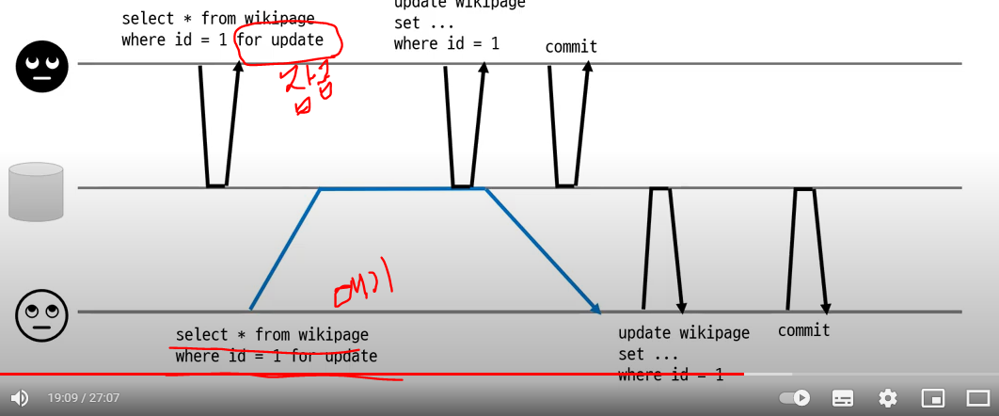

# transaction
2022/08/31

## 1. 트랜잭션(Transaction)이란 무엇인가? + ACID
- 트랜잭션이란 : 데이터베이스의 상태를 변화시키기 위해 수행하는 작업 단위(All or Nothing)
- 상태를 변화시킨다는 것 : SQL 질의어를 통해 DB에 접근하는 것
  - SELECT, INSERT, DELETE, UPDATE
- 작업 단위 : 많은 SQL 명령문들을 사람이 정하는 기준에 따라 정하는 것

### ACID
한 트랜젝션이 안전하도록 보장하기 위해서 만족해야 하는 특성모음
- 원자성(Atomicity) : All or Nothing
  - 트랜잭션이 DB에 모두 반영되거나, 혹은 전혀 반영되지 않아야 된다.
- 일관성(Consistency)
  - 트랜잭션의 작업 처리 결과는 항상 일관성 있어야 한다.
  - 일관성은 특정한 조건을 두고, 그 조건을 만족하는지를 확인하는 방식으로 검사할 수 있다.
- 독립성(Isolation)
  - 둘 이상의 트랜잭션이 동시에 병행 실행되고 있을 때, 어떤 트랜잭션도 다른 트랜잭션 연산에 끼어들 수 없다.
- 지속성(Durability)
  - 트랜잭션이 성공적으로 완료되었으면, 결과는 영구적으로 반영되어야 한다.
  - 완전히 반영되면 로그를 남기게 되는데, 후에 이 로그를 이용해서 트랜잭션 수행전 상태로 되돌릴 수 있어야 한다. 
  - 때문에 트랜잭션은 로그저장이 완료된 시점에서 종료가 되어야 한다.

### 트랜잭션 로그
- 모든 트랜잭션과 관련된 로그는 트랜잭션 로그 파일에 기록된다. --> 데이터 일관성 유지, 데이터베이스 복구 가능
- Roll Back 이란 ? 
  - 데이터 변경이 가해지는 쿼리가 실행 되면 트랜잭션 로그에 기록된다.
  - 그런데 해당 트랜잭션이 완전히 끝나지 못하게 되면, 해당 작업은 변경 전 상태로 되돌아간다.
- Roll Forward 란 ? 
  - 트랜잭션 로그에는 데이터 변경 처리가 완벽히 끝난 것으로 기록되어 있으나 해당 내용이 데이터 파일에 미처 반영되지 못했을 때 트랜잭션 로그 내용을 참조해 데이터 변경 작업이 실제 데이터 파일에 반영된다.

### 트랜잭션 종류
- 자동 커밋 트랜잭션(MSSQL디폴트) : 데이터 변경이 성공적으로 끝나면 자동으로 커밋 되고, 실패하면 자동으로 롤백된다.
- 묵시적 트랜잭션(Oracle디폴트) : 자동 커밋 트랜잭션과 정 반대되는 개념이다.
- 명시적 트랜잭션 : 사용자가 트랜잭션의 시작과 끝을 결정 짓는다. 명시적 트랜잭션을 사용하면 여러 데이터 변경 처리를 하나의 트랜잭션으로 묶어 처리할 수 있다

## 2. 트랜잭션과 연산
크게 2개의 연산이 있다.
1. Commit 연산
- Commit 연산은 하나의 트랜잭션이 성공적으로 종료된 후, 데이터베이스가 일관된 상태를 유지할 때 갱신 연산이 완료되었다고 트랜잭션 관리자에게 알려주고 결과를 최종적으로 데이터베이스에 반영하는 연산이다.

2. Rollback 연산
- Rollback 연산은 하나의 트랜잭션이 비정상적으로 종료되어 데이터베이스의 일관성을 잃었을 때 트랜잭션이 지금까지 실행한 연산의 결과가 취소되고 트랜잭션 수행 이전의 상태로 돌아가는 연산이다. 
- Rollback을 하는 경우엔 해당 트랜잭션을 재시작하거나 폐기한다.

## 3. 트랜잭션의 상태

1. 활성화(Active) : 트랜잭션이 작업을 시작하여 실행 중인 상태
2. 실패(Failed) : 트랜잭션에 오류가 발생하여 실행이 중단된 상태
3. 철회(Aborted) : 트랜잭션이 비정상적으로 종료되어 Rollback 연산을 수행한 상태
4. 부분 완료(Partially commited) : 트랜잭션의 마지막 연산까지 실행하고 commit 요청이 들어온 직후의 상태. 최종 결과를 데이터베이스에 아직 반영하지 않은 상태.
5. 완료(Commited) : 트랜잭션이 성공적으로 종료되어 commit 연산을 실행한 후의 상태

## 4. 트랜잭션 스케줄
데이터베이스에서 여러 트랜잭션이 동시에 수행될 때, 수행되는 트랜잭션의 순서에 따라서 결과가 달라질 수 있다.  
이때 처리하는 순서를 스케줄이라고 한다. 
트랜잭션 스케줄은 크게 3가지로 이루어져 있다. 

- 직렬(Serial) 스케줄 : 트랜잭션 별로 연산을 순차적으로 수행하는 것
- 비직렬(Non-serial) 스케줄 : 인터리빙(Interleaving) 방식을 이용하여 트랜잭션들을 병행하여 수행하는 것 (병행적으로 수행)
- 직렬 가능(Serializable) 스케줄 : 직렬성을 가진 스케줄. 트랜잭션이 동시에 수행되더라도 직렬 스케줄과 동일한 결과를 갖는 것 (서로 영향을 주지 않는 트랜잭션들에 한해 비직렬 스케줄링처럼 시행)

### 충돌 직렬 가능
- 스케줄에 따라 결과가 달라지는 이유는 **충돌(Conflict)**이 발생하기 때문이다.
- 둘 이상의 트랜잭션에서 동일한 데이터에 접근할 때, 쓰기(write)연산이 하나라도 발생하면 충돌이 발생한다.
- 연산의 순서를 바꾸면 결과가 달라질 수 있기 때문이다.
- 만약 어떤 스케줄 S가 일련의 비충돌 명령어의 교환으로 스케줄 S'으로 변환될 수 있다면, S와 S'은 **충돌 동등(Conflict equivalent)**이라고 한다.
- 그리고 S가 직렬 스케줄과 충돌 동등, 즉 동일한 결과를 갖는다면 S를 **충돌 직렬 가능(Conflict serializable)**이라고 한다.

- 위 그림과 같이 왼쪽의 스케줄이 오른쪽의 직렬 스케줄과 동일한 결과를 가지면 충돌 직렬 가능이라고 한다.
- 만약 아래처럼 스케줄이 구성된 경우, 직렬 스케줄인 <T1, T2> or <T2, T1> 어느 쪽과도 결과가 일치하지 않으므로 충돌 직렬 가능이라고 할 수 없다.

### 뷰 직렬 가능
- 같은 트랜잭션 집합을 가진 두 스케줄 S와 S'이 다음 세 조건을 만족하면 S와 S'은 뷰 동등(View equivalent)이라고 한다.
1) 데이터 x에 대하여 S에서 트랜잭션 Ti가 x의 초깃값을 읽는다면, S'에서도 Ti가 초깃값을 읽어야 한다.
2) S에서 트랜잭션 Ti가 수행한 모든 read(x)의 연산 값이 Tj가 수행한 write(x)가 생성한 값이라면, S'에서 Ti가 수행한 모든 read(x)의 연산 값도 Tj가 수행한 write(x)가 생성한 값이어야 한다.
3) S에서 Ti가 마지막 write(x)를 수행했다면, S'에서도 Ti가 마지막으로 write(x)를 수행해야 한다.
- 즉, 동일한 데이터 x에 대해서 '최초 읽기', '쓰기/읽기', '마지막 쓰기'를 수행하는 트랜잭션의 순서가 동일해야 한다는 의미이다.
- 그리고 마찬가지로 S가 직렬 스케줄과 뷰 동등이라면 S를 뷰 직렬 가능(View conflict serializable)이라고 한다.

- 모든 충돌 직렬 가능 스케줄은 뷰 직렬 가능이며, 역은 성립하지 않는다. 아래가 예시이다.

- 이 스케줄은 <T1, T2, T3> 직렬 스케줄과 뷰 동등이다. 조건 1과 3을 만족하고, write 연산 후의 read 연산이 없기 때문에 조건 2 또한 만족한다.
- 반면 충돌 직렬 가능은 만족하지 않는다.
---
## 4. 트랜잭션 격리 수준
트랜잭션이 일관된 처리를 진행할 수 있기 위해서 사용자가 잠금을 사용해 트랜잭션 격리 수준을 지정할 수 있다.

### READ-UNCOMMITTED
커밋 전의 트랜잭션의 데이터 변경 내용을 다른 트랜잭션이 읽는 것 허용

### READ-COMMITTED
커밋이 완료된 트랜잭션의 변경사항만 다른 트랜잭션에서 조회 가능

### REPEATABLE-READ
트랜잭션 볌위 내에서 조회한 내용이 항상 동일함을 보장

### SERIALIZABLE
한 트랜잭션에서 사용하는 데이터를 다른 트랜잭션에서 접근 불가

## 5. 트랜잭션 격리 수준을 설정할 때 발생 하는 문제점들

## 6. 트랜잭션과 lock

## 6. 트랜잭션을 사용할 때 주의할 점

## 7. 트랜잭션 전파 

## 8. 트랜잭션 범위
트랜잭션 범위 : 커넥션 기준
커넥션 1 안에 커넥션 2가 새로 만들어진다면 
커넥션 2가 끝나고 커넥션 1이 롤백을 결정했을때 커넥션2가 롤백이 안될 수 있다
따라서 전파 타입을 설정해야 한다.(여러 메서드 호출이 한 트랜잭션에 묶이도록 설정)

만약 트랜잭션과 외부 연동이 섞여있으면 롤백 처리에 주의해야 한다.

롤백 처리 한 후 외부 시스템 원복 방법:
외부 시스템 연동 후 어떤 문제가 발생하면 외부 시스템에 취소 요청을 보내는 방식을 보통 사용 합니다. 문제가 생긴 건을 모아서 일 배치로 하기도 하고, 문제 건을 주기적으로 확인해서 취소 요청을 하기도 합니다. 문제가 생겼을 때 즉시 취소 요청을 보내기도 하구요.

## 9. 글로벌 트랜잭션

## 질문
### READ-UNCOMMITTED
커밋 전의 트랜잭션의 데이터 변경 내용을 다른 트랜잭션이 읽는 것 허용
dirty read 란? 
- 트랜잭션B는 트랜잭션A가 수정중인 데이터를 조회한다
- 만약 트랜잭션 A 가 롤백을 한다면 트랜잭션 B는 commit 되지 않은 데이터를 가지고 로직을 수행하게 된다.

dirty write 란?
- 트랜잭션B는 트랜잭션A가 수정중인 데이터를 업데이트한다
- A는 1로 업데이트 하고 커밋 이전에 B 가 2 로 업데이트 한다면 A 는 1을 기대하지만 실제로 2로 업데이트 된다.

### READ-COMMITTED
커밋이 완료된 트랜잭션의 변경사항만 다른 트랜잭션에서 조회 가능
- 커밋된 데이터만 읽기 : 커밋된 값과 트랜잭션 진행 중인 값을 따로 보관
커밋된 데이터만 덮어쓰기
- 행 단위 잠금 사용
  - 같은 데이터를 수정한 트랜잭션이 끝날 때까지 대기

read skew 란?
- 읽는 시점에 따라 데이터가 바뀜
- A 가 x=10, y=10 을 기대하고 일단 x 를 뽑으면 10 이 나온다
- B 가 그 후 x=11, y=9 로 업데이트를 진행하고 커밋을 하면 커밋이 끝나고 A 가 select y 를 하는데 9 가 나오게 된다.
- 위 사용자는 x=10, y=10 합이 20을 기대하는데 합이 19 이므로 1이 사라진다.

### REPEATABLE-READ
- 위의 문제를 해결하기 위해 다음 격리 수준 제공
- 트랜잭션 볌위 내에서 조회한 내용이 항상 동일함을 보장
- 구현 예로는 오라클이 MVCC(Multi-Version Concurrency Control) 가 있다
  - 읽는 시점에 특정 버전에 해당하는 데이터만 읽음

READ-COMMITTED, REPEATABLE-READ 를 해도 Lost Update 문제가 발생할 수 있다.
- Lost Update
- 같은 데이터를 쓸 때 발생 : 예, count 증가, 위키 페이지 수정

- 같은 데이터를 업데이트 할때는 잠금을 통해 한쪽이 커밋을 할때까지 다른쪽 업데이트 쿼리가 대기된다.
- readCnt 값이 1일때 1번 이 읽은 후 같은데이터의 readCnt 값을 2로 업데이트, 커밋하면 2번 이 readCnt 를 2로 update 시도한다.
- 하지만 사실 2번 읽은 거니 마지막 update 는 3이 되어야 한다.(변경 유실!).

### 변경 유실을 막기 위해
- 원자적 연산 사용
  - DB 가 지원하는 원자적 연산 사용
  - 동시 수정 요청에 대해 DB 가 순차 처리
  - 예) update article set readcnt = readcnt +1 where id = 1;
- 명시적인 잠금
  - 조회할 때 수정할 행을 미리 잠금
  - 예) select ... for update

잠금 풀리고 진행을 하게 된다.

- CAS(Compare And Set)
  - 수정 할 때 값이 같은지 비교한다.

## 참고사이트
트랜잭션 기초1 : https://elanddba.tistory.com/13

트랜잭션 기초2 : https://rebro.kr/162

