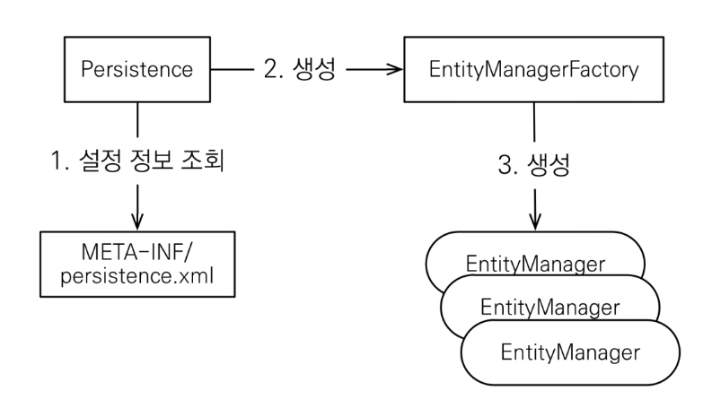
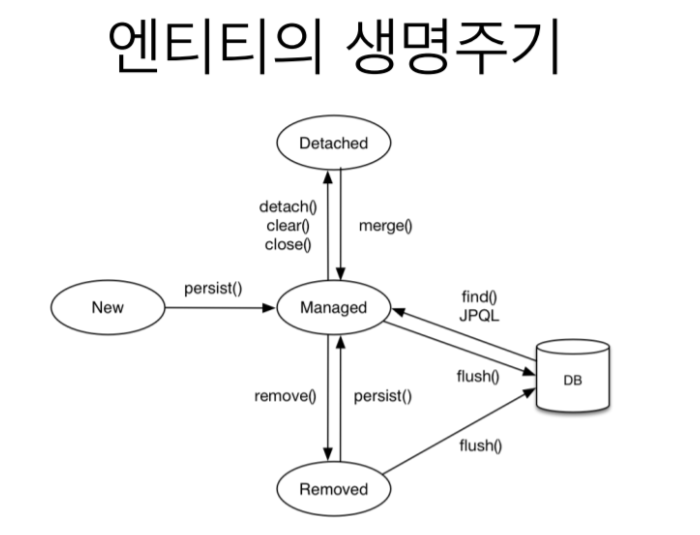
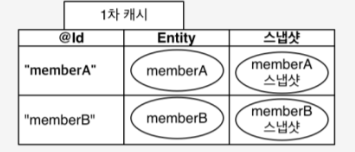

# 속성 컨텍스트(Persistence Context) - 엔티티 생명주기와 기능들
2022/07/17

# 1. 영속성 컨텍스트(Persistence Context)
**영속성 컨텍스트(Persistence Context)** : 애플리케이션과 테이터베이스 사이에 위치한 가상의 데이터베이스
- 내부 데이터는 `HashMap` 으로 구성되어 **key=value : id=Entity** 로 돌아간다.

**EntityManagerFactory** : EntityManager 를 생성한다.
- 불변객체로 이는 Thread-Safe 하다. 따라서 싱글톤 패턴으로 재활용 가능하다.

**EntityManager** : 영속성 컨텍스트(가상 데이터베이스)를 관리하는 객체
- Thread-Safe 하지 않다.
- 따라서 각자 고유한 Scope 를 가지므로 1 스레드당 1개만 생성된다.
- Transaction 위에서만 제대로 동작하므로 Transaction 설정이 매우 중요하다.



1. db 작업이 필요한 순간 `EntityManager` 를 생성해야 한다.
   2.`DataSource` 와 매핑된 `Persistence` 에서 `connection` 을 가져온다
3. `EntityManagerFactory` 는 `EntityManager` 를 생성하고 `EntityManager` 는 `connection` 을 `Lazy` 로 가지게 된다.
- `EntityManager` 가 생성되면 매핑된 `EntityManagerFactory` 에서 `connection` 을 얻지만 `connection` 이 꼭 필요한 시점 `flush` 메서드가 호출되는 시점에서 `connection` 을 사용한다.
   - 이는 과도하게 connection 이 사용되어 부족해질 상활을 대비하는 것이다.
4. 실제 작업이 시작 될 때 `EntityManager` 는 `EntityTransaction` 객체를 생성해 `transaction` 을 시작하며 `connection` 을 연결한다.
5. 이 후 작업이 끝나면 `EntitTransaction` 을 폐기하며 `transaction` 을 종료하고 `EntityManager` 을 폐기한다.
6. `EntityManager` 는 `Thread-Safe` 하지 않기 떄문에 매 작업마다 인스턴스를 새로 생성한다.
```java
EntityManagerFactory emf = Persistence.createEntityManagerFactory("test"); // emf 생성
EntityManager em = emf.createEntityManager(); // em 생성
EntityTransaction tx = em.getTransaction(); // 트랜잭션 획득

try{
	tx.begin(); // 트랜잭션 시작
    biz_logic(em); // 비즈니스 로직 실행
	tx.commit(); // 트랜잭션 커밋
} catch (Exception e) {
	tx.rollback(); // 오류 시 롤백
} finally {
	em.close(); // em 종료
}

emf.close(); // emf 종료
```

**영속성 컨텍스트** : 단순히 `Entity` 의 집합니다. 이 안에서 모든 `Entity` 인스턴스의 생명주기가 관리되며, `EntityManager` 의 모든 public API(`findById`, `flush` 등) 들은 이 생명주기를 관리하는데 쓰인다. `HashMap` 으로 `Entity` 들을 가지고 있다. 따라서 `DB`의 `PK` 와 바로 연결하지 않고 연속성 컨텍스트 내부에서 `HashMap` 으로 `key` 와 `entity` 를 매핑함으로써 `connection` 을 줄여 DB 부하를 줄인다. 그 후 `flush` 를 통해 영속성 컨텍스트 내부의 데이터를 한꺼번에 db 에 반영한다.

- 보통 EntityManger 와 PersistenceContext 는 J2SE 환경에서 1:1이지만 스프링프레임워크 같은 컨테이너 환경에서는 N:1 의 관계를 가진다.

# 2. 엔티티의 생명주기



## 비영속 (new/transient)
영속성 컨텍스트와 전혀 관계가 없는 새로운 상태**

- 최초에 member 객체를 생성한 상태 = new
- db 동기화 되지 않으며 할당된 식별자 값이 사용되지 않거나 식별자 값이 할당 되지 않은 상태
```java
Member member = new Member();
```

## 영속 (managed)
영속성 컨텍스트에 관리되는 상태**
- Entity 에 연관된 식별자가 있다.(내부적으로 HashMap 으로 Entity 관리를 위해 key 값 필수)
   - 방금 등록한 entity 는 비영속 상태로 key (id)가 null 이므로 보통 Entity 객체에 선언된 @GeneratedValue 를 참조하여 id 를 생성한다.
   - MYSQL 은 auto_increment 를 지원하므로 이 전략을 사용하기도 한다.(IDENTITY)
- db 와 논리적으로 동기화 되있는상태(물리적으로 아닐수 있다)
```java
em.persist(member);
```

entity manager. persist 하면 영속 상태로(managed)

## 준영속 (detached)
영속성 컨텍스트에 저장되었다가 분리된 상태, 더이상 영속 상태의 엔티티가 아니다.**
`detach` 하면 다시 영속성 컨텍스트와 관련이 없어진다.
```java
em.detach(member); // 엔티티를 영속성 컨텍스트에서 분리

em.claer(); // 영속성 콘텍스트를 비움

em.close(); // 영속성 콘텍스트를 종료
```
- 준영속이므로 연속성 컨텍스트가 제공하는 어떠한 기능도 사용할수 없다(1차캐시, 쓰기지연, 변경감지, 지연로딩 등...)
- Entity 에 연관된 식별자는 있지만 더 이상 영속성 컨텍스트와 연관되 지 않는다.

### 준영속과 비영속의 차이점
> 비영속 상태는 식별자가 있을수도 있고, 없을 수도 있다.
> 하지만 준영속 상태의 경우 식별자가 **반드시** 존재한다.
- 비영속 상태에는 `entity` 객체 생성 시 `id` 를 초기화 하지 않았으므로 식별자가 없다.
- 만약 개발자가 초기 `entity` 객체 생성 시 직접 id 를 초기화해 생성하면 `EntityManage` 는 비영속이 아닌 준영속 상태로 간주한다.
- 즉 준영속 상태는 내부 `HashMap` 에 같은 식별자를 갖는 `Entity` 가 존재하지 않지만, `Entity` 에는 식별자가 있는 모든 경우를 의미한다.
  **- 이런 경우 `persist` 뿐만 아니라 `merge` 메서드도 가능하다(비영속임에도 불구하고)

## 삭제 (removed)
엔티티가 영속성 컨텍스트와 db 에서 삭제되도록 예약된 상태 최종적으로 모두 삭제된다.**
```java
em.remove(member);
```
- 영속성 컨텍스트에서 삭제가 예약되고 이후 `flush` 호출시 영속성 컨텍스트에서 제거됨과 동시에 db 에 delete 쿼리가 발생한다.

# 3. 영속성 컨텍스트의 특징
1. 영속성 컨텍스트의 식별자
- 영속성 컨텍스트는 엔티티를 식별자 값으로 구분하기 때문에 영속 상태는 식별자 값이 반드시 있어야 한다.

2. 영속성 컨텍스트와 db 저장
- Jpa 는 트랜잭션을 커밋하는 순간 영속성 컨텍스트에 저장된 엔티티를 db 에 반영한다. 이를 `flush` 라고 한다.

# 4. 영속성 컨텍스트 기능
## 1. 1차 캐시
영속 상태의 `Entity` 는 모두 영속성 컨텍스트에 `HashMap(key(@Id) = value(Entity))` 로 저장된다.
따라서 식별자`(@Id)`가 반드시 있어야 한다.
```java
Member member = new Member();
member.setId("member1"); // 직접 id 값을 초기화 암으로써 준영속상태로 인지한다.
member.seUsername("회원1");
// 엔티티 영속(1차 캐시 저장)
em.persist(member);

// 1차 캐시에서 조회
em.find(Member.class, "member1");
```
- 아직 flush 가 일어나지 않아 1차 캐시에 저장된다. 추후 flush 를 통해 db 저장된다.
- 만약에 1차 캐시에 없으면 db 조회 후 1차 캐시에 저장한 후 반환한다.
   - 보통 entityManager 는 transaction 단위로 만들고 종료되므로 em 종료시 캐시도 날라간다. 순간적인 성능 이점보다는 비즈니스 로직이 굉장히 복잡할때 좋다.
- 전체 단위로 2차 캐시가 있다.
## 2. 동일성 보장
```java
Member a = em.find(Member.class, "member1");
Member b = em.find(Member.class, "member1");

System.out.println(a == b); // true 반환
```
- 1차 캐시가 있기 때문에 영속 엔티티의 동일성(메모리 주소가 같음을 의미)을 보장해 준다.
- 1차 캐시로 반복 가능한 읽기(REPEATABLE READ) 등급의 트랜잿녕 격리 수준을 db 가 아닌 애플리케이션 차원에서 제공한다.
## 3. 트랙잭션을 지원하는 쓰기 지연
- 쓰지 지연 SQL 저장소가 존재한다.
- entity 분석 후 insert 쿼리를 생성하고 쓰기 지연 SQL 저장소에 쌓는다.
- commit 하는 순간 쿼리들이 flush 되면서 db 로 날아간다.
## 4. 변경 감지(dirty checking)
`em.update` 와 같은 코드를 작성하지 않는다.
- flush 발생시 entity 와 스냅샷을 비교한다. 스냅샷을 처음 db 에서 읽어왔을때 내용이다.
- 바뀐내용이 있으면 쓰기 지연 SQL 저장소에서 update 쿼리를 작성하여 commit 시 db 에 적용한다.
  

# 5. 플러시(flush)
플러시는 영속성 컨텍스트의 변경 내용을 db 에 반영한다. 즉 변경 내용을 db 와 동기화 하는 것이다.

플러시하는 방법
1.`em.flush()`
2. 트랜잭션 commit 시 자동 호출
3. JPQL 쿼리 실행 시 자동 호출

## 참고사이트
https://velog.io/@neptunes032/JPA-%EC%98%81%EC%86%8D%EC%84%B1-%EC%BB%A8%ED%85%8D%EC%8A%A4%ED%8A%B8%EB%9E%80

심화내용까지 보고싶으면 참고해 보세요 : https://shirohoo.github.io/spring/spring-data-jpa/2021-06-23-jpa-3/