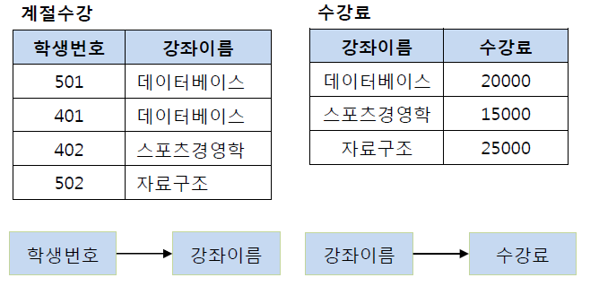

# 정규화에 대해서
2022/08/22

# 1. 데이터베이스
## 데이터베이스 정의 4가지
데이터베이스는 특정 조직의 업무를 수행하는 데 필요한 상호 관련된 데이터들의 모임이다.

1. 통합된 데이터(Integrated Data): 자료의 중복을 배제한 데이터의 모임이다.
2. 저장된 데이터(Stored Data): 컴퓨터가 접근할 수 있는 저장 매체에 저장된 자료이다.
3. 운영 데이터(Operational Data): 조직의 고유한 업무를 수행하는 데 존재 가치가 확실하고 없어서는 안 될 반드시 필요한 자료이다.
4. 공용 데이터(Shared Data): 여러 응용 시스템들이 공동으로 소유하고 유지하는 자료이다.

## 데이터베이스 특징 4가지
1. 실시간 접근성(Real-Time Accessibility) : 수시적이고 비정형적인 질의(조회)에 대하여 실시간 처리에 의한 응답이 가능해야 한다.
2. 계속적인 변화(Continuous Evolution) : 데이터베이스의 상태는 동적이다. 즉 새로운 데이터의 삽입(Insert),삭제(Delete),갱신(Update)로 항상 최신의 데이터를 유지한다.
3. 동시공용(Concurrent Sharing): 데이터베이스는 서로 다른 목적을 가진 여러 응용자들을 위한 것이므로 다수의 사용자가 동시에 같은 내용의 데이터를 이용할 수 있어야 한다.
4. 내용에 의한 참조(Content Reference): 데이터베이스에 있는 데이터를 참조할 때 데이터 레코드의 주소나 위치에 의해서가 아니라, 사용자가 요구하는 데이터 내용으로 데이터를 찾는다.

## 데이터베이스 언어 3가지
1. 데이터 정의 언어 (DDL) - 관계형 데이터베이스의 구조를 정의함 - 쌍, 속성, 관계 인덱스 파일 위치 등 데이터베이스 고유의 특성을 포함함
2. 데이터 조작 언어 (DML) - 데이터베이스 검색, 등록, 삭제, 갱신을 하기 위해 사용하는 데이터베이스 언어    - 데이터베이스의 검색 및 업데이트 등 데이터 조작을 위해 사용
3. 데이터 제어 언어 (DCL) - 데이터베이스에서 데이터에 대한 액세스를 제어하기 위한 데이터베이스 언어 또는 데이터베이스 언어 요소 - 박탈, 연결, 권한 부여, 질의, 자료 삽입, 갱신, 삭제 등

# 2. 정규화(Normalization)
## 정규화 탄생 배경
### 이상현상(Anomaly)
- 삭제 이상 : 튜플 삭제 시 같이 저장된 다른 정보까지 연쇄적으로 삭제
ex) 1개 로우를 삭제하면 해당 로우 중 103호 라는 정보라는 장소 정보도 사라져 다른 로우들이 103호 라는 장소 정보를 사용할 수 없다.
- 삽입 이상 : 튜플 삽잇 시 특정 속성에 해당하는 값이 없어 NULL 을 입력해야 하는 현상
- 수정 이상 : 튜플 수정 시 중복된 데이터의 일부만 수정되어 일어나는 데이터 불일치 현상
ex) 서로다른 2개 로우가 103호라는 한 수업에 대한 같은 장소정보를 가질때 1개의 로우의 장소변경을 해도 다른 로우는 변경안될때
---
- 이러한 이상현상은 서로 공유하는 데이터임에도 각자의 튜플에 독립적으로 존재하기 때문에 발생한다.
- 따라서 데이블을 분리해서 강의 제목이나 강의실을 참고하게 하여 해결할 수 있다.

### 함수 종속성(Functional Dependency)
- 어떤 속성 A의 값을 알면 다른 속성 B의 값이 유일하게 정해지는 관계를 종속성이라 함
- A->B로 표기하며 A를 B의 결정자라고 함
- 예시로는 학생번호 -> 학생이름, 학과 -> 학과사무실 등이 있다.

#### 함수 종속성 다이어그램
종속성을 나타내는 표기법
- 릴레이션의 속성: 직사각형
- 속성 간의 함수 종속성: 화살표
- 복합 속성: 직사각형으로 묶어서 그림

- 학생번호와 강좌이름을 알아야 성적을 알 수 있기 때문에 복합 속성으로 같이 묶어준다.

#### 릴레이션과 기본키
- 관계(Relationship)란 개체 사이의 연관성을 나타내는 개념이다.
- 관계 타입(Relationship Type)이란 개체 타입과 개체 타입 간의 연결 가능한 관계를 정의한 것이다.
- 관계 집합(Relationship set)은 관계로 연결된 집합을 의미한다.
기본키는 한 릴레이션의 다른 소성들을 모두 결정할 수 있어야 한다.

#### 이상현상과 결정자
- 이상현상은 1개의 릴레이션에 2개이상의 속성이 포함되어 있고 기본키가 아닌 속서이 결정자일 때 발생한다.
- 위의 사진에서 기본키를 지닌 학생 정보(학생번호, 학생이름, 주소, 학과)와 기본키가 아니지만 결정자적 성질을 지닌 강좌 정보(강좌이름, 강의실)가 한 릴레이션에 포함되어 이상현상이 나타난 것이다
- 학과, 학생 번호, 강좌 이름은 기본키가 아니면서 결정자이기 때문에 이상현상을 해결하기 위해 우리는 총 4개의 릴레이션으로 학생수강성적 릴레이션을 분해하면 된다

## 정규화란
- 정규화: 이상현상이 발생하는 릴레이션을 분해하여 이상현상을 없애는 과정
- 이상현상이 있는 릴레이션은 이상현상을 일으키는 함수 종속성의 유형에 따라 등급을 구분가능
- 릴레이션은 정규형 개념으로 구분하며, 정규형이 높을수록 이상현상은 줄어듬.
정규화란 즉 이상현상이 존재하는 릴레이션을 분해하여 여러 개의 릴레이션을 생성하는 과정을 의미합니다. 
릴레이션(테이블)은 분해되는 정도에 따라 정규형 단계로 나누어지며 정규형이 높아질수록 이상현상은 줄어듭니다.

## 정규화 종류
### 제 1 정규형
- 릴레이션의 모든 속성 값이 원자값을 갖는 경우

### 제 2 정규형
- 릴레이션이 제 1 정규형을 만족하고, 기본키가 아닌 속성이 기본키에 완전 함수 종속일 때
  - 완전 함수 종속 : 기본키로 묶인 복합키가 존재할 때 복합키(A,B,C)가 모여 하나의 다른 값(X)를 결정하고 복합키의 부분집합이 결정자가 되면 안된다는 의미
  - 즉 기본키의 부분집합이 결정자가 되어선 안된다는 의미

- 위 그림에서 학생번호와 강좌이름이 성적을 결정한다 (학생번호, 강좌이름) --> (성적)
- 하지만 강의실은 기본키의 부분집합인 강좌이름에 의해 결정 될 수 있다. (강좌이름) --> (강의실)
- 즉, 기본키(학생번호, 강좌이름)의 부분키인 강좌이름이 결정자이기 때문에 위의 테이블의 경우 다음과 같이 기존의 테이블에서 강의실을 분해하여 별도의 테이블로 관리하여 제2 정규형을 만족시킬 수 있다.

### 제 3 정규형
- 제2정규화를 진행한 테이블에 대해 이행적 종속을 없애도록 테이블을 분해하는 것
  - 이행적 종속 : A->B, B->C가 성립할 때 A->C가 성립되는 함수 종속성

- 이행적 종속을 제거하는 이유는 비교적 간단하다.
- 예를 들어 501번 학생이 수강하는 강좌가 스포츠경영학으로 변경되었다고 하자. 
- 이행적 종속이 존재한다면 501번의 학생은 스포츠경영학이라는 수업을 20000원이라는 수강료로 듣게 된다.
-  물론 강좌 이름에 맞게 수강료를 다시 변경할 수 있지만, 이러한 번거로움을 해결하기 위해 제3 정규화를 하는 것이다.

### BCNF 정규형
- 제3 정규화를 진행한 테이블에 대해 모든 결정자가 후보키가 되도록 테이블을 분해하는 것
- BCNF 정규형은릴레이션 R에서 함수 종속성 X->Y가 성립할 때 모든 결정자 X가 후보키인 정규형이다

- 특강수강 테이블에서 기본키는(학생번호,특강이름)이고 교수를 결정한다
- 문제는 교수가 특강이름을 결정하는 결정자이지만 후보키가 아니다
- BCNF 를 만족하기 위해 릴레이션을 분해한다.

## 정규화 장단점
### 장점
1. 데이터베이스 변경 시 이상 현상(Anomaly) 제거 위에서 언급했던 각종 이상 현상들이 발생하는 문제점을 해결할 수 있다.
2. 데이터베이스 구조 확장 시 재 디자인 최소화 정규화된 데이터베이스 구조에서는 새로운 데이터 형의 추가로 인한 확장 시, 그 구조를 변경하지 않아도 되거나 일부만 변경해도 된다. 이는 데이터베이스와 연동된 응용 프로그램에 최소한의 영향만을 미치게 되며 응용프로그램의 생명을 연장시킨다.
3. 사용자에게 데이터 모델을 더욱 의미있게 제공 정규화된 테이블들과 정규화된 테이블들간의 관계들은 현실 세계에서의 개념들과 그들간의 관계들을 반영한다.

### 단점
릴레이션의 분해로 인해 릴레이션 간의 연산(JOIN 연산)이 많아진다. 이로 인해 질의에 대한 응답 시간이 느려질 수 있다. 조금 덧붙이자면, 정규화를 수행한다는 것은 데이터를 결정하는 결정자에 의해 함수적 종속을 가지고 있는 일반 속성을 의존자로 하여 입력/수정/삭제 이상을 제거하는 것이다. 데이터의 중복 속성을 제거하고 결정자에 의해 동일한 의미의 일반 속성이 하나의 테이블로 집약되므로 한 테이블의 데이터 용량이 최소화되는 효과가 있다. 따라서 정규화된 테이블은 데이터를 처리할 때 속도가 빨라질 수도 있고 느려질 수도 있는 특성이 있다.

## 정규화 고찰
조회를 하는 SQL 문장에서 조인이 많이 발생하여 이로 인한 성능저하가 나타나는 경우에 반정규화를 적용하는 전략이 필요하다.

> 반정규화(De-normalization, 비정규화) : 반정규화는 정규화된 엔티티, 속성, 관계를 시스템의 성능 향상 및 개발과 운영의 단순화를 위해 중복 통합, 분리 등을 수행하는 데이터 모델링 기법 중 하나이다. 디스크 I/O 량이 많아서 조회 시 성능이 저하되거나, 테이블끼리의 경로가 너무 멀어 조인으로 인한 성능 저하가 예상되거나, 칼럼을 계산하여 조회할 때 성능이 저하될 것이 예상되는 경우 반정규화를 수행하게 된다. 일반적으로 조회에 대한 처리 성능이 중요하다고 판단될 때 부분적으로 반정규화를 고려하게 된다.

#### 5-1. 무엇이 반정규화의 대상이 되는가?
1. 자주 사용되는 테이블에 액세스하는 프로세스의 수가 가장 많고, 항상 일정한 범위만을 조회하는 경우
2. 테이블에 대량 데이터가 있고 대량의 범위를 자주 처리하는 경우, 성능 상 이슈가 있을 경우
3. 테이블에 지나치게 조인을 많이 사용하게 되어 데이터를 조회하는 것이 기술적으로 어려울 경우
#### 5-2. 반정규화 과정에서 주의할 점은?
- 반정규화를 과도하게 적용하다 보면 데이터의 무결성이 깨질 수 있다. 또한 입력, 수정, 삭제의 질의문에 대한 응답 시간이 늦어질 수 있다.
## 참고사이트
- 데이터베이스 정의 : https://coding-factory.tistory.com/214
- 정규화 이상현상 : https://mangkyu.tistory.com/28
- 정규화 : https://mangkyu.tistory.com/110
- 고찰 : https://github.com/JaeYeopHan/Interview_Question_for_Beginner/tree/master/Database#part-1-5-database

