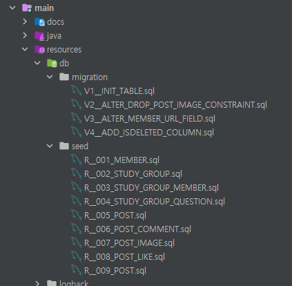

# Flyway 를 사용한 데이터베이스 형상관리
2022/08/21

## 코드적용
### build.gradle
```groovy
// FLYWAY
implementation 'org.flywaydb:flyway-core'
implementation 'org.flywaydb:flyway-mysql'
```
- 언어에 맞춰서 추가한다.

### application.yml
```yaml
spring:
  flyway:
    enabled: true
    baseline-on-migrate: true
    locations: classpath:db/migration,db/seed
```
- yml 설정을 추가
- ddl 은 migration 에서 관리
- seed data 는 seed 에서 관리

### main/resources/db/migration
