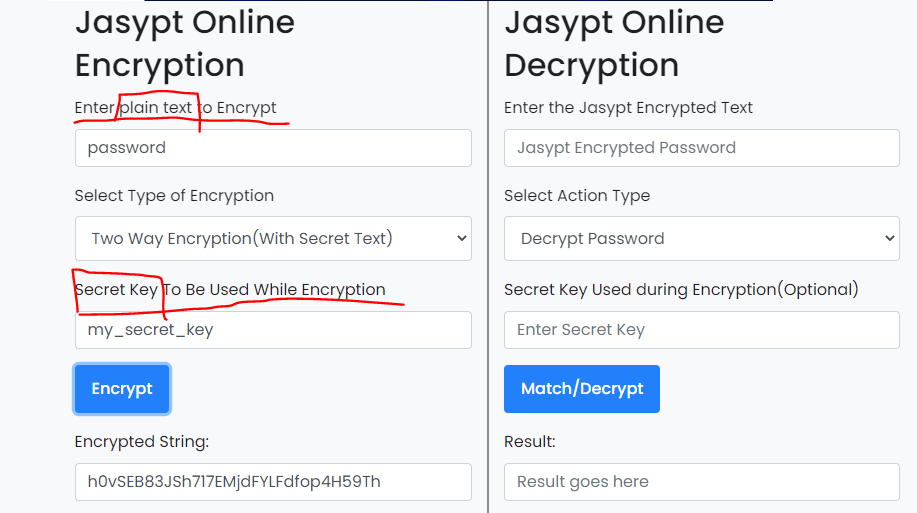

# Jasypt 를 통한 정보 암호화
2022/07/14

## 1. 포스팅 이유
github 에 정보를 올릴때 보안정보가 노출되는 경우를 방지하기 위해 Jasypt 를 통해 암호화 과정을 겪어보자

## 2. Jasypt 란?
- Jasypt는 개발자가 암호화 작동 방식에 대한 깊은 지식 없이도 최소한의 노력으로 자신의 프로젝트에 기본 암호화 기능을 추가할 수 있도록 하는 Java 라이브러리입니다.

- 정말 간단하게 라이브러리 추가, 암호화, key값 넘겨주기 세 가지 단계로 프로퍼티를 암호화하여 관리할 수 있다.

## 3. Jasypt 적용
### dependency 추가
```groovy
	implementation 'com.github.ulisesbocchio:jasypt-spring-boot-starter:3.0.4'
```
- 3.0.3 적용 시 도커활용 시 에러 발생 이슈가 존재한다. 3.0.4 버전 이상을 사용하자

### Bean 등록
```java
import org.jasypt.encryption.StringEncryptor;
import org.jasypt.encryption.pbe.PooledPBEStringEncryptor;
import org.jasypt.encryption.pbe.config.SimpleStringPBEConfig;
import org.springframework.beans.factory.annotation.Value;
import org.springframework.context.annotation.Bean;
import org.springframework.context.annotation.Configuration;
@Configuration
public class JasyptConfig {

    @Value("${jasypt.encryptor.password}")
    private String password;

    @Bean("jasyptStringEncryptor")
    public StringEncryptor stringEncryptor() {
        PooledPBEStringEncryptor encryptor = new PooledPBEStringEncryptor();
        SimpleStringPBEConfig config = new SimpleStringPBEConfig();
        config.setPassword(password); // 암호화할 때 사용하는 키
        config.setAlgorithm("PBEWithMD5AndDES"); // 암호화 알고리즘
        config.setKeyObtentionIterations("1000"); // 반복할 해싱 회수
        config.setPoolSize("1"); // 인스턴스 pool
        config.setProviderName("SunJCE");
        config.setSaltGeneratorClassName("org.jasypt.salt.RandomSaltGenerator");
        config.setIvGeneratorClassName("org.jasypt.iv.NoIvGenerator");
        config.setStringOutputType("base64");
        encryptor.setConfig(config);

        return encryptor;
    }
}
```
- 위 코드와 같이 bean 등록 후 암호화에 사용되는 password 는 `@Value` 를 통해 yaml 에서 가져온다.

### 3. 프로퍼티 암호화
https://www.devglan.com/online-tools/jasypt-online-encryption-decryption



- 위 사이트를 통해 암호화를 직접 진행 할 수 있다.
- 암호화하고자 하는 값을 넣고, 'Two Way Encryption' 을 선택한 후 자신의 SecertKey 를 집어넣고 Encryption 버튼을 누르면 암호화된 결과가 나온다.
- 암호화된 값을 Decryption 에 넣고 secret key 를 넣으면 다시 원래의 값을 얻을 수 있다.

```yaml
  security:
    oauth2:
      client:
        registration:
          naver:
            client-id: { client-id }
            client-secret: { secret }
            redirect-uri: http://localhost:8080/login/oauth2/code/naver
            authorization-grant-type: authorization_code

  security:
    oauth2:
      client:
        registration:
          naver:
            client-id: ENC(DNf1SeHYTxyyG9dJTGwSVAN8E3kXBTJUwD7nY2S7Ak8=)
            client-secret: ENC(+gIL8lfla1khvDTeN5iNH2/JeovNx6F2)
            redirect-uri: http://localhost:8080/login/oauth2/code/naver
            authorization-grant-type: authorization_code
```
- 그 후 다음과 같이 기존의 보안 정보를 사이트에서 encrytion 을 통해 암호화된 값을 얻고
- 그 값은 ENC 로 감싸서 입력시키면 된다.

### 4. Password 전달
- password 값을 application.yaml 에 넣는다면 누구나 복호화할 수 있어 의미가 없어진다.
- 그렇기 떄문에 직접 외부에서 전달하거나 혹은 password 를 숨겨주어야 한다.

### 환경변수 설정
1. 환경변수로 ENC_KEY = customPassword 와 같이 키를 입력한 후 서버를 실행하면 된다.
2. jasypt-1.9.2-dist.zip 을 압축해제 한다.
3. 명령 프롬프트(cmd) 창을 열고, 압축 해제한 jasypt 폴더의 bin폴더로 경로를 설정한다.
```
cd C:\Downloads\jasypt-1.9.2-dist\jasypt-1.9.2\bin
```
4. 암호화, 복호화
```
encrypt input=“암호화할 값” password=“키 값” algorithm=“적용할 암호화 알고리즘” 입력
(예 : encrypt input=“test“ password=“test“ algorithm=“PBEWITHMD5ANDDES“)

decrypt input=“복호화할 값” password=“키 값” algorithm=“적용할 암호화 알고리즘” 입력
(예 : decrypt input=“MkeTNSesdm35edc2“ password=“test“ algorithm=“PBEWITHMD5ANDDES“)
```
- 이부분은 추가적인 조사가 필요할거 같다.

### private 한 레포지토리에 저장
yaml 파일을 github 의 submodule 에 적용시켜 권한이 있는 관리자만 접근할 수 있는곳에 보관한다.
