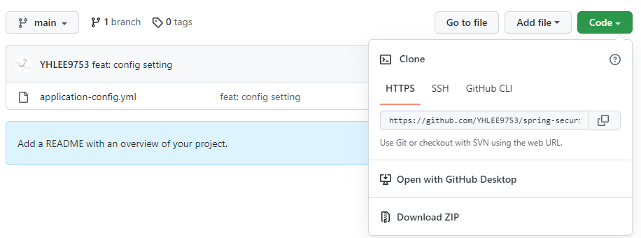
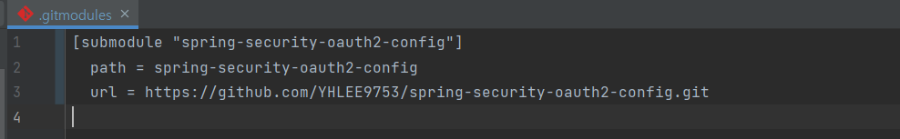
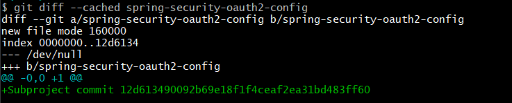
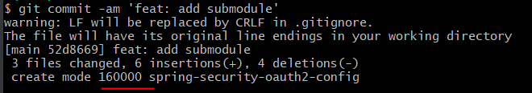
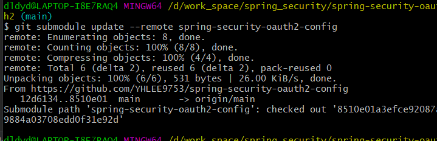

# git submodule
2022/07/14

## 1. 포스팅 이유
암호화된 정보를 숨기기 위해 submodule 에 대해 알아본다. 하지만 환경변수를 통한 설정이 더 정석적인 방법이라는 생각이 든다.

## 2. submodule
- 민감한 정보는 시스템 환경 변수를 사용할 수 있다.
- 각 운영체제 환경이 다른경우 위험성을 가진다.
- 따라서 docker 를 통한 컨테이너 배포에서 dockerfile 설정을 통한 환경변수가 안정적인 방법으로 생각된다
- 하지만 서버를 올리지 않은 상황에서 테스트하는 경우 submodule 을 통해 보안정보들을 숨길수 있을거라 생각된다.

### submodule 이란?
- 프로젝트를 수행하다 보면 다른 프로젝트를 함께 사용해야 하는 경우가 종종 있다. 
- 함께 사용할 다른 프로젝트는 외부에서 개발한 라이브러리라던가 내부 여러 프로젝트에서 공통으로 사용할 라이브러리일 수 있다. 
- 이런 상황에서 자주 생기는 이슈는 두 프로젝트를 서로 별개로 다루면서도 그 중 하나를 다른 하나 안에서 사용할 수 있어야 한다는 것이다.

- Git의 서브모듈은 이런 문제를 다루는 도구다. Git 저장소 안에 다른 Git 저장소를 디렉토리로 분리해 넣는 것이 서브모듈이다. 
- 다른 독립된 Git 저장소를 Clone 해서 내 Git 저장소 안에 포함할 수 있으며 각 저장소의 커밋은 독립적으로 관리한다.

## 3. submodule 생성 후 메인 repo 에 적용 
1. private 권한의 git repository 를 생성한다. 이곳에 Jasypt 키를 숨겨둔다.


2. 본 프로젝트로 에서 private repository 를 submodule 로 등록한다.
```git
git submodule add https://github.com/YHLEE9753/spring-security-oauth2-config.git
```
3. submodule 폴더가 추가된 것을 확인할 수 있다.


4. submofule 은 수정사항을 추적하지 않는다.


- 디렉토리를 서브모듈로 취급하기 때문에 해당 디렉토리 아래의 파일 수정사항을 직접 추적하지 않는다.
- 대신 서브모듈 디렉토리를 통째로 특별한 커밋으로 취급한다.
- `git diff --cached --submodule` 명령어를 통해 해당 서브모듈에 대해 자세히 볼 수 있다.

5. gitignore 에 해당 파일을 추가하여 보안정보가 원격 저장소에 올라가지 않도록 설정한다.
```git
# .gitignore
application-config.yml
application-config.yaml
```
- push 후 repository 확인 결과 데이터가 올라간걸 볼 수 있다. 즉 gitignore 이 적용되지않는다.
- 하지만 권한이 없는 유저 접근 시 private 접근 권한이 없기 때문에 404 에러가 뜨는 것을 확인할 수 있다.
- ~~따라서 해당 작업은 불필요하다 생각된다.~~ 필요하다. 뒤쪽에서 추가서술

6. 파일을 commit 한다

- 디렉토리의 모드는 `160000`이다. 
- Git에게 있어 160000 모드는 일반적인 파일이나 디렉토리가 아니라 특별하다는 의미다.

7. 파일을 push 한다.
```git
git push
```

## 4. submodule clone 하기
서브모듈을 포함한 프로젝트 clone 하기
```git
git clone https://github.com/YHLEE9753/spring-security-oauth2.git
```
- clone 후 디렉토리를 확인하면 서브모듈 디렉토리는 비어있는것을 확인할 수 있다.
- 2개의 명령을 실행해야 완전히 clone 이 끝난다.
1. 먼저 `git submodule init` 명령을 실행하면 서브모듈 정보를 기반으로 로컬 환경설정 파일이 준비된다.
2. 이후 `git submodule update` 명령으로 서브모듈의 리모트 저장소에서 데이터를 가져오고 서브모듈을 포함한 프로젝트의 현재 스냅샷에서 Checkout 해야 할 커밋 정보를 가져와서 서브모듈 프로젝트에 대한 Checkout을 한다.

- 만약 권한이 없을 경우 repo 를 찾을 수 없다는 오류가 발생한다.
```git
fatal: repository 'https://github.com/YHLEE9753/spring-security-oauth2-config.git/' not found
fatal: clone of 'https://github.com/YHLEE9753/spring-security-oauth2-config.git' into submodule
 path 'C:/Users/jinw0/Desktop/Web/spring-security-oauth2/spring-security-oauth2-config' failed
```

## 5. submodule update 하기
- `git submodule update --remote` 명령을 실행하면 Git이 알아서 서브모듈 프로젝트를 Fetch 하고 업데이트한다.
```git
git submodule update --remote spring-security-oauth2-config
```


## 6. submodule 공유하기
>Submodule에 대한 변경사항이 있다면 서브모듈의 저장소에 먼저 커밋하고 푸쉬해야합니다. 그 후 메인 프로젝트에 커밋/푸쉬를 해야합니다.
>메인 모듈을 먼저 커밋한다면 서브모듈의 변경사항을 추적하지 못하게 되어 문제가 발생할 수 있습니다.

- 추가로 다음과 같이 서브모듈을 먼저 push하고 메인 모듈을 push할 수 있도록 초기설정이 가능하다.
```git
#submodule이 모두 push된 상태인지 확인하고, 확인이 되면 main project를 push
git push --recurse-submodules=check

# submodule을 모두 push하고, 성공하면 main project를 push
git push --recurse-submodules=on-demand
```

- 또한 디폴트 push명령어에 옵션을 주어 별도의 명령어를 추가하지 않아도 check하거나 순서를 제어할 수 있습니다.
```git
# push시에 항상 check
git config push.recurseSubmodules check
# push 시에 항상 서브 모듈을 push
git config push.recurseSubmodules on-demand
```

## 7. 최종 코드
다음 명령어를 통해 서브 모듈 사용이 가능하다
```git
# 서브모듈을 포함한 프로젝트 clone 하기
git clone https://github.com/YHLEE9753/spring-security-oauth2.git

# 서브모듈 이니셜라이징
git submodule init

# 서브 모듈 업데이트 
git submodule update

# 모든 서브모듈에서 main으로 checkout 합니다.
git submodule foreach git checkout main

---------------------------------
# 서브 모듈 변경 사항을 update 할때
git submodule update --remote --merge
```
# 2022/07/17 - 추가 설명
## 8. gradle 문법을 통한 resource 에 yaml 파일 추가 작업
- Gradle를 이용해 local에서 submodules의 내용을 빌드 시 가져와야 오류 없이 사용할 수 있다.
```java
task copyPrivate(type: Copy) {
    copy {
    from './MediGo-Config'
    include "*.yaml"
    into 'src/main/resources'
    }
}
```
- 그 후 profile 의 include 를 통해 해당 yaml 을 사용 yaml 에 추가하여야한다.
```java
spring:
  application:
    name: medigo
  profiles:
    active: local
    include: config
```
- 그후 **반드시!! 해당 yaml 을 gitignore 을 해주어야 한다.**
- **이 작업이 없으면 데이터가 노출되기때문에 submodule 의 의미가 사라진다**
- **이 과정을 반드시 잊지 말자!! gitignore 에 추가해라!!**
```gitignore
### Submodule ###
application-config.yaml
application-config.yal
```

## 8. CI/CD in Github Action
```yaml
- name: Checkout 
		uses: actions/checkout@v1 
		with:
		  token: $ 
		  submodules: true
```
- 를 workflow file에 추가해주면 된다.
- 추후 실습 과정이 필요하다


## 참고 사이트
https://git-scm.com/book/ko/v2/Git-%EB%8F%84%EA%B5%AC-%EC%84%9C%EB%B8%8C%EB%AA%A8%EB%93%88

https://choieungi.github.io/posts/git-submodule/