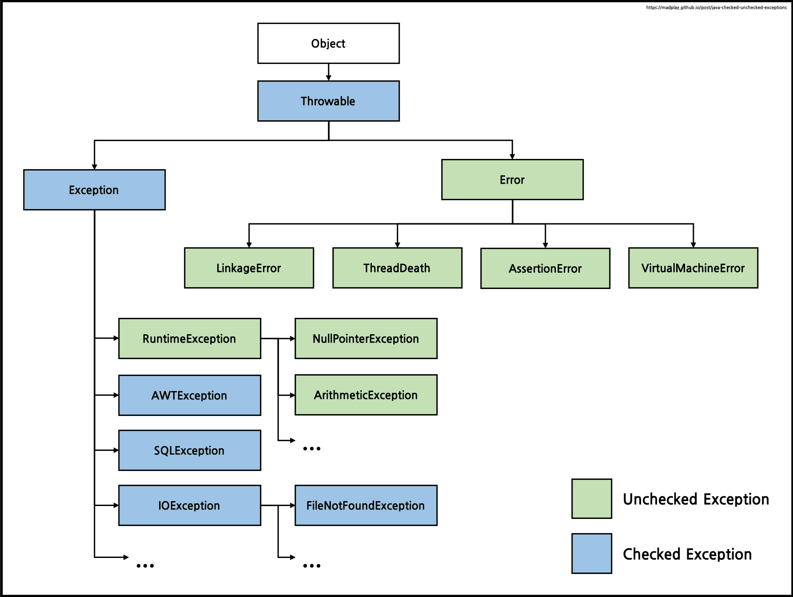

# Checked Exception, UnChecked Exception
2022/07/23

## 1. Checked Exception, UnChecked Exception



```java
public class Main {
    
    // 런타임 에러 발생
    public void unchecked(){ 
        throw new RuntimeException("unchecked exception");
    }

    public void checked1() throws Exception {
        throw new Exception("checked exception");
    }
    
    // 컴파일 에러 발생
//    public void checked1() { 
//        throw new Exception("checked exception");
//    }

    public void checked2() {
        try{
            throw new Exception("checked exception");
        }catch (Exception e){
            System.out.println("solve problem");
        }
    }
}

```
- Checked Exception 
  - 프로그램의 제어 밖에 있는 예외들. 
  - 컴파일 시점에 예외처리 여부를 확인한다 
  - 모든 RuntimeException을 상속하지 않는 예외 
  - ex) FileNotFoundException, SQLException

- UnChecked Exception 
  - 프로그램 로직의 오류로인한 예외들. 
  - 런타임 시점에 예외처리 여부를 확인한다 
  - 모든 RuntimeException을 상속하는 예외 
  - ex) ArrayIndexOutOfBoundsException, IllegalArgumentException


## 2. Checked Exception
### 언제 쓸까?
- ~~SQL 처리와 같이 예외를 바로 처리해주어 롤백을 해주어야 할때 유용하다~~
- unchecked 예외도 rollback 이 되기 때문에 빨리 실패하기 관점에서 써야할 상황은 없는거 같다.
- File 관련 메서드?

### 왜 쓰지 말까?
- Open/Closed 원칙의 위배
  - Checked Exception를 처리하지 않고 상위 계층으로 던지려면 반드시 메소드 시그니처의 throws에 명시해야한다. 
  - 예외의 처리를 강제하는 장점이기도하지만,던진 계층부터 처리한 계층까지 거치는 모든 메소드에서 Checked 예외를 사용하는 경우 
  - 시그니처를 수정해야하기 때문에 open-closed 원칙에 위배된다

- 모든 단계에서 시그니처를 명시해야 한다.
- HTTP API는 잘못된 요청에서 회복할 수 없다
  - 예외 발생 시 request의 라이프 사이클은 400, 404, 500 등 응답을 반환하고 끝이 난다. 
  - 클라이언트가 이 request를 회복 시킬 수는 없다. 다만 새로운 요청을 보낼 뿐이다.
  - 클라이언트는 아무것도 할 수 없고 백엔드는 회복할 수 없다. 
  - 현재 프로그램의 흐름 내에서 회복할 수 있을때만 checked exception을 사용해야한다

## 3. Unchecked Exception
- 객체에게 모든 책임을 맡기자
- unchecked exception 을 사용하자

## 참고 사이트
https://madplay.github.io/post/java-checked-unchecked-exceptions

https://devlog-wjdrbs96.tistory.com/351

https://velog.io/@sangmin7648/%EB%8B%B9%EC%8B%A0%EC%9D%98-Checked-Exception%EC%9D%80-%ED%95%84%EC%9A%94-%EC%97%86%EB%8B%A4


