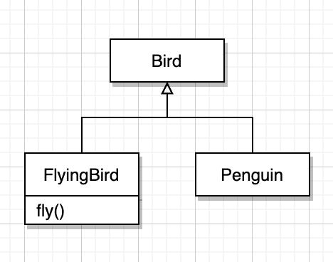
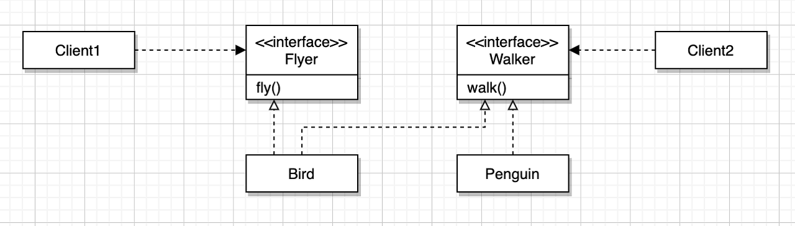

# Generics(1) - 서브클래싱(SubClassing)과 서브타이핑(SubTyping)
2022/07/23

# 1. 상속

상속의 용도는 크게 2가지이다

**1.  타입 계층을 구현 (부모클래스는 자식클래스의 일반화이고 자식 클래스는 부모클래스의 특수화다.)
2. 코드 재사용**

상속을 코드 재사용 목적으로 사용한다면 부모 클래스와 자식클래스를 강하게 결합시킨다.
따라서 상속은 코드 재사용이아니라 타입 계층을 구현하기위해 사용해야한다.

**코드 재사용은 상속이 아닌 합성을 사용하는게 올바르다.**

# 2. 상속과 인터페이스
보통 타입 계층의 구현을 위해 상속을 이용하고 이는 부모 클래스가 슈퍼타입의 역할을, 자식 클래스가 서브타입의 역할을 수행하도록 클래스간의 관계를 정의한다.

그렇다면 언제 상속을 이용할까?

### is-a 관계

흔히 is-a 관계일때 상속을 할 수 있다고 하지만 is-a 는 관계는 쉽게 배신할 수 있다.

>Bird <- Penguin

- 펭귄은 새다.
- 새는 날 수 있다.
- 하지만 실제로 펭귄은 날 수 없다.(is-a 실패)
  **
  즉 is-a 관계는 실제 세계의 개념적인 요소가 아닌 기대되는 행동에 따라 타입 계층을 구성해야 한다는 사실을 보여준다.**

### 행동 호환성
- 개념적으로 연관성이 있더라도 행동상의 호환성이 없으면 is-a 관계를 사용하면 안된다.
- 결론적으로 두 타입의 행동이 호환될 경우에만 타입 계층으로 묶어야 한다.
- 클라이언트 기대에 따라 계층을 분리하여야 한다.

**해결방법1**

- 상속 계층을 분리함으로 써 펭귄은 더이상 fly 메시지를 수신하지 않는다.

**해결방법2**

- 행동기반으로 인터페이스를 구현하여 Bird 와 Penguin 은 자신이 수행할 인터페이스만 구현한다.

이러한 설계원칙은 인터페이스 분리 원칙(ISP) 라고 부른다.

# 3. 서브클래싱과 서브타이핑

>**서브클래싱이란 **: 다른 클래스의 코드를 재사용할 목적으로 상속을 사용하는 경우를 가리킨다.

자식 클래스와 부모 클래스의 행동이 호환되지 않기 때문에 자식 클래스의 인스턴스가 부모 클래스의 인스턴스를 대체할 수 없다. 서브 클래싱을 **구현 상속(implementation inheritane)** 또는 **클래스 상속(class inheritance)**이라고 부르기도 한다.

>**서브타이핑이란 **: 타입 계층을 구성하기 위해 상속을 사용하는 경우를 가리킨다.

서브 타이핑에서는 자식 클래스와 부모 클래스의 행동이 호환되기 때문에 자식 클래스의 인스턴스가 부모 클래스의 인스턴스를 대체할 수 있다. 이때 부모 클래스는 자식 클래스의 슈퍼타입이 되고 자식 클래스는 부모 클래스의 서브타입이 된다. 서브타이핑을 **인터페이스 상속(interface inheritance)** 라고 부르기도 한다.

### 서브타이핑
- 슈퍼타입과 서브타입 사이에서 가장 중요한 것은 퍼블릭 인터페이스이다.
- 서브타입의 퍼블릭 인터페이스가 슈퍼타입에서 정의된 퍼블릭 인터페이스와 동일하거나 더 많은 오퍼레이션을 포함해야 한다.
- 그에 반해 서브 클래싱은 내부 구현 자체를 상속받는것에 초점을 모은다.

- 서브타이핑 관계를 유지하기 위해 서브타입이 슈퍼타입이 하는 모든 행동을 동일하게 할 수 있어야 한다. 즉** 행동호환성** 을 만족시켜햐 한다.
- 이 행동호환성은 부모클래스에 대한 자식 클래스의 **대체 가능성**으로 이어진다.

### 리스코프 치환 원칙(LSP)
- 서브타입은 그것의 기반 타입에 대해 대체 가능해야 함을 의미
- 즉 자식 클래스가 부모 클래스와 행동 호환성을 유지함으로써 부모 클래스를 대체할 수 있도록 구현된 상속 관계만을 서브타이핑이라고 부른다.

## 참고 사이트 및 도서
오브젝트 - 조영호 지음 | 위키북스
https://hwannny.tistory.com/63

