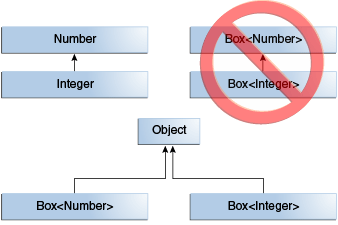
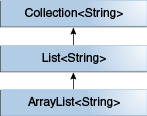
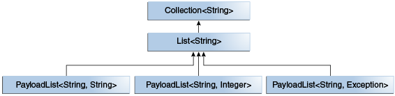

# Generics(5) - 사용 방식
2022/07/23

# 목차
1. 매개변수화 타입(Parameterized type)
2. 언바운드 와일드카드 타입(Unbounded wildcard type)
3. 바운드 타입 매개변수(Bounded type parameter)
4. 재귀적 타입 바운드(Recursive type bound)
5. 제네릭의 서브타이핑(Subtyping in generics)
6. 와일드카드 서브 타이핑(Wildcard and subtyping)
7. 바운드 와일드카드 타입(Bounded wildcard type)
8. 제네릭 메소드(Generic method)


# 1. 매개변수화 타입(Parameterized type)
하나 이상의 타입 매개변수를 선언하고 있는 클래스나 인터페이스는 제네릭 클래스 혹은 제네릭 인터페이스라고 한다. 이를 합쳐 제너릭 타입이라고 한다.
각각의 제너릭 타입에서는 매개변수화 타입(parameterized type)들을 정의하는데 다음 과 같다

```java
List<String> list = new ArrayList<>();
```
- `List<E>` 의 `E` = 형식 타입 매개변수(Formal type parameter)
- `List<String>` 의 `String` = 실 타입 매개변수(Actual type parameter)


제네럭은 타입 소거자(Type erasure) 에 의해 자신의 타입 요소 정보를 삭제 하므로 컴파일 시 다음과 같이 변경된다.

```java
ArrayList list = new ArrayList();
```

컴파일러는 컴파일 단계에서 `List` 컬렉션에 `String` 인스턴스만 저장되어야 하는 것을 알게 되었고 그것을 보장해주기 때문에 `ArrayList list` 로 변경해도 런타임에 동일한 동작을 보장한다.

## 구체화 vs 비구체화
- `비 구체화 타입(non-reifiable type)` : 타입 소거자에 의해 컴파일 타임에 타입 정보가 사라지는 것(런타임에 구체화화지 않는 것)
    - 제네릭 타입이 비구체화 타입에 해당
    - 제네릭은 컴파일 타임에 타입 체크를 한 뒤 런타임에는 타입을 지우는 방법을 사용

- `구체화 타입(reifiable type)` : 자신의 타입 정보를 런타임 시에 알고 지키게 하는 것(런타임에 구체화하는 것)
    - 배열이 구체화 타입에 해당

```java
```java
// 컴파일 할 때 (타입 소거 전) 
public static void main(String... args) {
  List<String> list = new ArrayList<>();
  Object[] array = new Long[10];

// 런타임 때 (타입 소거 후)
public static void main(String... var0) {
  ArrayList var1 = new ArrayList();
  Long[] var2 = new Long[10];
```

## Generics Type Erasure이란

- 소거(erasure)
    - 원소 타입을 컴파일 타입에만 검사하고 런테임에는 해당 타입 정보를 알 수 없는 것이다.
    - 컴파일 타입에만 타입 제약 조건을 정의하고, 런타임에는 타입을 제거한다는 뜻이다.
    - **컴파일된 class 파일에는 어떠한 제네릭 타입도 포함되지 않게 된다.**
      -제네릭을 사용하지 않은 코드와의 호환성 유지를 위해서이다.

예1) `Unbounded Type(<?>, <T>)`은 `Object`로 변환한다.
```java
// 컴파일 할 때 (타입 소거 전) 
public class Test<T> {
    public void test(T test) {
    ...

// 런타임 때 (타입 소거 후)
public class Test {
    public void test(Object test) {
    ...
```
예2) `Bound Type(<E extends Comparable>)`의 경우 `Object`가 아닌 `Comparable`로 변환한다.
```java
// 컴파일 할 때 (타입 소거 전) 
public class Test<T extends Comparable<T>> {
    private T data;
    ...

// 런타임 때 (타입 소거 후)
public class Test {
    private Comparable data;
    ...
```

## bridge method
- 확장된 제네릭 타입에서 다형성 보존을 위해 어떠한 클래스나, 인스턴스를 상속 혹은 구현할 때 `bridge method` 를 생성한다.

```java
public class Node<T> {
    public T data;
    public Node(T data) { this.data = data; }
    public void setData(T data) {
        System.out.println("Node.setData");
        this.data = data;
    }
}

// 컴파일 할 때 (타입 소거 전) 
public class MyNode extends Node<Integer> {
    public MyNode(Integer data) { super(data); }

    public void setData(Integer data) {
        System.out.println("MyNode.setData");
        super.setData(data);
    }
}

// 런타임 때 (타입 소거 후)
public class MyNode extends Node {

    // Bridge method generated by the compiler
    public void setData(Object data) {
        setData((Integer) data);
    }

    public void setData(Integer data) {
        System.out.println("MyNode.setData");
        super.setData(data);
    }
    // ...
}
```
- bridge 메서드는 type erasure 이후 Node 클래스에서의 setData메서드와 같은 - - 이름의 메서드를 가지고 원래의 setData 메서드의 역할을 대신한다.

- 제네릭 타입을 사용할 수 있는 일반 class, interface, method에만 소거 규칙을 적용한다.
- 타입 안정성 측면에서 필요하면 type casting을 넣는다.


# 2. 언바운드 와일드카드 타입(Unbounded wildcard type)
`List<?>` 와 같은 타입을 언바운드 와일드카드 타입이라고 한다. 어떤 타입이 오든 상관이 없다는 의미이다.
자주 사용되는 경우는 다음과 같다.
1. Object 클래스에서 제공되는 기능을 사용하여 구현할 수 있는 메서드를 작성하는 경우
2. 타입 파라미터에 의존적이지 않는 일반 클래스의 메소드를 사용하는 경우
    - `List.clear`, `List.size`, `Class<?>`

```java
// Before
public static void main(String... args) {
  List<String> list = new ArrayList<>();
  printList(list);
}

private static void printList(List<?> list) {
  for (Object elem: list)
    System.out.print(elem + " ");
}

// After
public static void main(String... var0) {
    ArrayList var1 = new ArrayList();
    printList(var1);
}

private static void printList(List<?> var0) {
    Iterator var1 = var0.iterator();
    while(var1.hasNext()) {
        Object var2 = var1.next();
        System.out.print(var2 + " ");
    }
}
```
- `List<String>` 으로 선언된 `list` 를 `printList` 메소드의 인자로 전달하는데 `printList` 메서드 내부에서는 List 타입에 의존하지 않는 코드를 수행하고 있다.
- 컴파일 된 코드에서도 마찬가지로 타입에 의존하는 코드는 없으며 **type erasure 에 의해 `<?>` 가 지워지지는 않는다.**


# 3. 바운드 타입 매개변수(Bounded type parameter)
바운드 타입은 특정 타입으로 제한한다는 의미이다.
특정 타입의 서브타입으로만 제한을 시키겠다는것으로 해석 가능하다.
클래스나 인터페이스 설계시 흔히 사용된다.

```java
public class Box<T extends Number> {
    public void set(T value) {}
}

public static void main(String... args) {
    Box<Integer> box = new Box<>();
    box.set("Hi"); // compile error
}
```
- `<T extends Number>` : Number 의 서브타입만 매개변수로
- `Integer` 는 `Number` 의 서브타입이므로 `Box<Integer>` 과 같은 선언 가능
- `set` 함수는 인자로 문자열을 전달하려고 하였으모로 컴파일 에러 발생


# 4. 재귀적 타입 바운드(Recursive type bound)
재귀적 타입 바운드는 타입 매개변수가 자신을 포함하는 수식에 의해 한정될 수 있다. 타입의 지연율(데이터의 순서)을 정의하는 `comparable` 인터페이스와 가장 많이 사용된다.
```java
public interface Comparable<T> {
    int compareTo(T o);
}
```
타입 매개변수 `T` 는 자신과 비교될 수 있는 요소를 정의한 것이다. `Comparable`을 구현하는 요소들의 목록을 정렬하거나, 최솟값, 최댓값을 구하는 등의 작업ㅇ을 하기 위해서는 목록의 모든 요소들이 서로 비교 가능해야 한다.
```java
static <T extends Comparable<T>> T max(List<T> list) {
    Iterator<T> iterator = list.iterator();
    T result = iterator.next();
    while (iterator.hasNext()) {
        T t = iterator.next();
        if (t.compareTo(result) > 0) result = t;
    }

    return result;
}
```
- `<T extends Comparable<T>>` 는 자신과 비교될 수 있는 모든 타입 T 라고 읽을 수있다.
- Java 는 연산자 오버로딩을 지원하지 않기 때문에 short, int, double 등과 같은 primitive 타입에는 `>` 과 같은 비교연산자를 사용할 수 있다.
- `Comparable` 인터페이스와 재귀적 타입바운드를 통해 이 한계를 극복한다.

```java
public static <T> int countGreaterThan(T[] anArray, T elem) {
    int count = 0;
    for (T e : anArray)
        if (e > elem)  // compiler error
            ++count;
    return count;
}

public static <T extends Comparable<T>> int countGreaterThan(T[] anArray, T elem) {
    int count = 0;
    for (T e : anArray)
        if (e.compareTo(elem) > 0)
            ++count;
    return count;
}
```
- Java 가 문법적으로 연산자 오버 로딩을 지원했다면 이런 기능도 필요 없었을 거라 판단된다.

# 5. 제네릭의 서브타이핑(Subtyping in generics)
```java
public void someMethod(Number n) { /* ... */ }
someMethod(new Integer(10));   // OK
someMethod(new Double(10.1));   // OK


Box<Number> box = new Box<Number>();
box.add(new Integer(10));   // OK
box.add(new Double(10.1));  // OK


public void boxTest(Box<Number> n) { /* ... */ }
boxTest(new Box<Double>()); // error
boxTest(new Box<Integer>()); // orror
```
- 배열은 공변성을 가지지만 제너릭은 무공변(invariant)(`C`와 `C<T’>`는 아무 관계가 없다.)이다.
  

---
따라서 제너릭 클래스나 인터페이스를 상속관계로 정의하고 싶다면 클래스나 인터페이스의 상속관계를 정의해야 한다.


---
우리만의 List 인터페이스를 정의한다 생각해보자.

```java
interface PayloadList<E,P> extends List<E> {
  void setPayload(int index, P val);
}
```


이러한 방식으로 `List<E>` 를 상속받은 `PayloadList` 즉 `List<String>` 의 서브타입을 만들수 있다.(물론 현실적인 코드는 아니지만)

# 6. 와일드카드 서브 타이핑(Wildcard and subtyping)
```java
List<Integer> list = new ArrayList<>();
addAll(list); // compile error

public void addAll(List<Number> list) { /* ... */ }
```
제네릭은 무공변(invariant) 이므로 위의 코드는 에러가 발생한다. 이와 같은 문제 해결을 위해 와일드카드 타입을 사용한다.

```java
List<Integer> list1 = new ArrayList<>();
List<Float> list2 = new ArrayList<>();
addAll(list1);  // ok
addAll(list2);  // ok

public void addAll(List<? extends Number> list) { /* ... */ }
```
`List<? extends Number>`가 의미하는 것은 `Number`의 어떤 서브 타입의 `List`가 되어야 한다는 것이다. 위 케이스의 `List<Number>` 처럼 무공변(invariant)의 성질을 가지는 매개변수화 타입의 문제점을 해결하기 위해 제공하는 것이 바운드 와일드카드 타입이다.

# 7. 바운드 와일드카드 타입(Bounded wildcard type)
Upper bounded wildcard : `<? extends T>`
Lower bounded wildcard : `<? super T>`

> 무공변(invariant) : 오로지 자기 타입만 허용하는 것 `<T>`

> 공변 (covariant) : 자기 자신과 자식 객체만 허용 `<? extends T>`

> 반공변 (contravariant) : 자기 자신과 부모 객체만 허용 `<? super T>`

제너릭은 런타임에서의 안정성 보장을 위하여 무공변을 선택하였다. 하지마 여러 불편함을 가져다 준다.
```java
interface Collection<E> {
  void addAll(Collection<E> items);  
}

void copyAll(Collection<Object> to, Collection<String> from) {
  to.addAll(from); // Compile Error
}
```
- `<Object>` 와 `<String>` 은 무공변에 의해 타입이 맞지 않아 컴파일 실패를 한다.

```java
public interface Collection<E> {
    void addAll(Collection<? extends E> items);
}
```
- 위와 같이 변경하면 된다.

### PECS
> PECS : Producer(생산자)-extends, Consumer(소비자)-super

```java
    public void doSomething(List<? extends MyClass> list) {
        for (MyClass e : list) { // Ok
            System.out.println(e);
        }
    }

    public void doSomething(List<? extends MyClass> list) {
        list.add(new MyClass()); // Compile Error
    }

    public void doSomething(List<? super MyClass> list) {
        for (MyClass e : list) { // Compile Error
            System.out.println(e);
        }
    }

    public void doSomething(List<? super MyClass> list) {
        list.add(new MyClass()); // Ok
    }
```

- Producer-extends 는 **읽기**만 가능하다
- Consumer-super 는 **쓰기**만 가능하다.

# 8. 제네릭 메소드(Generic method)
- 클래스나 인터페이스에 제너릭을 사용하듯이 메소드에서도 제네릭을 적용할 수 있다.
- 주로 static 유틸리티 메소드에 유용하게 쓰일 수 있다.
- 제네릭 메소드의 타입 매개변수를 선언할 때 타입 매개변수의 위치는 **메소드의 접근 지시자와 반환 타입 사이**이다

```java
public class Pair<K, V> {
    private K key;
    private V value;

    public Pair(K key, V value) {
        this.key = key;
        this.value = value;
    }

    public void setKey(K key) { this.key = key; }
    public void setValue(V value) { this.value = value; }
    public K getKey()   { return key; }
    public V getValue() { return value; }
}

public class Util {
    public static <K, V> boolean compare(Pair<K, V> p1, Pair<K, V> p2) {
        return p1.getKey().equals(p2.getKey()) &&
                p1.getValue().equals(p2.getValue());
    }
}
```
- 타입 `K`,`V`는 클래스에는 정의되어 있지 않고 메소드에만 정의되어 있다.
- 타입 `K`,`V`는 메소드의 접근 지시자 와 반환 타입 사이에 위치하지 않으면 컴파일 에러가 발생한다.

```java
public static void main(String... args) {
    Pair<Integer, String> p1 = new Pair<>(1, "apple");
    Pair<Integer, String> p2 = new Pair<>(2, "pear");
    boolean result = Util.<Integer, String>compare(p1, p2);
    boolean result = Util.compare(p1, p2); // type inference
}
```
- 실제 메서드 호출에서는 타입 추론(Type inference) 에 의해 타입정의를 생략할 수 있다.
  -만약 타입이 `<String, Integer>` 과 같이 다르다면 컴파일 에러가 발생할 것이다.
    - 왜냐하면 `<K, V> boolean compare(Pair<K, V> p1, Pair<K, V> p2)` 메소드 시그니처에 p1, p2 모두 동일한 형식 타입 매개변수로 정의되어 있기 때문이다

- 만약 `p2`를`Pair<V, K>`로 변경한다면 컴파일 에러가 발생하지 않을 것이다.

# 마치며
Java Oracle 공식 문서를 볼려고 하다가 너무 많은 시간이 걸릴거 같아 정리된 사이트들을 공부하면서 재정리하였다. 제너릭에 대해 알 수 있지만 실제 코드 적용과 여러번의 복습이 필요할거라고 예상된다.

## 참고 사이트
https://medium.com/@joongwon/java-java%EC%9D%98-generics-604b562530b3
https://docs.oracle.com/javase/tutorial/java/generics/index.html
https://velog.io/@guswns3371/%EC%A0%9C%EB%84%A4%EB%A6%AD


