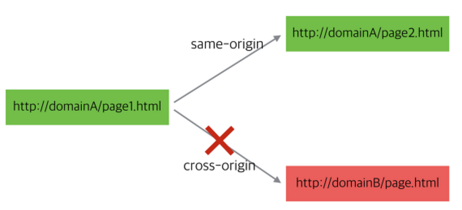
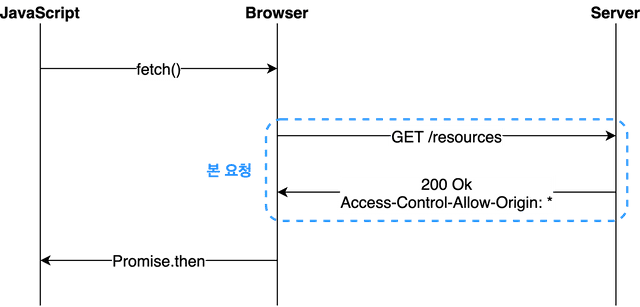
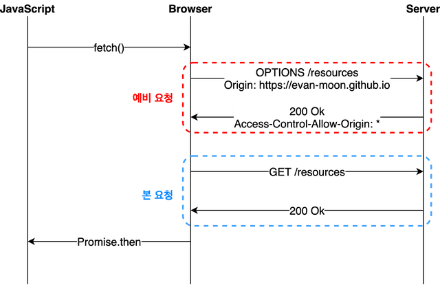

# CORS 란?
2022/07/13

## 1. 포스팅 이유
파이널 프로젝트를 시작하기 전에 CORS 에 대해 정리한 후 CORS 에러를 어떻게 해결할지 미리 경험하고 해결해본다.

## 2. CORS 란
Cross Origin Resource Sharing



- CORS는 한 도메인 또는 Origin의 웹 페이지가 다른 도메인 (도메인 간 요청)을 가진 리소스에 액세스 할 수 있게하는 보안 메커니즘이다.
- CORS는 서버와 클라이언트가 정해진 헤더를 통해 서로 요청이나 응답에 반응할지 결정하는 방식으로 CORS라는 이름으로 표준화 되었다. 
- CORS는 최신 브라우저에서 구현된 동일 출처 정책(same-origin policy) 때문에 등장했다.

### 동일 출처 정책(SOP : same-origin policy)
- 동일 출처 정책은 동일한 출처의 리소스에만 접근하도록 제한하는 것이다. 
- 여기서 출처는 프로토콜, 호스트명, 포트가 같다는 것을 의미한다.
- https://naver.com:80을 예시로 들면, https는 프로토콜, naver.com은 호스트명 80은 포트다.

**왜 동일한 출처에서만 접근하도록 허용하는 것일까? 모든 출처를 허용하면 어떻게 될까?**

- https://bank.com 이라는 도메인 사이트가 있다 이 사이트의 api 주소는 https://bank.com/api 이다. 
- 사용자가 은행 사이트에서 로그인을 한 후 인증 토큰을 받았다.
- 그런데 사용자가 로그인한 상태에서 https://evil.com 사이트에 접속하게 되면, https://evil.com 사이트에서 https://bank.com/api 로 ajax 요청을 보낼 때 유저가 획득한 인증 토큰이 자동으로 첨부되어 사용자인척하면서 요청을 보낼 수 있게 된다.
- 이렇게 자동으로 쿠키가 첨부되기 때문에 보안상의 이유로 브라우저는 HTTP 호출을 동일한 출처로 제한했다.

## 3. CORS 가 생긴 이유?
- 이전에는 동일한 도메인에서 리소스를 받아왔지만, 지금은 클라이언트에서 도메인이 다른 서버에서 제공하는 API 를 사용하는 일이 많아졌다

## 4. CORS 는 어떻게 동작할까?
동일 출처 정책은 브라우저에서 임의로 하는 것이다.<br>
**즉 브라우저에서 컨트롤하는 것이다!!**
- 브라우저를 통하지 않고 요청을 보내거나 브라우저에서 동일 출처 정책이 아니라면, 
- 동일 출처가 아니라도 요청을 보내고 응답을 받을 수 있다.

브라우저는 다른 출처로 요청을 보낼때 3가지 절차를 거치게 된다.
## 5. Simple Request

- 특정 조건을 만족하는 경우에만 예비 요청을 생략할 수 있다.
- 거의 충족하기 어뎌운 조건들이다
- 아래 3가지 조건 중 모두 만족하면, simpe request 이다.

- 요청 메서드는 `GET`, `HEAD`, `POST` 중의 한 가지 방식을 사용
- `POST` 방식일 경우 content-type 이 아래 셋 중 하나여야 한다.( `application/json` 은 포함되지 않으므로 까다롭다)
    - `application/x-www-form-unlencoded`
    - `Body` 는 키와 값이 =로 연결되고 각 항목이 &로 연결된 문자열
    - ex) itle=Avengers&hero=Iron Man
  - multipart/form-data
    - `Body` 부분에 데이터를 여러 부분으로 나눠서 보내는 방식
    - ex) 사진 데이터 업로드(사진을 담는 데이터와 설명을 담는 데이터는 타입이 달라 구분하기 위해 사용)
  - `text/plain`
- `Accept`, `Accept-Language`, `Content-Language`, `Content-Type`, `DPR`, `Downlink`, `Save-Data`, `Viewport-Width`, `Width` 를 제외한 헤더를 사용하면 안된다.
  - 당장 `Authorization` 헤더 조차 포함되지 않았으므로 까다로운 조건이다

### simple request 과정
```
1. 요청을 보낸다.
2. 브라우저는 Host와 같은 헤더를 추가하는 것 외에도 교차 출처 요청에 대해 Origin Request Header를 자동으로 추가한다.
Host : 서버의 도메인 네임, Origin : Post 요청을 보낼떄 요청이 어느 주소에서 시작되는지는지 나타낸다(송수신 주소가 다르면 CORS)

GET /products/ HTTP/1.1
Host: api.domain.com
Origin: https://www.domain.com

3. 서버에서 Origin 리퀘스트 헤더를 확인합니다. 
Origin 값이 허용되면, Access-Control-Allow-Origin요청 헤더 Origin 값으로 설정한다.

Http/1.1 200 OK
Access-Control-Allow-Origin: https://www.domain.com
Content-Type: application/json

4. 응답을 받은 브라우저는 Access-Control-Allow-Origin 헤더가 탭의 출처와 일치하는지 확인한다. 
Access-Control-Allow-Origin 값이 정확히 출처와 일치하거나, "*" 와일드 카드 연산자를 포함하는 경우 검사가 통과된다.
```

## 6. Preflighted request


- preflighted 요청은 simple request 와는 다른 유형의 CORS 요청이다. 
- 브라우저에서 진짜 요청을 보내기 전에 미리 확인 요청을 보낸다. 이 요청은 OPTIONS 메소드를 사용한다.
- 브라우저가 본 요청을 보내기 전에 보내는 예비 요청을 Preflight 라고 부른다
- 
### Preflighted request 과정
```
1. ajax 요청을 보낸다.
예비 요청

OPTIONS /products/ HTTP/1.1
Host: api.domain.com
Origin: https://www.domain.com
Access-Control-Request-Method: POST
Access-Control-Request-Headers: Authorization, Content-Type

2. 서버는 허용된 메소드 및 헤더를 지정하여 응답한다.
허용되는 Origin 을 알려주고
허용되는 메서드와 헤더를 담아서 알려준다.

HTTP/1.1 200 OK
Access-Control-Allow-Origin: https://www.domain.com
Access-Control-Allow-Method: GET, POST, OPTIONS, PUT
Access-Control-Allow-Headers: Authorization, Content-Type 
Content-Type: application/json

3. 헤더와 메소드가 통과되면, 브라우저는 원래 CORS 요청을 보낸다.

POST /products/ HTTP/1.1
Host: api.domain.com
Authorization: token
Content-Type: application/json
Origin: https://www.domain.com

4. 응답은 Access-Control-Allow-Origin 헤더에 올바른 출처가 있으므로 검사를 통과한다.
```
- 이 떄 다른 출처로 사용하면 예비 요청에 대한 응답에서 에러가 발생하지 않고 정상적으로 200이 떨어진다.
- 이유는 브라우저가 CORS 정책 위반 여부를 판단하는 시점이 예비 요청에 대한 응답을 받은 직후이기 때문이다.
- 중요한점은 예비 요청의 성공/실패 여부가 아니라 “응답 헤더에 유효한 Access-Control-Allow-Origin 값이 존재하는가”이다.
- 즉 200이 아닌 상태 코드가 내려오더라도 헤더에 저 값이 제대로 들어가있다면 CORS 정책 위반이 아니라는 의미이다.

## 7. Credentialed Request
- CORS의 기본적인 방식이라기 보다는 다른 출처 간 통신에서 좀 더 보안을 강화하고 싶을 때 사용하는 방법이다.
- `credentials` 을 이용한다.(3가지 옵션 존재)
  - `same-origin` (기본값): 같은 출처 간 요청에만 인증 정보를 담을 수 있다
  - `include`	: 모든 요청에 인증 정보를 담을 수 있다
  - `omit` : 모든 요청에 인증 정보를 담지 않는다

- 만약 `same-origin` 이나 `include` 와 같은 옵션을 사용하여 리소스 요청에 인증 정보가 포함된다면, 
- 이제 브라우저는 다른 출처의 리소스를 요청할 때 단순히 `Access-Control-Allow-Origin` 만 확인하는 것이 아니라 
- 좀 더 강화된 검사 조건을 추가하게 된다.

- 즉 `Access-Control-Allow-Origin : *` 를 설정해도 `credentials` 옵션이 `include` 라면 모든 요청에 인증 정보를 포함하겠다는 의미를 가지므로 
- 동일 출처 여부와 상관없이 요청에 대한 인증 정보가 포함되어야 한다. (쿠키도 확인한다)(설정상)
- 즉 include 의 경우 `Access-Control-Allow-Origin : *` 를 사용하면 안된다.

## 8. CORS 해결 방법
### Access-Control-Allow-Origin 세팅하기
- 서버에서 `Access-Control-Allow-Origin` 헤더에 알맞은 값을 세팅해주는 것이다.
- `Access-Control-Allow-Origin: https://evan.github.io` 와 같이 출처를 명시해주도록 하자.
- `*` 사용은 당장은 편해도 추후 문제를 일으킬 수 있다.

### Webpack Dev Server로 리버스 프록싱하기
- 백엔드에는 이미 `Access-Control-Allow-Origin` 헤더가 세팅되어있겠지만, 
- 이 중요한 헤더에다가 `http://localhost:3000` 같은 범용적인 출처를 넣어주는 경우는 드물다
- 프론트엔드 개발자는 대부분 웹팩과 `webpack-dev-server` 를 사용하여 자신의 머신에 개발 환경을 구축하게 되는데, 
- 이 라이브러리가 제공하는 프록시 기능을 사용하면 아주 편하게 CORS 정책을 우회할 수 있다
- URL 로 보내는 요청에 대해 브라우저는 `localhost:8000/api` 로 요청을 보낸 것으로 알고 있지만, 
- 사실 뒤에서 웹팩이 `https://api.evan.com` 으로 요청을 프록싱해주기 때문에 마치 CORS 정책을 지킨 것처럼 브라우저를 속이면서도 우리는 원하는 서버와 자유롭게 통신을 할 수 있다.

## 참고 사이트
https://bohyeon-n.github.io/deploy/web/cors.html

https://evan-moon.github.io/2020/05/21/about-cors/