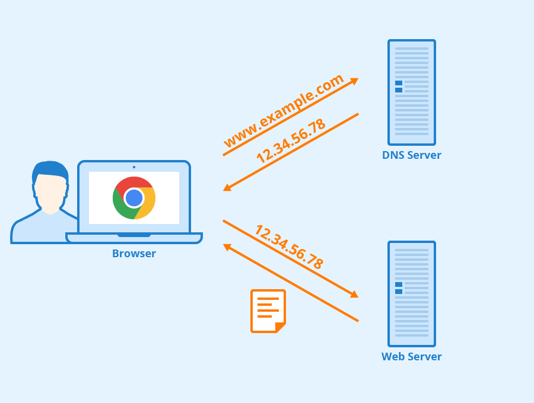
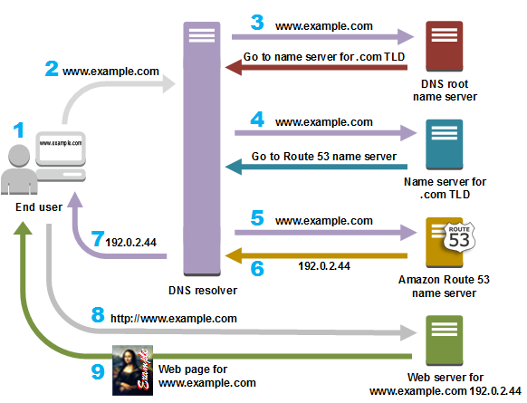
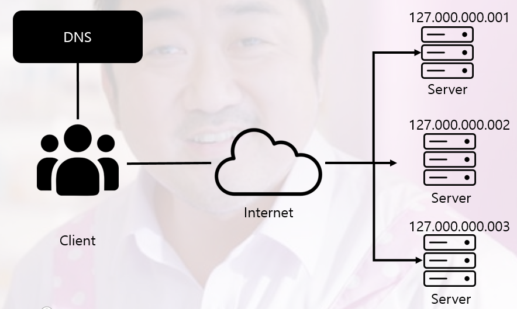

# DNS Round Robin 방식
2022/08/20

## 1. DNS 란?

- 도메인 이름 시스템(DNS)은 사람이 읽을 수 있는 도메인 이름(예: www.amazon.com)을 머신이 읽을 수 있는 IP 주소(예: 192.0.2.44)로 변환
- 대부분의 웹서비스는 IP 주소를 통해 서로 통신한다. 이를 도메인 이름으로 대체할 수 이싿.
- DNS 시스템은 이름을 IP 주소로 변한하여 도메인 이름을 웹 브라우저에 입력할 때 최종 사용자를 어떤 서버에 연결할 것인지를 제어한다.
  - 이 요청을 **쿼리**라고 부른다.

## 2. DNS 서비스 유형
### 신뢰할 수 있는 DNS
- 개발자가 퍼블릭 DNS 이름을 관리하는 데 사용하는 업데이트 메커니즘을 제공
- 이 메커니즘을 통해 DNS 시스템은 DNS 쿼리에 응답하고 도메인 이름을 IP 주소로 변환
- 도메인에 대한 최종 권한이 있으며 재귀적 DNS 서버에 IP 주소 정보가 담긴 답을 제공할 책임이 있다.
- Amazon Route 53 은 신뢰할 수 있는 DNS 시스템이다.

### 재귀적 DNS
- 대개 클라이언트는 신뢰할 수 있는 DNS 서비스에 직접 쿼리를 수행하지 않는다.
- 대신 해석기 또는 재귀적 DNS 라고 할려진 다른 유형의 DNS 서비스에 연결하는 경우가 일반적이다.
- 재귀적 DNS 서비스는 DNS 레코드를 소유하지 있지 않지만 사용자를 대신해서 DNS 정보를 가져올 수 있는 중간자 역할을 한다.
- 재귀적 DNS 가 일정 기간 캐시된 또는 저장된 DNS 참조를 가지고 있는 경우, 소스 또는 IP 정보를 제공하여 DNS 쿼리에 답을 한다.
- 그렇지 않는 경우 해당 정보를 찾기 위해 쿼리를 하나 이상의 신뢰할 수 있는 DNS 서버에 전달한다.

## 3. DNS 가 트래필을 웹 어플리케이션에 라우팅하는 방법

다음 다이어그램은 재귀적 DNS 서비스와 신뢰할 수 있는 DNS 서비스가 서로 연계하여 최종 사용자를 웹 사이트 또는 애플리케이션으로 라우팅하는 방법에 대한 개요를 보여줍니다.

1. 사용자가 웹 브라우저를 열어 주소 표시줄에 www.example.com을 입력하고 Enter 키를 누릅니다.
2. www.example.com에 대한 요청은 일반적으로 케이블 인터넷 공급업체, DSL 광대역 공급업체 또는 기업 네트워크 같은 인터넷 서비스 제공업체(ISP)가 관리하는 DNS 해석기로 라우팅됩니다.
3. ISP의 DNS 해석기는 www.example.com에 대한 요청을 DNS 루트 이름 서버에 전달합니다.
4. ISP의 DNS 해석기는 www.example.com에 대한 요청을 이번에는 .com 도메인의 TLD 이름 서버 중 하나에 다시 전달합니다. .com 도메인의 이름 서버는 example.com 도메인과 연관된 4개의 Amazon Route 53 이름 서버의 이름을 사용하여 요청에 응답합니다.
5. ISP의 DNS 해석기는 Amazon Route 53 이름 서버 하나를 선택해 www.example.com에 대한 요청을 해당 이름 서버에 전달합니다.
6. Amazon Route 53 이름 서버는 example.com 호스팅 영역에서 www.example.com 레코드를 찾아 웹 서버의 IP 주소 192.0.2.44 등 연관된 값을 받고 이 IP 주소를 DNS 해석기로 반환합니다.
7. ISP의 DNS 해석기가 마침내 사용자에게 필요한 IP 주소를 확보하게 됩니다. 해석기는 이 값을 웹 브라우저로 반환합니다. 또한, DNS 해석기는 다음에 누군가가 example.com을 탐색할 때 좀 더 빠르게 응답할 수 있도록 사용자가 지정하는 일정 기간 example.com의 IP 주소를 캐싱(저장)합니다. 자세한 내용은 Time to Live(TTL)를 참조하세요.
8. 웹 브라우저는 DNS 해석기로부터 얻은 IP 주소로 www.example.com에 대한 요청을 전송합니다. 여기가 콘텐츠가 있는 곳으로, 예를 들어 웹 사이트 엔드포인트로 구성된 Amazon S3 버킷 또는 Amazon EC2 인스턴스에서 실행되는 웹 서버입니다.
9. 192.0.2.44에 있는 웹 서버 또는 그 밖의 리소스는 www.example.com의 웹 페이지를 웹 브라우저로 반환하고, 웹 브라우저는 이 페이지를 표시합니다.

> TLD(Top-level domain) 도메인 네임의 가장 마지막 부분 ex).com

## 4 .Round Robin
- 프로세스가 도착한 순서대로 프로세스를 디스패치하지만 정해진 시간 할당량(또는 시간 간격)에 의해 실행을 제한한다
- 시간 할당량을 매 프로세스에 주고 할당된 시간 안에 완료되지 못한 프로세스는 준비 큐의 맨 뒤에 배치되도록 하여 CPU를 독점하지 않고 공평하게 이용될 수 있게 한다

### 장점
- CPU를 독점하지 않고 공평하게 이용
- 대화형 운영체제에 유용

### 단점
- 시간 할당량이 너무 크면 FCFS(First Come First Served = FIFO) 스케줄링과 같아짐
- 시간 할당량이 너무 작으면 문맥 교환에 따른 오버헤드가 크게 증가함

## 5. DNS Round Robin
### 그전에 용어 정리
- DNS Query : DNS 서버에서 Domain Name 이용하여 IP 를 받아온다. 이때 Domain Name Server 접속하는 유저 대해서 Round Robin 방식으로 IP 를 할당
- IP Communication : IP 를 받아온 유저는 리퀘스트 메시지 발송을 통하여 정상적으로 네트워크 통신을 실시

### DNS Round Robin 의 의미
- 라운드 로빈 DNS는 별도의 소프트웨어 혹은 하드웨어 로드밸런싱 장비를 사용하지 않고, DNS만을 이용하여 도메인 레코드 정보를 조회하는 시점에서 트래픽을 분산하는 기법
- 웹 사이트에 접속을 원하는 사용자가 해당 도메인 주소를 브라우저에 입력하면, DNS는 도메인의 정보를 조회하는 데, 이때 IP 주소를 여러 대의 서버 IP 리스트 중에서 라운드 로빈 형태로 랜덤하게 하나 혹은 여러개를 선택하여 다시 사용자에게 알려준다.
- 결과적으로 웹 사이트에 접속하는 다수의 사용자는 실제로는 복수의 웹 서버에 나뉘어 접속하게 되면서 자연스럽게 서버의 부하가 분산되는 방식

### 단점
1. 라운드 로빈 DNS는 지리적으로 복수의 웹 서버가 멀리 떨어져 있어서 실시간으로 헬스 체크가 어려울 때 사용한다. (혹은 적은 비용으로 구현이 필요할때)
   - 일반적인 로드밸런싱(load balancing)은 뒤 단에 있는 백 엔드 서버들의 헬스 체크(health check) 정보를 수반
   - 라운드 로빈 DNS는 로드밸런싱 기능이 없기에 별도의 헬스 체크가 없다.
   - 특정 웹 서버에 문제가 생겨 서비스가 불가한 상태라 하더라도, DNS는 이를 알 방법이 없고, 해당 서버의 공인 IP를 도메인 조회 결과에 포함
   - **HA(High Availability) 용도로는 적합하지 않다. 이것이 라운드 로빈 DNS의 최대 단점이다.**
2. DNS 조회 정보의 캐싱
   - 조회된 IP 주소들은 사용자가 사용 중인 ISP의 로컬 DNS 리졸버(local DNS resolver)에 캐싱이 되거나, 사용자의 클라이언트 애플리케이션에도 캐싱이 될 수 있다
   - (DNS가 조회한 도메인의 IP 정보도 네트워크상에서 캐싱)
   - 도메인 설정 작업을 할 때엔 캐싱 주기 설정을 고민해야 한다.
   - 캐싱을 무조건 길게 하면 관리자가 급하게 DNS 정보를 바꿔도 인터넷상에서 적용되려면 해당 시간 이상으로 기다려야 한다. 바뀐 DNS 정보가 인터넷상의 네임 서버에 전파(propagation) 되는 데 오랜 시간이 걸리기 때문이다.
   - 캐싱 주기를 짧게 하면 빠른 업데이트 반영은 가능하지만, 도메인 조회가 빈번해지면서 사용자가 웹 사이트에 접속하는데 필요한 시간이 증가한다.
   - 클라우드 벤더사들이 제공하는 라운드 로빈 DNS는 기존의 단점을 극복하기 위해 응답이 없는 웹 서버를 조회 결과에서 배제할 수 있도록 자체적인 health check 로직을 추가
   - 하지만 DNS 조회 결과가 캐싱 된 시간만큼은 HA 구성이 어려운 단점은 여전히 남아있다
   - 따라서 대부분 CDN 업체들은 A 레코드의 캐싱 주기를 매우 짧게 가져가는 추세

추가적인 정보는 https://m.blog.naver.com/sehyunfa/221691155719 를 확인해보자

## 참고 사이트
기본 : https://aws.amazon.com/ko/route53/what-is-dns/

https://yoons2owo.tistory.com/27

강추 : https://m.blog.naver.com/sehyunfa/221691155719