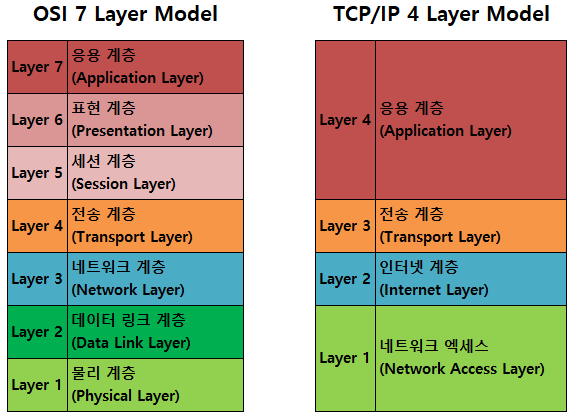

# OSI 7계층, TCP/IP 4계층
2022/07/13

## 1. OSI 7계층, TCP/IP 4계층

### OSI 7계층 
- Open Systems Interconnecrtoin 의 약자로서, ISO(국제표준화기구)에서 컴퓨터 네트워크 프로토콜 디자인과 통신을 계층으로 나눠 설명한 모델
### TCP/IP 4계층 : 
- 현재의 인터넷에서 컴퓨터들이 서로 정보를 주고 받는데 쓰이는 통신 규약(프로토콜)의 모음
- OSI가 이론적 표준이라면 TCP/IP는 실무적 표준

### 비교
- TCP/IP 프로토콜은 OSI 모델보다 먼저 개발되었다. 그러므로 TCP/IP 프로토콜의 계층은 OSI 모델의 계층과 정확하게 일치하지 않는다.
- 두 계층을 비교할 때 , 세션(Session)과 표현(presentation) 2개의 계층이 TCP/IP프로토콜 그룹에 없다는 것을 알 수 있다.
- 두 모델 모두 계층형 이라는 공통점을 가지고 있으며 TCP/IP는 인터넷 개발 이후 계속 표준화되어 신뢰성이 우수인 반면, OSI 7 Layer는 표준이 되기는 하지만 실제적으로 구현되는 예가 거의 없어 신뢰성이 저하되어있다.
- OSI 7 Layer는 장비 개발과 통신 자체를 어떻게 표준으로 잡을지 사용되는 반면에 실 질적인 통신 자체는 TCP/IP 프로토콜을 사용한다.

## 2. OSI (Open Systems Interconnection) 7 Model
### 7계층 : 응용 계층(Application Layer)
- 실제로 사용자가 사용하는 UI 및 I/O 작업
- 응용 프로세스 간의 정보 교환, 전자 메일, 파일 전송 등의 서비스를 제공
- 데이터 단위 : Message
- 프로토콜
  - HTTP
  - SMTP
  - FTP
### 6계층 : 표현 계층(Presentatoin Layer)
- 인코딩, 암호화
- 데이터 단위 : Message
### 5계층 : 세션 계층(Session Layer)
- 통신을 관리
  - duplex, half-duplex, full dupelx
  - 통신을 하기 위한 세션을 확립/유지/중단 (운영체제가 해줌)
- 데이터 단위 : Message
- 프로토콜
  - SSL, TLS
### 4계층 : 전송 계층(Transport Layer)
- 유저가 데이터를 주고 받을 수 있도록 함
- 데이터의 신뢰성 검증(시퀀스 넘버 기반)
  - 오류검출 및 복구
  - 흐름제어
  - 중복검사
- 데이터 단위 : Segment/Datagram
- 프로토콜
  - TCP, UDP, QUIC
### 3계층 : 네트워크 계층(Network Layer)
- 라우팅
  - 여러개의 노드를 거칠때마다 IP를 사용하여경로를 찾아주는 역할
- 포워딩
  - 다음 라우터로 넘김
- 흐름 제어, 세그멘테이션(segmentation/desegmentation), 오류 제어, 인터네트워킹
- 데이터 단위 : Packet
- 프로토콜
  - IP, ICMP, ARP, RARP...
### 2계층 : 데이터 링크 계층(Data Link Layer)
- 하드웨어와 소프트웨어의 연결점
- 데이터 단위 : frame
- 직접 연결된 두 point 간의 데이터 전송 담당
### 1계층 : 물리 계층(Physical Layer)
- 100110 과 같은 이진 데이터 송수신 (Digital ↔ Analog)
- 데이터 단위 : bit

## 3. TCP/IP Protocol Suite
### 4계층 : 응용 계층(Application Layer)
- FTP, HTTP< DNS 등 응용 프로그램이 사용되는 프로토콜 계층이다.
- 사용자와 가장 가까운 계층(실제 서비스를 제공하는 층)
- 데이터를 교환하기 위해 사용되는 프로토콜들 존재
- **데이터 단위 : Data**
- **프로토콜**
`  - DNS, TLS/SSH, HTTP, SMTP..`
---
①FTP (File Transfer Protocol)
- 파일 전송 프로토콜

②VSFTP (Very Secure File Transfer Protocol)
- VSFTP는 보안 부분을 특히 강조한 데몬으로 Redhat,Suse,Open-BSD에서 기본 FTP로 채택하고 있으며 보안, 빠른 퍼포먼스, 안정성을 주요 특징으로 소개하고 있다.

③SNMP (Simple Network Management Protocol)
- SNMP는 TCP/IP 프로토콜 그룹을 이용하여 인터넷상에서 장치를 관리하기위한 기반구조이다. 이것은 인터넷을 감시하고 관리하기 위한 기본적인 운영을 제공한다.

④SMTP (Simple Mail Transfer Protocol)
- 전자 우편을 보내고 받는데 사용되는 TCP/IP 프로토콜이다.

⑤HTTP (Hyper Text Transfer Protocol)
- Web-Browser같은 응용프로그램을 통해 Web-Client와 Web-Server사이에 데이터를 전송하는 프로토콜 이다.
- 평문 (암호화 하지않은) 통신이기 때문에 도청이 가능하다.

⑥HTTPS (Hyper Test Transfer Protocol Secure)
- HTTP의 약점을 보안하기 위하여 HTTP 암호화나 인증 등의 구조를 더한 것 이다.
- 웹페이지의 로그인이나 쇼핑의 결제 화면 등에서 사용되고 있다.

⑦DNS (Domain Name System)
- 네트워크상에서 컴퓨터들은 IP주소를 이용하여 서로를 구별하고 통신한다. 사람들이 네트워크를 통해 원격의 컴퓨터에 접속하기 위해서는 IP주소를 이용하여야 하지만, 숫자의 연속인 IP주소를 일일이 외울 수 없기 때문에 쉽게 기억할 수 있는 도메인 주소 체계가 만들어 졌다.
- 도메인 주소를 IP주소로 변환시켜주거나 그 반대의 기능을 한다.
---
### 3계층 : 전송 계층(Transport Layer)
- 송신자와 수신자를 연결하는 통신 서비스를 제공
- 연결 지향 데이터 스트림 지원, 신뢰성, 흐름 제어를 제공
- 애플리케이션과 인터넷 계층 사이의 데이터 전달시 중계 역할 을 한다.
- 대표적으로 TCP(패킷의 순서보장) 와 UDP(순서 보장X) 가 있다.
- 세그먼트 단위의 데이터를 구성한다.
- 연결 제어 및 데이터 송수신
- 세그먼트 : 데이터 전송을 위해 데이터를 일정 크기로 나눈 것(발신 수신 포트주소 오류검출코드가 붙는다)
- **데이터 단위 : Segment**
- **전송 주소 : Port**
- **프로토콜**
  - TCP, UDP,QUIC...
### 2계층 : 인터넷 계층(Internet Layer)
- 장치로 부터 받은 네트워크 패킷을 IP 주소로 지정된 목적지로 전송하기 위해 사용되는 계층
- IPP, ARP, ICMO 등이 있으며 패킷을 수신해야 할 상대의 주소를 지정하여 데이터를 전달한다.
- 상대방이 제대로 받았는지에 대해 보장하지 않는 비연결형적인 특징을 가진다.
- 최종 목적지까지 정확한 연결 제공 및 라우팅(경로설정)
- 단말을 구분하기 위해 논리적인 주소 IP 를 할당한다.
- 패킷 단위의 데이터 구성(세그먼트를 목적지까지 전송하기 위해 시작 주소와 목적지의 논리적 주소를 붙인 단위 = 데이터 + IP Header)
- **데이터 단위 : Packet**
- **전송 주소 : IP**
- **프로토콜**
  - IP, ARP, ICMP...
### 1계층 : 네트워크 연결 계층(Network Access Layer)
- 데이터가 네트워크를 통해 어떻게 전송되는지를 물리적으로 정의
  - → 논리주소(IP)가 아닌 물리 주소 (MAC) 사용
  - MAC 주소란 컴퓨터의 하드웨어 주소
- 프레임(Frame) 단위의 데이터 구선
  - 최종적으로 데이터 전송을 하기전 패킷헤더에 MAC 주소와 오류 검출을 위한 부분을 첨부한다.
- **데이터 단위 : 프레임**
- **전송 주소 : MAC**
- **프로토콜**
  - 이더넷, Wi-Fi...

## 참고 사이트
https://goitgo.tistory.com/25

https://marades.tistory.com/15

https://velog.io/@jehjong/%EA%B0%9C%EB%B0%9C%EC%9E%90-%EC%9D%B8%ED%84%B0%EB%B7%B0-TCPIP-4%EA%B3%84%EC%B8%B5