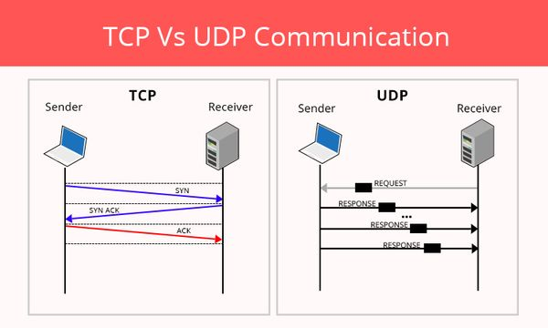
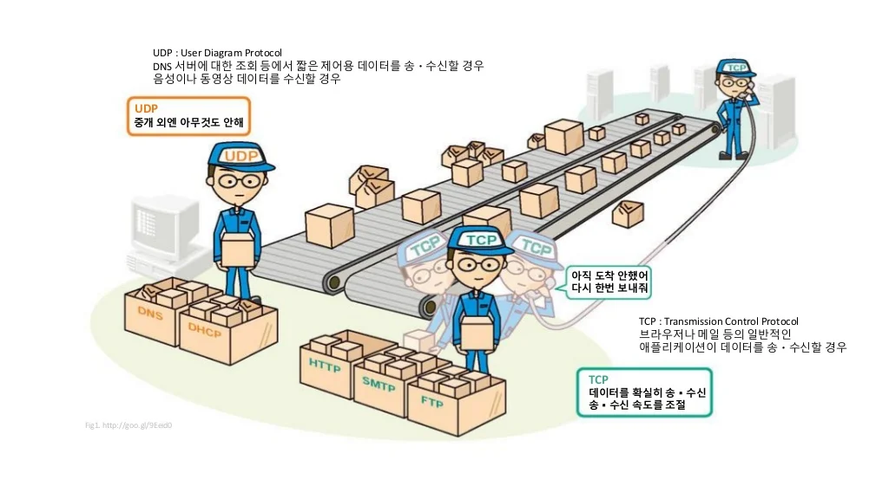
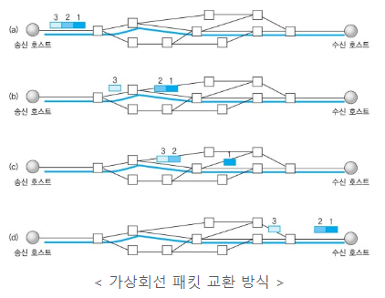
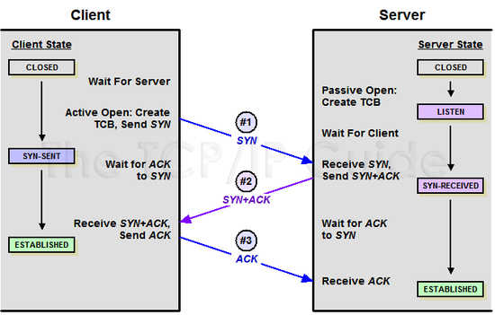
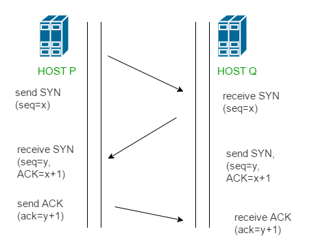
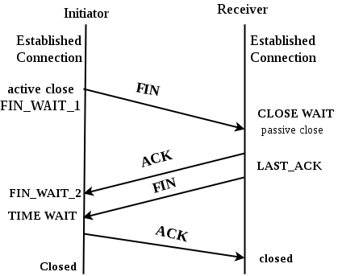
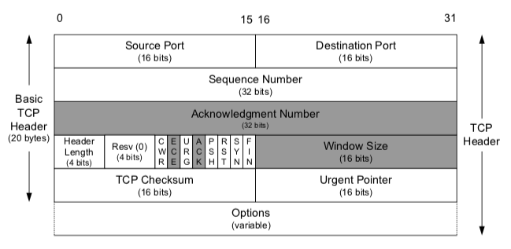
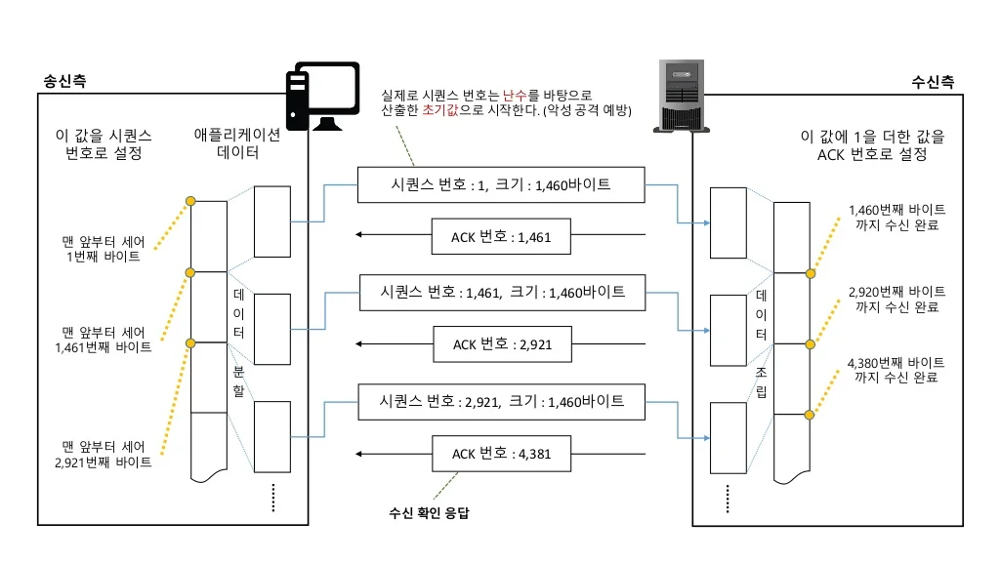
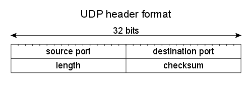

# TCP 와 UDP 비교
2022/07/13

## 1. 전송계층
- TCP와 UDP는 TCP/IP의 전송계층에서 사용되는 프로토콜이다. 
- 전송계층은 IP에 의해 전달되는 패킷의 오류를 검사하고 재전송 요구 등의 제어를 담당하는 계층이다.

## 2. TCP 와 UDP 비교
- TCP는 Transmission Control Protocol의 약자이고, UDP는 User Datagram Protocol의 약자이다. 
- 두 프로토콜은 모두 패킷을 한 컴퓨터에서 다른 컴퓨터로 전달해주는 IP 프로토콜을 기반으로 구현되어 있지만, 
- 그림을 통해 비교할 수 있다.

- TCP 는 데이터를 주고 받지만, UDP 는 일방적이다.
- 신뢰성이 요구되는 애플리케이션에서는 TCP를 사용하고 간단한 데이터를 빠른 속도로 전송하고자 하는 애플리케이션에서는 UDP를 사용한다.

| TCP                                             |UDP|
|-------------------------------------------------|---|
| Connection-oriented protocol(연결지향형 프로토콜)        |	Connection-less protocol(비 연결지향형 프로토콜)|
 | Connection by byte stream(바이트 스트림을 통한 연결)       |	Connection by message stream(메세지 스트림을 통한 연결)|
 | Congestion / Flow control(혼잡제어, 흐름제어)           |	NO Congestion / Flow control(혼잡제어와 흐름제어 지원 X)|
 | Ordered, Lower speed(순서 보장, 상대적으로 느림)           |	Not ordered, Higer speed(순서 보장되지 않음, 상대적으로 빠름)|
 | Reliable data transmission(신뢰성 있는 데이터 전송 - 안정적) |	Unreliable data transmission(데이터 전송 보장 X)|
 | TCP packet : Segment(세그먼트 TCP 패킷)               |	UDP packet : Datagram(데이터그램 UDP 패킷)|
 | HTTP, Email, File transfer 에서 사용                |	DNS, Broadcasting(도메인, 실시간 동영상 서비스에서 사용)|

## 3. TCP
- TCP는 네트워크 계층 중 전송 계층에서 사용하는 프로토콜로서, 장치들 사이에 논리적인 접속을 성립(establish)하기 위하여 연결을 설정하여 **신뢰성을 보장하는 연결형 서비스** 이다.
- 네트워크에 연결된 컴퓨터에서 실행되는 프로그램 간에 일련의 옥텟(데이터, 메세지, 세그먼트라는 블록 단위)를 안정적으로, 순서대로, 에러없이 교환할 수 있게 한다.

### **TCP 특징**
### Connection-oriented protocol(연결지향형 프로토콜)
**연결형 서비스로 가상 회선 패킷 교환 방식을 제공한다.** 
- 각 패킷에는 가상회선 식별 번호(VCI)가 포함된다.
- 각 패킷에는 가상회선 식별자가 포함한다. 
- 모든 패킷을 전송하면 가상회선이 해제된다.
- 가상회선이 해제되면 패킷들은 전송된 **순서대로** 도착하는 방식을 의미한다.
- 데이터 그램은 패킷마다 라우터가 경로를 선택하지만, 가상회선 방식은 경로를 설정할 때 한번만 수행한다.

### 3-way handshaking
**3-way handshaking 과정을 통해 연결을 설정한다.** 
TCP/IP프로토콜을 이용해서 통신을 하는 응용프로그램이 데이터를 전송하기 전에 먼저 정확한 전송을 보장하기 위해 상대방 컴퓨터와 사전에 세션을 수립하는 과정을 의미한다.

- Client > Server : TCP SYN
- Server > Client : TCP SYN ACK
- Client > Server : TCP ACK

*SYN : synchronize sequence numbers* 
*ACK : acknowledgment* 

[STEP 1] 
A클라이언트는 B서버에 접속을 요청하는 SYN 패킷을 보낸다.  
이때 A클라이언트는 SYN 을 보내고 SYN/ACK 응답을 기다리는SYN_SENT 상태가 되는 것이다. 

[STEP 2] 
B서버는 SYN요청을 받고 A클라이언트에게 요청을 수락한다는 ACK 와 SYN flag 가 설정된 패킷을 발송하고 A가 다시 ACK으로 응답하기를 기다린다.  
이때 B서버는 SYN_RECEIVED 상태가 된다. 

[STEP 3] 
A클라이언트는 B서버에게 ACK을 보내고 이후로부터는 연결이 이루어지고 데이터가 오가게 되는것이다. 
이때의 B서버 상태가 ESTABLISHED 이다. 

위와 같은 방식으로 통신하는것이 신뢰성 있는 연결을 맺어 준다는 TCP의 3 Way handshake 방식이다.

---
**정리** 
클라이언트가 서버에게 SYN 패킷을 보냄 (sequence : x) 
서버가 SYN(x)을 받고, 클라이언트로 받았다는 신호인 ACK와 SYN 패킷을 보냄 (sequence : y, ACK : x + 1) 
클라이언트는 서버의 응답은 ACK(x+1)와 SYN(y) 패킷을 받고, ACK(y+1)를 서버로 보냄 
---

### 4-way handshaking
**4-way handshaking 을 통해 연결을 해제한다.** 

[STEP 1] 
클라이언트가 연결을 종료하겠다는 FIN플래그를 전송한다. 

[STEP 2] 
서버는 일단 확인메시지를 보내고 자신의 통신이 끝날때까지 기다리는데 이 상태가 TIME_WAIT상태다. 

[STEP 3] 
서버가 통신이 끝났으면 연결이 종료되었다고 클라이언트에게 FIN플래그를 전송한다. 

[STEP 4] 
클라이언트는 확인했다는 메시지를 보낸다. 

- 그런데 만약 "Server에서 FIN을 전송하기 전에 전송한 패킷이 Routing 지연이나 패킷 유실로 인한 재전송 등으로 인해 FIN패킷보다 늦게 도착하는 상황"이 발생한다면 어떻게 될까요?
- Client에서 세션을 종료시킨 후 뒤늦게 도착하는 패킷이 있다면 이 패킷은 Drop되고 데이터는 유실될 것입니다.
- 이러한 현상에 대비하여 Client는 Server로부터 FIN을 수신하더라도 일정시간(디폴트 240초) 동안 세션을 남겨놓고 잉여 패킷을 기다리는 과정을 거치게 되는데 이 과정을 "TIME_WAIT" 라고 합니다.
- 세션을 만료하고 연결을 종료시키며, "CLOSE" 상태로 변화합니다.

> 주의
> 반드시 서버만 CLOSE_WAIT 상태를 갖는 것은 아니다.
> 서버가 먼저 종료하겠다고 FIN을 보낼 수 있고, 이런 경우 서버가 FIN_WAIT1 상태가 됩니다.
> 누가 먼저 close를 요청하느냐에 따라 상태가 달라질 수 있다.
---
**정리** 
1. 클라이언트는 서버에게 연결을 종료한다는 FIN 플래그를 보낸다.
2. 서버는 FIN을 받고, 확인했다는 ACK를 클라이언트에게 보낸다. (이때 모든 데이터를 보내기 위해 CLOSE_WAIT 상태가 된다)
3. 데이터를 모두 보냈다면, 연결이 종료되었다는 FIN 플래그를 클라이언트에게 보낸다.
4. 클라이언트는 FIN을 받고, 확인했다는 ACK를 서버에게 보낸다. (아직 서버로부터 받지 못한 데이터가 있을 수 있으므로 TIME_WAIT을 통해 기다린다.)
- 서버는 ACK를 받은 이후 소켓을 닫는다 (Closed)
- TIME_WAIT 시간이 끝나면 클라이언트도 닫는다 (Closed)
--- 

### Flow control(흐름제어)
데이터 처리 속도를 조절하여 수신자의 버퍼 오버플로우를 방지
- 송신하는 곳에서 감당이 안되게 많은 데이터를 빠르게 보내 수신하는 곳에서 문제가 일어나는 것을 막는다.
- 수신자가 윈도우크기(Window Size) 값을 통해 수신량을 정할 수 있다.

### Congestion(혼잡제어)
네트워크 내의 패킷 수가 넘치게 증가하지 않도록 방지
- 정보의 소통량이 과다하면 패킷을 조금만 전송하여 혼잡 붕괴 현상이 일어나는 것을 막는다.

### Reliable data transmission(신뢰성 있는 데이터 전송 - 안정적)
- Dupack-based retransmission
    - 정상적인 상황에서는 ACK 값이 연속적으로 전송되어야 한다.
    - 그러나 ACK값이 중복으로 올 경우 패킷 이상을 감지하고 재전송을 요청한다.
- Timeout-based retransmission
    - 일정시간동안 ACK 값이 수신을 못할 경우 재전송을 요청한다.

### 전이중, 점대점 방식
- 전이중 (Full-Duplex)
  - 전송이 양방향으로 동시에 일어날 수 있다.
- 점대점 (Point to Point)
  - 각 연결이 정확히 2개의 종단점을 가지고 있다.

=> 멀티캐스팅이나 브로드캐스팅을 지원하지 않는다.  

## 4. TCP Header

응용 계층으로부터 데이터를 받은 TCP는 헤더를 추가한 후에 이를 IP로 보낸다. 헤더에는 아래 표와 같은 정보가 포함된다.

| 필 드                                             | 내용                                                                                                                                           | 크기|
|-------------------------------------------------|----------------------------------------------------------------------------------------------------------------------------------------------|---|
|송수신자의 포트 번호| 	TCP로 연결되는 가상 회선 양단의 송수신 프로세스에 할당되는 포트 주소	                                                                                                   |16|
|시퀀스 번호(Sequence Number)	| 송신자가 지정하는 순서 번호, 전송되는 바이트 수를 기준으로 증가. SYN = 1 : 초기 시퀀스 번호가 된다. ACK 번호는 이 값에 1을 더한 값. SYN = 0 : 현재 세션의 이 세그먼트 데이터의 최초 바이트 값의 누적 시퀀스 번호	 |32|
|응답 번호(ACK Number)	| 수신 프로세스가 제대로 수신한 바이트의 수를 응답하기 위해 사용.	                                                                                                        |32|
|데이터 오프셋(Data Offset)| 	TCP 세그먼트의 시작 위치를 기준으로 데이터의 시작 위치를 표현(TCP 헤더의 크기)	                                                                                           |4|
|예약 필드(Reserved)	| 사용을 하지 않지만 나중을 위한 예약 필드이며 0으로 채워져야한다.	                                                                                                       |6|
|제어 비트(Flag Bit)| 	SYN, ACK, FIN 등의 제어 번호 -> 아래 추가 설명 참조	                                                                                                      |6|
|윈도우 크기(Window)	| 수신 윈도우의 버퍼 크기를 지정할 때 사용. 0이면 송신 프로세스의 전송 중지                                                                                                  |	16|
|체크섬(Checksum)	| TCP 세그먼트에 포함되는 프로토콜 헤더와 데이터에 대한 오류 검출 용도                                                                                                     |	16|
|긴급 위치(Urgent Pointer)| 	긴급 데이터를 처리하기 위함, URG 플래그 비트가 지정된 경우에만 유효	                                                                                                   |16|

### 제어 비트(Flag Bit) 정보

| 종류| 내용                                      |
|-------------------------------------------------|-----------------------------------------|
|URG|	긴급 위치를 필드가 유효한지 설정|
|ACK|	응답 번호 필드가 유효한지 설정. 클라이언트가 보낸 최초의 SYN 패킷 이후에 전송되는 모든 패킷은 이 플래그가 설정되어야 한다. 자세한 내용은 아래 추가 설명 참조|
|PSH|	수신 애플리케이션에 버퍼링된 데이터를 상위 계층에 즉시 전달할 때|
|RST|	연결의 리셋이나 유효하지 않은 세그먼트에 대한 응답용|
|SYN|	연결 설정 요구. 동기화 시퀀스 번호. 양쪽이 보낸 최초의 패킷에만 이 플래그가 설정되어 있어야 한다.|
|FIN|	더 이상 전송할 데이터가 없을 때 연결 종료 의사 표시|

### ACK 제어비트
- ACK는 송신측에 대하여 수신측에서 긍정 응답으로 보내지는 전송 제어용 캐릭터
- ACK 번호를 사용하여 패킷이 도착했는지 확인한다. 

-> 송신한 패킷이 제대로 도착하지 않았으면 재송신을 요구한다.

## 4. UDP

### UDP Header

응용 계층으로부터 데이터 받은 UDP도 UDP 헤더를 추가한 후에 이를 IP로 보낸다.

|필드| 크기 |내용|
|------------------------------------------|-------|---------------------------------------|
|송신자의 포트 번호|16|	데이터를 보내는 애플리케이션의 포트 번호|
|수신자의 포트 번호|	16|	데이터를 받을 애플리케이션의 포트 번호|
|데이터의 길이	|16|	UDP 헤더와 데이터의 총 길이|
|체크섬(Checksum)	|16	|데이터 오류 검사에 사용|

- TCP 헤더와 다르게 UDP 헤더에는 포함된 정보가 부실한 느낌마저 든다.
- UDP는 수신자가 데이터를 받는지 마는지 관심이 없기 때문이다. 즉, 신뢰성을 보장해주지 않지만 간단하고 속도가 빠른 것이 특징이다.

## 참고 사이트
https://bangu4.tistory.com/74

https://mindnet.tistory.com/entry/%EB%84%A4%ED%8A%B8%EC%9B%8C%ED%81%AC-%EC%89%BD%EA%B2%8C-%EC%9D%B4%ED%95%B4%ED%95%98%EA%B8%B0-22%ED%8E%B8-TCP-3-WayHandshake-4-WayHandshake

https://velog.io/@hidaehyunlee/TCP-%EC%99%80-UDP-%EC%9D%98-%EC%B0%A8%EC%9D%B4

https://coding-factory.tistory.com/613
