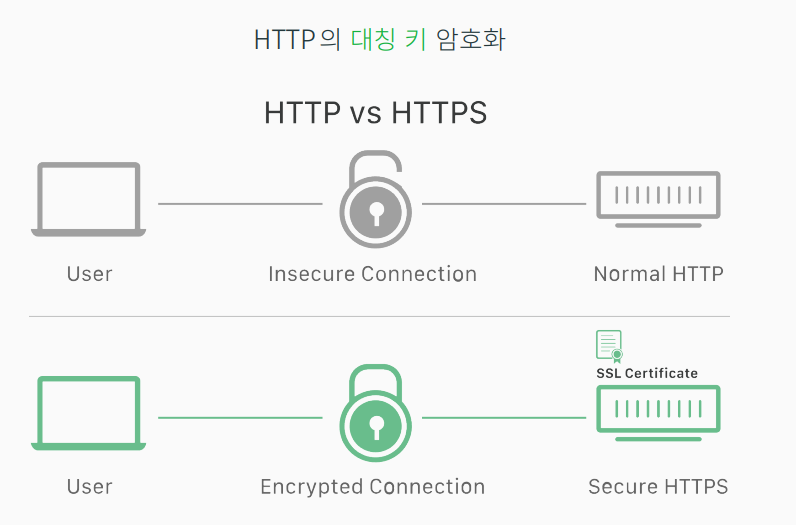
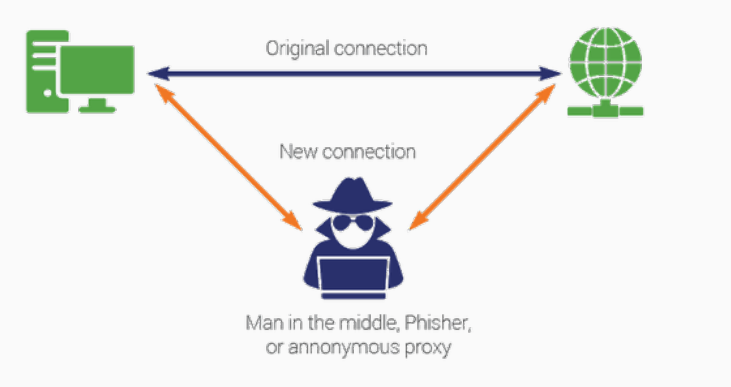
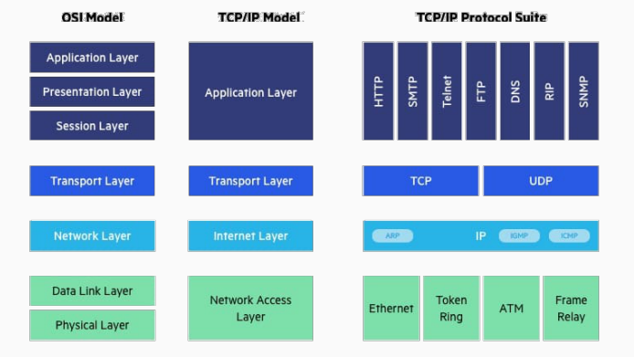
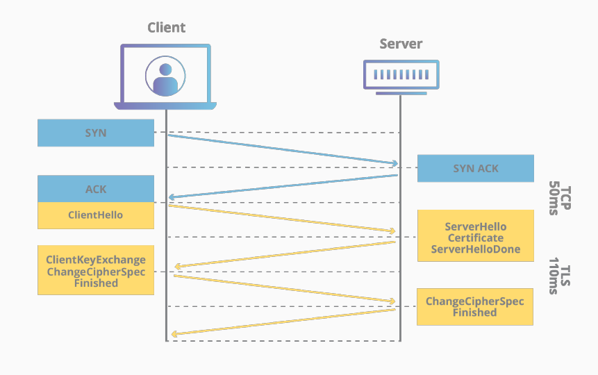

# SSL and TLS
2022/07/23

## 1. SSL 인증서

- HTTPS는 대칭 키 암호화 채널을 생성한다고 했는데，
- 도대체 대칭 키는 어떻게 공유할 것인가？
- 공개 키 암호화 방식으로 대칭 키를 서로 공유하자．

### 키 교환 알고리즘
- 공개 키 암호화 방식을 이용하여 암호화되지 않은 통신망을 통해 대칭 키를
- 공유할 수 있도록 한다．
- 사용자는 서버에게 공개 키를 달라고 한다． 서버는 자신의 공개 키를 보낸다．
- 사용자는 대칭 키를 생성하여 서버의 공개 키로 암호화해서 서버에게 보낸다．
- 서버는 사용자가 보내 온 암호화된 대칭 키를 자신의 비밀 키로 복호화 하여 대칭 키를 얻는다．
- DHKE, RSA, ECDH, ECDHE, ...

- **하지만 서버가 보내온 공개키가 진짜 그 서버의 키인지 확정할 수 없다**

### 중간자 공격
- Man in the middle attack
- 공격자가 통신 객체가 전송하는 공개 키를 자신의 공개 키로 바꾸는 것

### 인증서와 인증기관
- 공개 키의 진위 여부를 판단 할 수 있는 어떤 장치가 필요하다．
- 인증서는 서버의 공개 키를 권위있는 인증 기관이 서명한 증서이다．

#### 인증서(certificates)
인증서certificates 는 다음의 정보들의 조합이다．
- 서버의 공개 키
- 도메인 이름을 비롯한 서버의 여러 정보들
- 위의 두 가지를 합한 것을 인증 기관이 자신의 개인 키로 서명한 값

#### 인증 기관(certificate authorities， ca)
- 인증서를 발행하는 신뢰할 수 있는 기관， 놀랍게도 상업적인 기관이다．
- CA는 서버가 제출한 서류CSR 를 심사하여， 자신의 개인 키로 서명한 값을 추가한 인증서를 생성하여 서버에게 돈을 받고 준다． 그것도 매년 혹은 격년．
- 각 운영체제와 웹브라우저는 유명한 CA의 인증서（공개 키）를 미리 가지고 있다．
예） 맥의 키체인 접근， /usr/local/share/ca-certificates

### 인증서 예제
- `x509` : ITU-T가 만든 PKIPublic Key Infrastructure 공개 키 기반 구조의 표준
- `PEM` : X．509 v3 파일의 한 형태로써 Privacy Enhanced Mail은 Base64 인코딩된 ASCII text file． 확장자 p e m 으로 사용된다．
- `DER` : Distinguished Encoding Representation， 바이너리 형식으로 인코딩된 인증서． 확장자 d e r 로 사용된다．
- `key` : 개인 또는 공개 키， 대개 pem 형식
- `crt`， `cer` : 인증서를 나타내는 확장자로써， 대개 pem 형식
- `csr` : Certificate Signing Request는 인증기관（CA）에 인증서 발급 요청을 하는 파일이며 그 안에는 내 공개키 정보와 사용하는 알고리즘 정보등이 들어 있다． 대개 pem 형식

### 키 교환 방식
공개 키 암호화 방식을 이용하여 암호화되지 않은 통신망을 통해 대칭 키를 공유할 수 있도록 한다．
- A는 B에게 공개 키（인증서）를 달라고 한다． B는 자신의 공개 키가 들어있는 권위있는 인증 기관이 인증한 인증서를 보낸다．
- A는 자신이 이미 가지고 있는 인증 기관의 인증서（공개 키）로 B가 보내 온 인증서의 서명 값을 검증한다． 
- 맞으면， 대칭 키를 생성하여 인증서에 포함된 B의 공개 키로 암호화해서 B에게 보낸다．
- B는 A가 보내 온 암호화된 대칭 키를 자신의 비밀 키로 복호화 하여 대칭 키를 얻는다．

따라서 암호화된 채널을 만들기 위해서는 클라이언트와 서버간에 키 교환， 전자 서명， 암호 해시， 대칭 키 암호화 알고리즘이 서로 약속되어야 한다．

이것을 암호 모음 Cipher Suite 이라고 한다．

#### 암호모음
Cipher Suite， 안전한 통신 채널을 만들기 위한 암호 알고리즘들
- 키 교환 （Kx） RSA， Diffie-Hellman， Elliptic Curve Diffie-Hellman， Secure Remote Password， ．．．
- 서명 인증 （Au） RSA， Diffie-Hellman， DSS， ECDSA， ．．．
- 대칭 키 암호화 （Enc） AES128-CBC， AES256-GCM， ．．．
- 메시지 다이제스트 （Mac） MD5， SHA， SHA1， SHA256， SHA384， ．．．
  - 암호 모음 형식 Kx-Au-Enc-Mac
  - openssl 확인 openssl ciphers -v

## 2. TSL
- Transport Layer Security， HTTPS의 S 암호화를 담당
- 과거에 SSLsecure sockets layer 라고 불리었음． 사실은 지금도 ．．．
- 전송 계층 보안， 전송 데이터 암호화

- 1995년 넷스케이프에서 SSL 개발． SSL 1．0， SSL 2．0， SSL 3．0
- SSL 3．0을 보완하여 TLS 1．0 탄생 （1999）， 현재 버전은 TSL 1．3
- 두 개의 주요 프로토콜로 구성
  - **레코드 프로토콜** 전송할 자료의 형식을 결정 
  - **핸드세이크 프로토콜** 자료를 전송하는 방법． 이 방법이 바로 키 교환/합의 프로토콜이다．
- 자료는 TLS 레코드 형태로 전송． 레코드는 패킷의 이름이다．
- 자신이 전송하는 자료의 의미는 신경쓰지 않는다．
- 통신 프로토콜/응용 프로그램과는 독립적이다．
- 암호화는 레코드 프로토콜에서 이루어진다．

### 핸드세이크 프로토콜

1. ClientHello 클라이언트에서 생성한 랜덤 데이터， 클라이언트가 지원하는 암호화 방식들chipher suites， 세션 ID 등 포함한 패킷을 서버로 전송한다．
2. ServerHello 서버측에서 생성한 랜덤 데이터， 서버가 선택한 클라이언트의 암호화 방식등 포함한 패킷을 클라이언트로 전송한다． Certificate SSL 인증서를 세션키로 암호화한 패킷을 클라이언트로 전송한다． ServerHelloDone 서버 공개키 포함한 패킷을 클라이언트로 전송한다． （서버 공개키는 인증서에 포함되기도 하고 포함되지 않을 수도 있음）
3. ClientKeyExchange/ChangeCipherSpec/Finished 클라이언트 공개키를 포함한 패킷을 서버로 전송한다．
4. ChangeCipherSpec/Finished 세션키를 대칭키로 사용할 것을 정의하여 클라이언트로 전송한다．

## 정리
- 서버 SSL 인증서는 다름 아닌 인증 기관이 인정（서명）한 공개 키이다．
- 각 운영체제와 웹브라우저는 유명한 CA의 인증서（공개 키）를 미리 가지고 있어서 서버가 보내 온 인증서를 검증 할 수 있다． 서버의 공개 키를 믿을 수 있다．
- TLS는 SSL 3．0을 이어받아서 TLS v1， v1．1， 1．2， 1．3으로 발전 되어 왔고， 레코드 프로토콜과 핸드세이크 프로토콜로 이루어져 있다．

## 추가 공부 
• 공개 키 기반 구조， Public Key Infrastructurepki
• 공개 키 알고리즘의 수학적인 내용
    • 이산 대수 문제， Discrete Logarithm Problemdlp
    • RSA의 원리
    • Elliptic Curves Cryptographyecc
• 체인 인증서
• TLS의 세부 내용
• openssl의 사용법