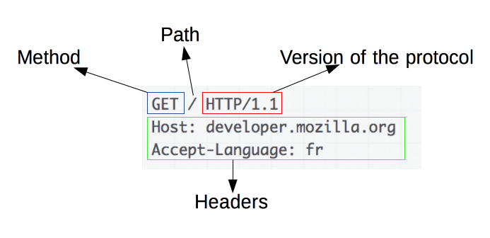

# HTTP 와 HTTPS
2022/07/23

## 1. HTTP(Hyper Text Transfer Protocol)
- HTTP(Hyper Text Transfer Protocol)란 서버/클라이언트 모델을 따라 데이터를 주고 받기 위한 프로토콜이다.
- HTTP는 인터넷에서 하이퍼텍스트를 교환하기 위한 통신 규약으로, 80번 포트를 사용하고 있다. 따라서 HTTP 서버가 80번 포트에서 요청을 기다리고 있으며, 클라이언트는 80번 포트로 요청을 보내게 된다.
- HTTP는 1989년 팀 버너스 리(Tim Berners Lee)에 의해 처음 설계되었으며, WWW(World-Wide-Web) 기반에서 세계적인 정보를 공유하는데 큰 역할을 하였다.

### 구조
- HTTP는 애플리케이션 레벨의 프로토콜로 TCP/IP 위에서 작동한다.
- HTTP는 상태를 가지고 있지 않는 Stateless 프로토콜이며 
- Method, Path, Version, Headers, Body 등으로 구성된다.

### 문제
- HTTP는 암호화가 되지 않은 평문 데이터를 전송하는 프로토콜이였기 때문에, 
- HTTP로 비밀번호나 주민등록번호 등을 주고 받으면 제3자가 정보를 조회할 수 있었다. 
- 이러한 문제를 해결하기 위해 HTTPS가 등장하게 되었다.

## 2. HTTPS(Hyper Text Transfer Protocol Secure)

- HyperText Transfer Protocol over Secure Socket Layer, 
- HTTP over TLS, 
- HTTP over SSL, 
- HTTP Secure
- 으로 불리는 HTTPS는 HTTP에 데이터 암호화가 추가된 프로토콜이다
- HTTPS는 HTTP와 다르게 443번 포트를 사용하며, 
- 네트워크 상에서 중간에 제3자가 정보를 볼 수 없도록 암호화를 지원하고 있다.

### HTTPS 의 동작 과정
- HTTPS는 대칭키 암호화와 비대칭키 암호화를 모두 사용하여 빠른 연산 속도와 안정성을 모두 얻고 있다.
- HTTPS 연결 과정(Hand-Shaking)에서는 먼저 서버와 클라이언트 간에 세션키를 교환한다. 여기서 세션키는 주고 받는 데이터를 암호화하기 위해 사용되는 대칭키이며, 데이터 간의 교환에는 빠른 연산 속도가 필요하므로 세션키는 대칭키로 만들어진다. 문제는 이 세션키를 클라이언트와 서버가 어떻게 교환할 것이냐 인데, 이 과정에서 비대칭키가 사용된다.
- 즉, 처음 연결을 성립하여 안전하게 세션키를 공유하는 과정에서 비대칭키가 사용되는 것이고, 이후에 데이터를 교환하는 과정에서 빠른 연산 속도를 위해 대칭키가 사용되는 것이다.

실제 HTTPS 연결 과정이 성립되는 흐름을 살펴보면 다음과 같다.

1. 클라이언트(브라우저)가 서버로 최초 연결 시도를 함
2. 서버는 공개키(엄밀히는 인증서)를 브라우저에게 넘겨줌
3. 브라우저는 인증서의 유효성을 검사하고 세션키를 발급함
4. 브라우저는 세션키를 보관하며 추가로 서버의 공개키로 세션키를 암호화하여 서버로 전송함
5. 서버는 개인키로 암호화된 세션키를 복호화하여 세션키를 얻음
6. 클라이언트와 서버는 동일한 세션키를 공유하므로 데이터를 전달할 때 세션키로 암호화/복호화를 진행함

### HTTPS의 발급 과정
<CA로부터 인증서 발급>
1. 기업은 자신의 public key 와 private key를 가지고 있는다.
2. 기업은 CA 로부터 인증서를 발급요청한다(public 키를 전달)
3. CA 는 public key(인증서) 를 CA 의 private 키로 암호화 하여 기업에게 제공한다
4. 기업은 받은 암호화된 public key(인증서) 가지게 된다.

5. <클라이언트와 통신>
6. 클라이언트는 기업서버와 통신을 원한다.
7. 기업은 CA 의 private 키로 암호화된 자사의 public key 를 전달한다.
8. 클라이언트는 CA 의 public key 를 이용하여 회사의 public key 를 얻는다.
9. 클라리언트는 회사의 public key 를 이용하여 대칭키를 암호화 하여 회사서버에 전달한다.
10. 회사서버는 자사의 private key 를 통해 복호화를 진행하여 서로 같은 대칭키를 가지게 된다.
11. 서로 같은 대칭키를 가지고 통신을 하게 된다.

## 3. 대칭키 암호화와 비대칭키 암호화
- HTTPS는 대칭키 암호화 방식과 비대칭키 암호화 방식을 모두 사용하고 있다.

### 대칭키 암호화
- 클라이언트와 서버가 동일한 키를 사용해 암호화/복호화를 진행함
- 키가 노출되면 매우 위험하지만 연산 속도가 빠름

### 비대칭키 암호화
- 1개의 쌍으로 구성된 공개키와 개인키를 암호화/복호화 하는데 사용함
- 키가 노출되어도 비교적 안전하지만 연산 속도가 느림

## 정리
- HTTP는 암호화가 추가되지 않았기 때문에 보안에 취약한 반면, 
- HTTPS는 안전하게 데이터를 주고받을 수 있다. 하지만 HTTPS를 이용하면 암호화/복호화의 과정이 필요하기 때문에 HTTP보다 속도가 느리다. 
- (물론 오늘날에는 거의 차이를 못느낄 정도이다.) 
- 또한 HTTPS는 인증서를 발급하고 유지하기 위한 추가 비용이 발생하다.
- 그렇다면 언제 HTTP를 쓰고, 언제 HTTPS를 쓰는 것이 좋겠는가?
- 개인 정보와 같은 민감한 데이터를 주고 받아야 한다면 HTTPS를 이용해야 하지만, 
- 노출이 되어도 괜찮은 단순한 정보 조회 등 만을 처리하고 있다면 HTTP를 이용하면 된다.\

## 참고사이트
https://mangkyu.tistory.com/98

## 이거봐라 사이트
https://babbab2.tistory.com/4?category=960153

https://babbab2.tistory.com/5?category=960153

https://babbab2.tistory.com/7?category=960153

