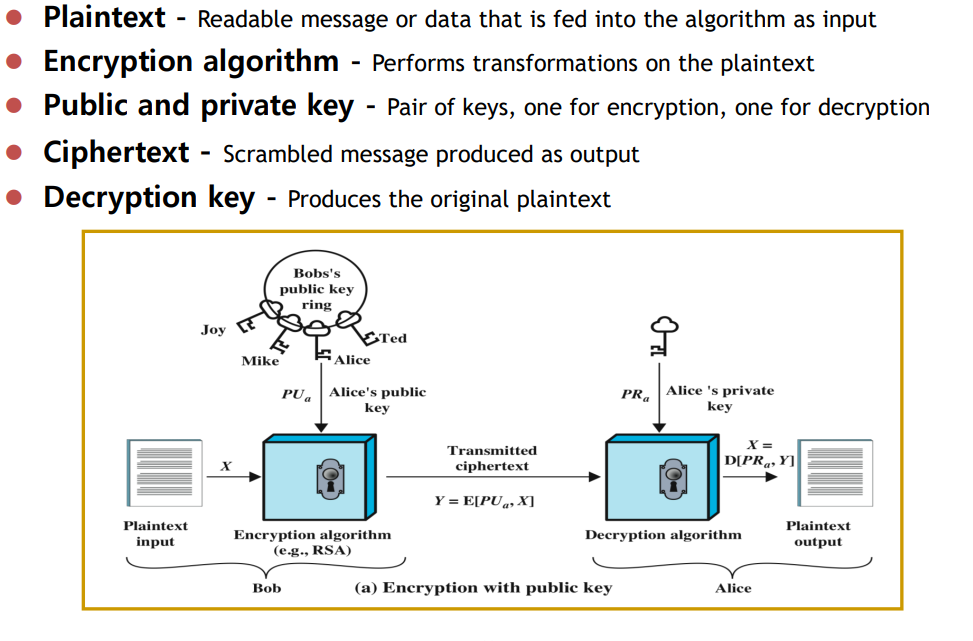
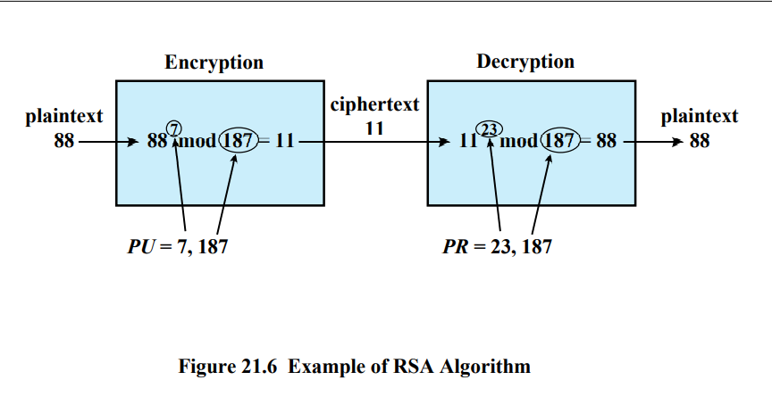

# HTTPS 보안 알고리즘
2022/07/23

## 1. 메시지 압축， Message Digest
- 메시지의 무결성 integrity 검사를 위하여 암호 해시 cryptographic hash 함수를 이용하여 생성하는 크기가 고정된 값
  - 비예측성 unpredictability
  - 역상 저항성 preimage resistance
- MD5， SHA-256， Keccak-256

### SHA-256
- SHA-256은 SHA(Secure Hash Algorithm) 알고리즘의 한 종류로서 256비트로 구성되며 64자리 문자열을 반환한다
- 해시 알고리즘 SHA-2 계열 중 하나이며, 2^256만큼 경우의 수를 만들 수 있다
- SHA-256 해시 함수는 어떤 길이의 값을 입력하더라도 256비트의 고정된 결과값을 반환한다
- 입력 값이 조금만 변동되더라도 반환값이 완전히 달라지기 때문에 반환값을 토대로 입력값을 유추하는 것이 거의 불가능하다
- 단방향 암호화 방식(평문을 암호화 했을 때, 원래 평문으로 복호화할 수 없는 암호화)이기 때문에 복호화가 불가능하다
- 복호화를 하지 않아도 되기 때문에 속도가 빠르며, 사용 예로 비밀번호의 일치여부 확인이 있다

```java
import java.security.NoSuchAlgorithmException;

public class Main {
    public static void main(String[] args) throws NoSuchAlgorithmException {
        SHA256 sha256 = new SHA256();
        
        //비밀번호
        String password = "hi12345678";
        //SHA256으로 암호화된 비밀번호
        String cryptogram = sha256.encrypt(password);
        
        System.out.println(cryptogram);
        
        //비밀번호 일치 여부
        System.out.println(cryptogram.equals(sha256.encrypt(password)));
    }
}
/*
  결과 값
  3d939b8a32d9e0138935522f8c524b3fbe2d5cc39bf6a2c04805f890b11f3bdb
  true
*/
```

## 2. 대칭 키 암호， Symmetric-Key Algorithm
- 암호화 encryption 와 복호화 decryption 에 같은 키 symmetric 를 사용하는 암호
- 대개 안전하며 암복호 속도가 매우 빠르다．
- 하지만， 대칭 키의 공유， 분배에 문제가 있다．
- AES128-CBC， AES256-GCM

### AES


- 데이터를 블록으로 나눕니다.
- 키 확장 : 블록에 초기 키를 추가
- 라운드 키를 추가합니다 :  뒤죽박죽으로 뒤덮인 새로운 128비트 라운드 키 추가
- 바이트의 대체/교체 : bit shift
- 행을 이동합니다 : row shift
- 열을 혼합하십시오 : column shift
- 라운드 키를 다시 추가합니다 : add round key
- 다시 하세요 : repeat

## 3. 공개 키 암호， Public-Key （Asymmetric-Key） Algorithm
- 암호화와 복호화에 서로 다른 키asymmetric 를 사용하는 암호
- 개인 키와 공개 키， 공개 키는 개인 키로 만든다．
- 암복호의 비용이 대칭 키 암호화에 비하여 매우 크다．
- Diffie-Hellman， RSA， ECC， ．．．




## 4. 전자 서명， Digital Signature Algorithm， DSA
- 공개 키 암호화 방식을 이용한 서명
- 송신자는 원본 파일의 메시지 압축값 md 을 구하고， 그 md값을 서명하여 수신자에게 원본과 서명을 보낸다．
- 수신자는 이미 가지고 있는 송신자의 공개 키를 사용하여 송신자가 보내 온 원본 파일과 서명을 검증한다．
- 송신자를 유일하게 식별할 수 있는 값을 이용해서 생성해야 한다(부인 방지 non-repudiation)
- RSA, ECDSA，...

### 방법
1) 개인키와 공개키 생성
- 보내야 할 데이터, 문서, 메시지 등을 해시 알고리즘으로 암호화하여 개인키와 공개키를 생성합니다. 
- 데이터는 해시 함수를 사용하여 암호화되기 때문에 데이터의 길이에 상관없이 고정된 크기의 해시를 생성하는데요. 
- 이렇게 해싱을 통해 개인키와 이에 상응하는 공개키를 생성합니다. 
- 이때 단 1비트라도 변하게 된다면 완전 다른 해시값을 내놓기 때문에 역산해서 암호를 푸는 것은 사실상 불가능합니다.

2) 서명
- 서명은 데이터나 문서에 발신자의 개인키가 포함됨으로써 서명을 하게 됩니다. 
- 또한 발신자는 수신자에게 개인키에 부합하는 공개키를 함께 보냅니다.
- 데이터가 해시화되었기 때문에 메시지 별로 모두 다른 디지털 서명을 갖게 됩니다.

3) 검증
- 수신자는 발신자가 보낸 공개키를 통해 디지털 서명의 유효성을 확인할 수 있습니다.


### 디지털 서명이 갖는 기술적 의의

1) 무결성 보장
- 무결성 보장이란 데이터나 문서 등이 전송되는 동안 변경되지 않았음을 의미합니다. 
- 만약 해킹 공격으로 인해 데이터가 변경이 된다면 서명이 무효화가 되기 때문에 데이터가 위변조된 것을 바로 알 수 있게 됩니다.

2) 인증
- 발신자 인증이란 데이터를 전송하는 주체에 대한 인증입니다. 
- 서명이 유효하다면 개인키를 보유한 사람이 발신했다는 것을 확인할 수 있습니다. 
- 또한 서명한 발신자가 다른 사람이 아니라는 것을 확인시켜주기 때문에 서명을 하지 않았다고 부인하는 것을 방지하기도 합니다.





## 참고사이트
https://bamdule.tistory.com/233


