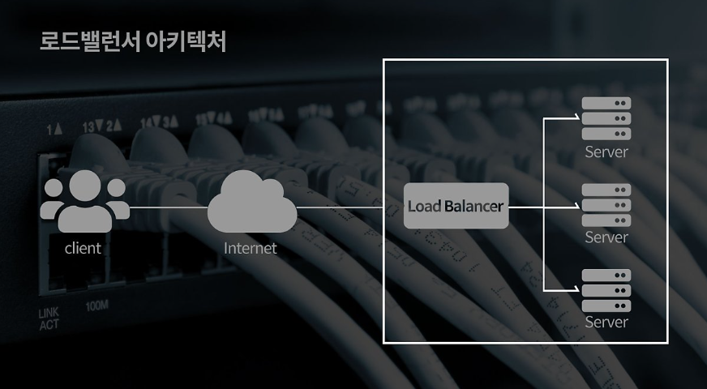
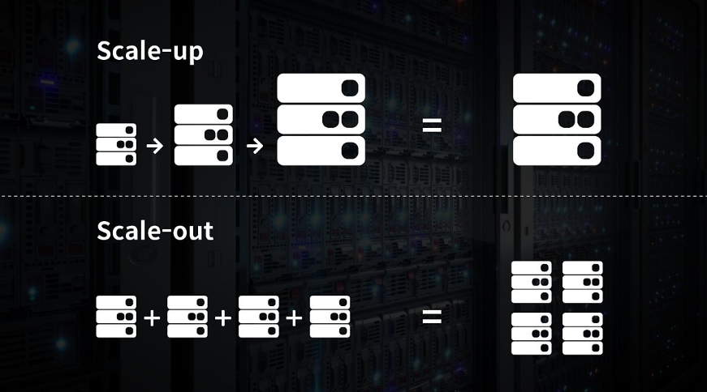
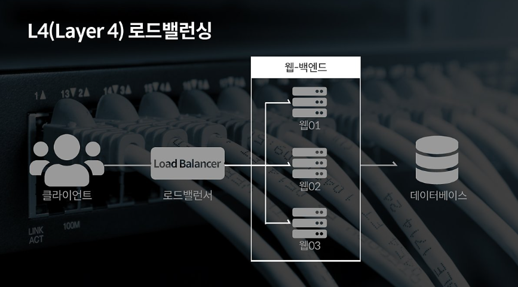
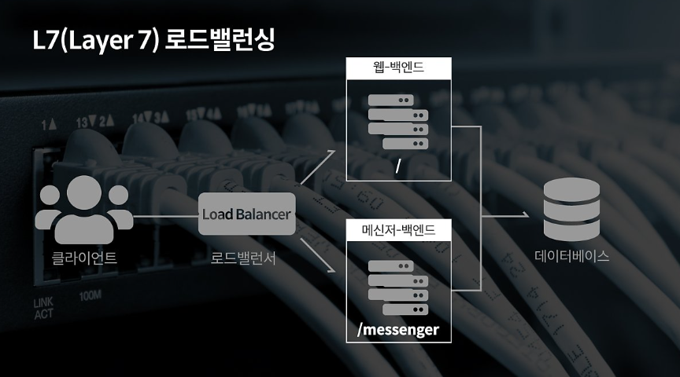
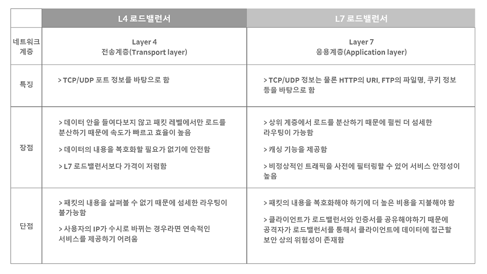
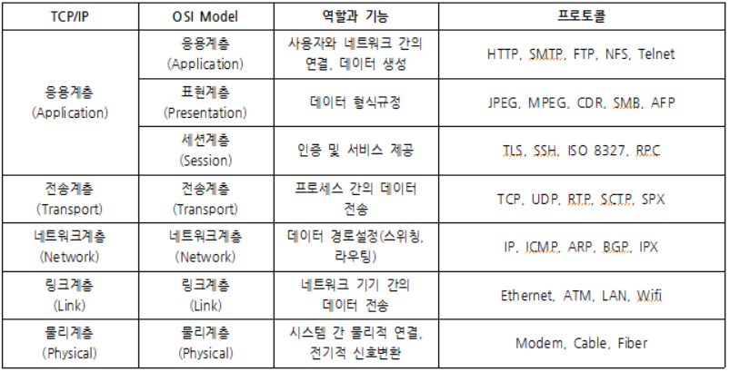

# 로드 밸런싱(Load Balancing)
2022/08/20

## 1. 로드 밸런싱이란
### 발생이유
- 트래픽이 증가함에 따라 한 서버에서 모든 트래픽을 감당할 수 없다.
- 기업들은 서버를 추가로 구비하고 여러 대의 서버에 동일한 데이터를 저장해 많은 트래픽을 분산해야 한다.
- 방대한 트래픽을 여러대의 서버로 분산해주는 기술이 바로 로드밸런싱이다.

### 호드밸런서란?

- 로드밸런서는 서버에 가해지는 부하(로드) 를 분산(밸런싱) 해주는 장치 또는 기술을 통칭
- 일반적으로 클라이언트와 서버풀(Server Pool, 분산 네트워크를 구성하는 서버들의 그룹) 사이에 위치
- 보통 2가지 방식으로 증가하는 트래픽을 대처한다.

### Scale-up, Scale-out

- Scale-up : 서버 자체의 성능을 롹장
- Scale-out : 기존 서버와 동일하거나 낮은 성능의 서버를 2개 이상 증설 운영
  - Scale-out 방식이 경우 여러대의 서버로 트래픽을 균등하게 분산해주는 **로드밸런싱** 이 반드시 필요

## 2. 로드 밸런싱 알고리즘
### 라운드로빈 방식(Round Robin Method)
- 서버에 들어온 요청을 순서대로 돌아가며 배정
- 순서대로 분배하므로 여러 대의 서버가 동일한 스펙을 갖고 있고, 서버와의 연결(세션)이 오래 지속되지 않는 경우에 적합

### 가중 라운드로빈 방식(Weighted Round Robin Method)
- 각각의 서버마다 가중치를 매기고 가중치가 높은 서버에 클라이언트 요청을 우선적으로 배분
- 주로 서버의 트래픽 처리 능력이 상이한 경우 사용되는 부하 분산 방식
ex) A 는 5의 가중치, B 는 2의 가중치를 가진다면, A 서버는 5개의 요청을, B 서버는 2개의 요청을 전달받는다.

### IP 해시 방식(IP Hash Method)
- 클라이언트의 IP 주소를 특정 서버로 매핑하여 요청을 처리하는 방식
- 사용자의 IP 를 해싱해 로드를 분배하기 때문에 사용자가 항상 동일한 서버로 연결되는 것을 보장한다.

### 최소 연결 방식(Least Connection Method)
- 요청이 들어오는 시점에 가장 적은 연결 상태를 보이는 서버에 우선적으로 트래픽 배분.
- 세션이 길어지거나, 서버에 분배된 트래픽들이 일정하지 않는 경우에 적합

### 최소 리스폰타임(Least Response Time Method)
- 서버의 현재 연결상태와 응답시간(Response Time : 서버에 요청을 보내고 최초 응답을 받을 때까지 소요되는 시간) 모두를 고려하여 트래픽 배분
- 가장 연결 상태와 가장 짧은 응답시간을 보이는 서버에 우선적으로 로드를 배분

### 3. L4 로드밸런서와 L7 로드밸런서
- L4, L7 : OSI 7계층에서 각각의 계층중 L4와 L7 을 의미한다.
- 상위 계층에서 사용되는 장비는 하위 계층의 장비가 갖고 있는 기능을 모두 가지기 때문에 상위 계층으로 갈수록 더욱 정교한 로드밸런싱이 가능

- L4 로드밸런서는 네트워크 계층(IP, IPX)나 트랜스포트 계층(TCP, UDP)의 정보를 바탕으로 로드를 분산
- IP 주소, 포트넘버, MAC 주소, 전송 프로토콜에 따라 트래픽을 나눌 수 있다.

- L7 로드밸런서는 애플리케이션 계층(HTTP, FTP, SMTP)에서 로드를 분산
- HPPT 헤더, 쿠키 등과 같은 사용자의 요청을 기준으로 특정 서버의 트래픽을 분산하는 것이 가능
  - 패킷의 내용을 확인하고 그 내용에 따라 로드를 특정 서버에 분배하는 것이 가능
  - 위 그림과 같이 URL 에 따라 부하를 분산시키거나, HTTP 헤더의 쿠키값에 따라 부하 분산 등 
  - 클라이언트 요청을 보다 세분화해 서버에 전달
- 특정한 패턴을 지닌 바이러스를 감지해 네트워크 보호 가능
- Dos/DDos 와 같은 비정상적인 트래픽을 필터링해 네트워크 보안 분야에서 활용 가능

### 잠깐 OST 7 계층 복습해보자

## 참고 사이트

