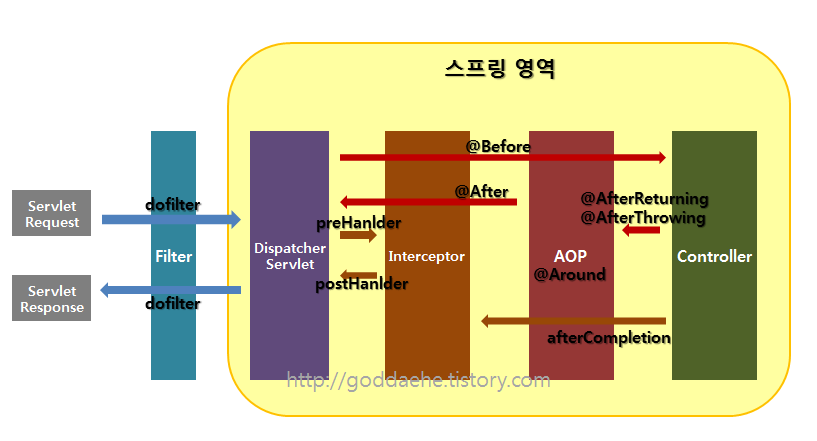

# Filter, Interceptor, AOP 차이
2022/07/12

## 1. 포스팅 이유
JWT OAuth 구현을 하면서 filter 에 대해 정리하던 중 실제 mvc 진행 순서에 대해서 알고 싶어졌다.

## 2. 공통 프로세스
스프링 개발을 하다보면 대표적으로 인가(Authorization) 과 같이 request 마다 권한 설정을 할 때는 공통적으로 처리를 해주어야 한다.
공통 프로세스 코드를 모든 페이지 마다 작성한다면 중복된 코드가 증가하게 될것이고, 유지보수에도 좋지않다.
이러한 공통 부분을 따로 빼서 관하기 위해서 3가지를 활용할 수 있다.

1. Filter
2. Interceptor
3. AOP

## 3. Filter, Interceptor, AOP 의 흐름

- 다음 그림을 보면 `Filter` 가 가장 밖에 있고, 그안에 `Interceptor` 그 다음에 `AOP` 가 있는 형태이다.
- `Request` 에 `Filter` -> `Interceptor` -> `AOP` -> `Interceptor` -> `Filter` 순서이다.
- `Interceptor` 와 `Filter` 는 `Servlet` 단위로 실행되고 `AOP` 는 메소드 앞에 `Proxy` 패턴의 형태로 실행된다.
1. 서버를 실행시켜 서블릿이 올라오는 동안 `init` 이 실행되고, 그 후 `doFilter` 가 실행된다.
2. 컨트롤러에 들어가기 전에 `preHandler` 가 실행된다.
3. 컨트롤러에서 나와 `postHandler`,` after Completion`, `doFilter` 순으로 진행이 된다.
4. 서블릿 종료 시 `destroy` 가 실행된다.

흐름을 파악했으니 각 요소에 대해 더 자세히 알아보자

## 4. Fiter
- J2EE 표준 스펙 기능으로 디스패처 서블릿(Dispatcher Servlet)에 요청이 전달되기 전/후에 url 패턴에 맞는 모든 요청에 대해 부가작업을 처리할 수 있는 기능을 제공한다

