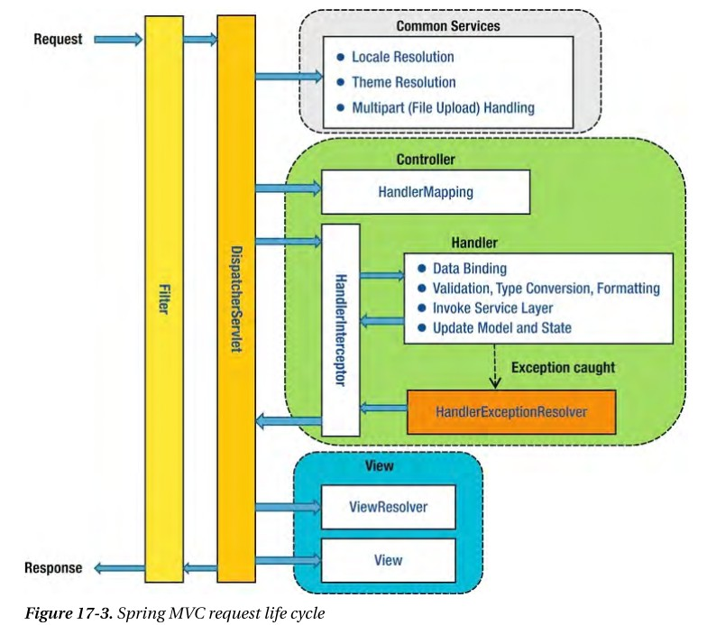

# OncePerRequestFilter 와 Filter의 차이
2022/07/12

## 1. 포스팅 이유
JWT OAUTH 구현을 하던 중 팀원으로 부터 authenticationfilter 를 사용할 때 GenericFilterBean 말고 OncePerRequestFilter 사용하라고 추천받았다.
그 이유로는 OncePerRequestFilter 의 경우 다른 서블렛으로 부터 요청을 받을때 수행할 수 있다고 하는데 정확한 이유에 대해 한번 알아보자

## 2. Spring MVC request life cycle
