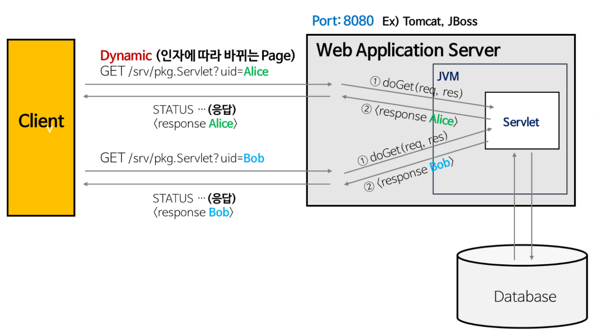
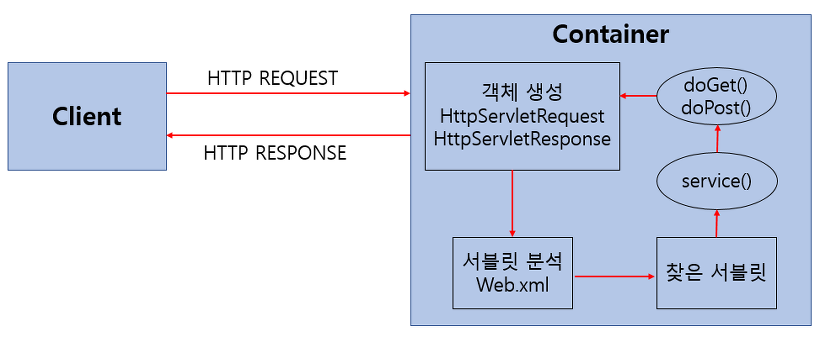
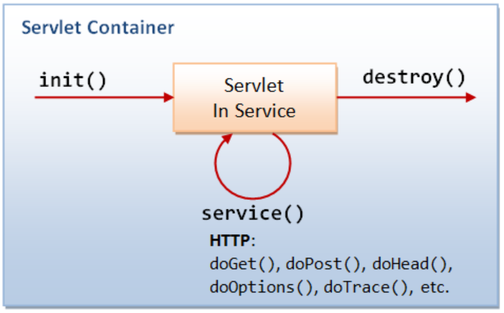

# 서블릿(Servlet) 이란?
2022/07/12

## 1. 포스팅 이유
기본적인 mvc 의 흐름을 파악하기 위해서 서블릿에 대해 필수적으로 알아야겠다고 생각했다. 

## 2. 서블릿 이란?


- 서블릿이란 동적 웹 페이지(Dynamic Web Page) 를 만들 때 사용되는 자바 기반의 웹 애플리케이션 프로그래밍 기술이다.
- 웹에는 수많은 request 와 response 가 존재하는데 서블릿이 웹 요청과 응답의 흐름을 간단한 메서드 호출만으로 체계적으로 다룰 수 있게 만드는 기술이다.

- 예를 들어 로그인을 시도할 때 서버가 클라이언트에서 입력되는 아이디와 비밀번호를 확인하고 응답하는 역할을 수행하는것이 서블릿이다.

## 3. 서블릿 특징
- 클라이언트의 요청에 대해 동적으로 작동하는 웹 어플리케이션 컴포넌트
- html을 사용하여 요청에 응답한다.
- Java Thread를 이용하여 동작한다.
- MVC 패턴에서 Controller로 이용된다.
- HTTP 프로토콜 서비스를 지원하는 javax.servlet.http.HttpServlet 클래스를 상속받는다.
- UDP보다 처리 속도가 느리다.
- HTML 변경 시 Servlet을 재컴파일해야 하는 단점이 있다.

## 4. 서블릿 컨테이너
- 우리가 서버에 서블릿을 만들었다고 해서 스스로 작동하는 것이 아니다
- 서블릿 컨테이너란 서블릿을 담고 관리해주는 컨테이너이다.
- 서블릿 컨테이너는 클라이언트의 요청(Request)을 받아주고 응답(Response)할 수 있게, 웹서버와 소켓으로 통신하며 대표적인 예로 톰캣(Tomcat)이 있다.

### 서블릿 컨테이너의 역할
1. 웹서버와의 통신 지원
서블릿 컨테이너는 서블릿과 웹서버가 손쉽게 통신할 수 있게 해준다.. 일반적으로 우리는 소켓을 만들고 listen, accept 등을 해야하지만 서블릿 컨테이너는 이러한 기능을 API로 제공하여 복잡한 과정을 생략할 수 있게 해준다. 그래서 개발자가 서블릿에 구현해야 할 비지니스 로직에 대해서만 초점을 두게끔 도와준다.
2. 서블릿 생명주기(Life Cycle)관리 
서블릿 컨테이너는 서블릿의 탄생과 죽음을 관리한다. 서블릿 클래스를 로딩하여 인스턴스화하고, 초기화 메소드를 호출하고, 요청이 들어오면 적절한 서블릿 메소드를 호출한다. 또한 서블릿이 생명을 다 한 순간에는 적절하게 Garbage Collection(가비지 컬렉션)을 진행하여 편의를 제공한다.
3. 멀티쓰레드 지원 및 관리 
서블릿 컨테이너는 요청이 올 때 마다 새로운 자바 쓰레드를 하나 생성하는데, HTTP 서비스 메소드를실행하고 나면, 쓰레드는 자동으로 죽게된다. 원래는 쓰레드를 관리해야 하지만 서버가 다중 쓰레드를생성 및 운영해주니 쓰레드의 안정성에 대해서 걱정하지 않아도 된다.
4. 선언적인 보안 관리 
서블릿 컨테이너를 사용하면 개발자는 보안에 관련된 내용을 서블릿 또는 자바 클래스에 구현해 놓지 않아도된다. 일반적으로 보안관리는 XML 배포 서술자에 다가 기록하므로, 보안에 대해 수정할 일이 생겨도 자바 소스 코드를수정하여 다시 컴파일 하지 않아도 보안관리가 가능하다

## 5. 서블릿 동작 방식


- 클라이언트가 웹 서버에 요청하면 웹 서버는 그 요청을 톰캣과 같은 WAS 에 위임한다.
- 그러면 WAS 는 각 요청에 해당하는 서블릿을 실행한다.
- 그리고 서블릿은 요청에 대한 기능을 수행한 후 그 결과를 반환하여 클라이언트에게 전송한다.

1. 클라이언트 요청
2. HttpServletRequest, HttpServletResponse 객체 생성
3. Web.xml이 어느 서블릿에 대해 요청한 것인지 탐색
4. 해당하는 서블릿에서 service() 메소드 호출
5. doGet() 또는 doPost() 호출
6. 동적 페이지 생성 후 ServletResponse 객체에 응답 전송
7. HttpServletRequest, HttpServletResponse 객체 소멸

※ web.xml : 서블릿을 작성했다면 해당 서블릿을 사용자가 요청한 경로와 맵핑시켜야 WAS에서 맵핑된 정보를 읽어서 브라우저에서 해당 URL로 HTTP요청 시 해당 서블릿으로 요청을 전달해 줄 수 있다. 소스를 분석할 때도 가장 먼저 확인해봐야 할 부분이다. 톰캣을 예로 들면 웹 어플리케이션 서비스 처리에 대해 정의된 환경 설정 파일이 server디렉터리의 web.xml에 있다.

### 서블릿 설정 파일(web.xml)
```xml
<?xml version="1.0" encoding="UTF-8"?>
<web-app xmlns:xsi="http://www.w3.org/2001/XMLSchema-instance"
     xmlns="http://xmlns.jcp.org/xml/ns/javaee"
     xsi:schemaLocation="http://xmlns.jcp.org/xml/ns/javaee http://xmlns.jcp.org/xml/ns/javaee/web-app_3_1.xsd"
     version="3.1">
 
     <servlet> //서블릿 클래스를 서블릿으로 등록
           <servlet-name>myServlet</servlet-name> //해당 서블릿을 참조할 때 사용할 이름
           <servlet-class>controller.MyServlet</servlet-class> //서블릿으로 사용할 서블릿 클래스의 FullName
     </servlet>
 
     <servlet-mapping>
           <servlet-name>myServlet</servlet-name> //매핑할 서블릿의 이름
           <url-pattern>/myServlet</url-pattern> //매핑할 URL 패턴
     </servlet-mapping>
 
</web-app>
```
- 서블릿을 작성하였다면 해당 서블릿을 사용자가 요청한 경로와 맵핑시켜줘야 WAS에서 맵핑된 정보를 읽어서 브라우저에서 해당 URL로 HTTP 요청 시 해당 서블릿으로 요청을 전달해 줄 수 있다.
- 소스를 분석할 때도 가장 먼저 확인해봐야 할 부분이다.
- 톰캣을 예로 들자면 웹 애플리케이션 서비스 처리에 대한 정의된 환경 설정 파일이 server디렉터리의 web.xml에 있다.

## 6. 서블릿의 생명주기


> 서블릿도 자바 클래스이므로 실행하면 초기화부터 서비스 수행 후 소멸하기까지의 과정을 거친다. 이 과정을 서블릿의 생명주기라하며 각 단계마다 호출되어 기능을 수행하는 콜백 메서드를 서블릿 생명주기 메서드라한다.

1. 클라이언트의 요청이 들어오면 컨테이너는 해당 서블릿이 메모리에 있는지 확인하고, 없을 경우 init()메서드를 호출하여 메모리에 적재한다. init()은 처음 한번만 실행되기 때문에, 서블릿의 스레드에서 공통적으로 사용해야 하는 것이 있다면 오버라이딩 하여 구현하면 된다. 실행 중 서블릿이 변경될 경우, 기존 서블릿을 destroy()하고 init()을 통해 새로운 내용을 다시 메모리에 적재한다.

2. init()이 호출된 후 클라이언트의 요청에 따라서 service() 메소드를 통해 요청에 대한 응답이 doGet()과 doPost()로 분기된다. 이 때 서블릿 컨테이너가 클라이언트의 요청이 오면 가장 먼저 처리하는 과정으로 생성된 HttpServletRequest, HttpServleResponse에 의해 request와 response 객체가 제공된다.

3. 컨테이너가 서블릿에 종료 요청을 하면 destroy() 메소드가 호출되는데 마찬가지로 한번만 실행되며, 종료시에 처리해야 하는 작업들은 destroy() 메소드를 오버라이딩하여 구현하면 된다.

```java
public class myServlet extends HttpServlet {

    @Override
    public void init(ServletConfig config) throws ServletException {
        System.out.println("init method 호출!");
    }
    
    @Override
    public void destroy() {
        System.out.println("destroy method 호출!");
    }
    
    @Override
    protected void doGet(HttpServletRequest request, HttpServletResponse response)
        throws ServletException, IOException
    {
        System.out.println("doGet service method 호출!");		
    }
    
    @Override
    protected void doPost(HttpServletRequest request, HttpServletResponse response)
        throws ServletException, IOException
    {
        System.out.println("doPost service method 호출!");		
    }
	
}
```

### init()
**서블릿이 처음으로 요청될 때 초기화를 하는 메서드이다.** <br>
클래스를 new 해서 사용하듯 서블릿 클래스도 초기화해주어야 사용이 가능하다. 이렇게 초기화된 서블릿은 싱글톤으로 관리되어 다음에 한번 더 해당 서블릿 클래스를 호출하면 초기화가 다시 일어나는 것이 아니라 기존에 있던 서블릿 클래스를 호출한다.

### service()
**서블릿 컨테이너가 요청을 받고 응답을 내려줄 때 필요한 서블릿의 service 메서드이다**. <br>
Servlet interface를 구현한 HttpServlet 클래스의 doGet, doPost 같은 메서드들이 호출된다.

### destroy()
**더 이상 사용되지 않는 서블릿 클래스는 주기적으로 서블릿 컨테이너가 destory() 메서드를 호출하여 제거한다**. <br>
이렇게 제거된 서블릿은 service 메서드들에 해당하는 모든 스레드들이 종료되거나 사용시간이 오래되어 타임아웃된 경우에는 이 클래스를 다시 사용하기 위해서는 init()을 다시 해주어야 한다.

## 참고 사이트
https://velog.io/@falling_star3/Tomcat-%EC%84%9C%EB%B8%94%EB%A6%BFServlet%EC%9D%B4%EB%9E%80

https://mangkyu.tistory.com/14

https://coding-factory.tistory.com/742


