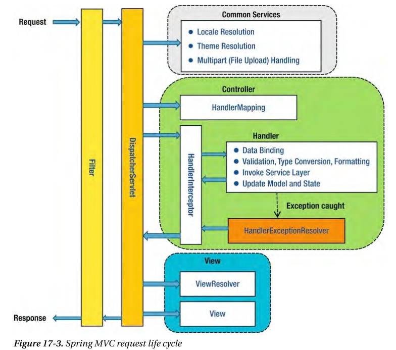

# Dispatcher-Servlet(디스패처 서블릿)이란?
2022/07/13

## 1. 포스팅 이유
필터에서 dispatch 가 발생한다는데 정확한 개념에 대해 파악하고자 한다

## 2. 디스패처 서블릿

- 디스패처 서블릿의 dispatch는 "보내다"라는 뜻을 가지고 있다.
- 그리고 이러한 단어를 포함하는 디스패처 서블릿은 HTTP 프로토콜로 들어오는 모든 요청을 가장 먼저 받아 적합한 컨트롤러에 위임해주는 프론트 컨트롤러(Front Controller)라고 정의할 수 있다
- 클라이언트로부터 어떠한 요청이 오면 Tomcat(톰캣)과 같은 서블릿 컨테이너가 요청을 받게 된다
- 이 모든 요청을 프론트 컨트롤러인 디스패처 서블릿이 가장 먼저 받게 된다.
- 디스패처 서블릿은 공통적인 작업을 먼저 처리한 후에 해당 요청을 처리해야 하는 컨트롤러를 찾아서 작업을 위임한다
- Front Controller는 주로 서블릿 컨테이너의 제일 앞에서 서버로 들어오는 클라이언트의 모든 요청을 받아서 처리해주는 컨트롤러이다

## 3. 디스패처 서블릿의 장점
- dispatcher-servlet이 해당 **어플리케이션으로 들어오는 모든 요청을 핸들링해주고 공통 작업을 처리**면서 상당히 편리하게 이용할 수 있게 되었다.
- 우리는 컨트롤러를 구현해두기만 하면 디스패처 서블릿가 알아서 적합한 컨트롤러로 위임을 해주는 구조가 되었다.

## 4. 디스패처 서블릿의 정적자원 처리
- Dispatcher Servlet이 요청을 Controller로 넘겨주는 방식은 효율적으로 보인다.
- 하지만 Dispatcher Servlet이 모든 요청을 처리하다보니 이미지나 HTML/CSS/JavaScript 등과 같은 정적 파일에 대한 요청마저 모두 가로채는 까닭에 정적자원(Static Resources)을 불러오지 못하는 상황도 발생하곤 한다.
- 2가지 해결방법이 있다.

1. 정적 자원에 대한 요청과 애플리케이션에 대한 요청을 분리
- /apps 의 URL로 접근하면 Dispatcher Servlet이 담당한다.
- /resources 의 URL로 접근하면 Dispatcher Servlet이 컨트롤할 수 없으므로 담당하지 않는다.
> 코드가 지저분해지며, 모든 요청에 대해서 저런 URL을 붙여주어야 하므로 직관적인 설계가 될 수 없다
 
2. 애플리케이션에 대한 요청을 탐색하고 없으면 정적 자원에 대한 요청으로 처리
- Dispatcher Servlet이 요청을 처리할 컨트롤러를 먼저 찾고, 요청에 대한 컨트롤러를 찾을 수 없는 경우에, 2차적으로 설정된 자원(Resource) 경로를 탐색하여 자원을 탐색하는 것이다.
> 영역을 분리하면 효율적인 리소스 관리를 지원할 뿐 아니라 추후 확장을 용이하게 해준다는 장점이 있다.

## 5. 디스패처 서블릿의 동작 과정

- 디스패처 서블릿은 적합한 컨트롤러와 메소드를 찾아 요청을 위임하고 결과를 받아온다.

1. 클라이언트의 요청을 디스패처 서블릿이 받음
2. 요청 정보를 통해 요청을 위임할 컨트롤러를 찾음
3. 요청을 컨트롤러로 위임할 핸들러 어댑터를 찾아서 전달함
4. 핸들러 어댑터가 컨트롤러로 요청을 위임함
5. 비지니스 로직을 처리함
6. 컨트롤러가 반환값을 반환함
7. HandlerAdapter가 반환값을 처리함
8. 서버의 응답을 클라이언트로 반환함

---
1. 클라이언트의 요청을 디스패처 서블릿이 받음

- 서블릿 컨텍스트에서 필터를 지나 스프링 컨텍스트에서 디스패치 서블릿이 가장 먼저 요청을 받게 된다.
- 그 후 interceptor 와 controller 를 거쳐 반환값을 받는다
- 이때 interceptor 가 controller 로 요청을 위임하지는 않는다(그림의 도식화)

2. 요청 정보를 통해 요청을 위임할 컨트롤러를 찾음
- 디스패치 서블릿은 요청을 처리할 컨트롤러를 찾고 해당 메소드에 이를 위임한다.
- HandleMapping 의 구현체 중 하나인 RequestMappingHandlerMapping 은 모든 컨트롤러 빈을 파싱한다
- 그 후 HashMap 으로 요청정보와 처리 대상을 관리한다.
- 정확하게 컨트롤러를 찾는게 아닌, 요청에 매핑하는 컨트롤러와 해당 메소드 등을 갖는 HandleMethod 객체를 찾는다.
- HadlerMapping은 요청이 오면 Http Method, URI 등을 사용해 Key 객체인 요청 정보를 만들고, Value인 요청을 처리할 HandlerMethod를 찾아 HandlerMethodExecutionChain으로 감싸서 반환한다.
- andlerMethodExecutionChain으로 감싸는 이유는 컨트롤러로 요청을 넘겨주기 전에 처리해야 하는 인터셉터 등을 포함하기 위해서이다

3. 요청을 컨트롤러로 위임할 핸들러 어댑터를 찾아서 전달함
- 디스패처 서블릿은 컨트롤러로 요청을 직접 위임하는 것이 아니라 HandlerAdapter를 통해 컨트롤러로 요청을 위임한다
- Adapter를 통해 컨트롤러를 호출하는 이유는 **공통적인 전/후처리 과정이 필요**하기 때문이다
- 대표적으로 요청 시에 @RequestParam, @RequestBody 등을 처리하기 위한 ArgumentResolver 와
- 응답 시에 ResponseEntity의 Body를 Json으로 직렬화하는 등의 처리를 하는 ReturnValueHandler 들이 어댑터를 통해 처리한다
- 디스패처 서블릿은 대신 컨트롤러로 요청을 위임할 HandlerAdapter 구현체인 RequestMappingHandlerAdapter를 찾는다
- 앞서 찾은 HandlerMethodExecutionChain이 갖는 인터셉터들을 모두 실행한 다음에 HandlerAdapter를 통해 컨트롤러의 메소드를 호출하도록 요청을 위임한다

4. 핸들러 어댑터가 컨트롤러로 요청을 위임함
- 요청을 처리할 대상 정보인 HandlerMethod 객체에는 컨트롤러 정보와 메소드 객체가 있으므로 리플렉션의 메소드 객체를 invoke 한다.
- 실제로는 HandlerMethod에 컨트롤러 빈 이름과 메소드, 빈 팩토리가 있어서 빈 팩토리에서 컨트롤러 빈을 찾는다.

5. 비지니스 로직을 처리함

6. 컨트롤러가 반환값을 반환함
- 비지니스 로직이 처리된 후에는 컨트롤러가 반환값을 반환한다. 주로 ResponseEntity를 반환한다.

7. HandlerAdapter가 반환값을 처리함 
- HandlerAdapter는 컨트롤러로부터 받은 응답을 응답 처리기인 ReturnValueHandler가 후처리한 후에 디스패처 서블릿으로 돌려준다.
- 만약 컨트롤러가 ResponseEntity를 반환하면 HttpEntityMethodProcessor가 MessageConverter를 사용해 응답 객체를 직렬화하고 응답 상태(HttpStatus)를 설정한다. 
- 만약 컨트롤러가 View 이름을 반환하면 ViewResolver를 통해 View를 반환한다

8. 서버의 응답을 클라이언트로 반환함
- 디스패처 서블릿을 통해 반환되는 응답은 다시 필터들을 거쳐 클라이언트에게 반환된다.

## 디스패처 서블릿 실제 소스 코드
https://mangkyu.tistory.com/216

## 출처 사이트
https://mangkyu.tistory.com/18
