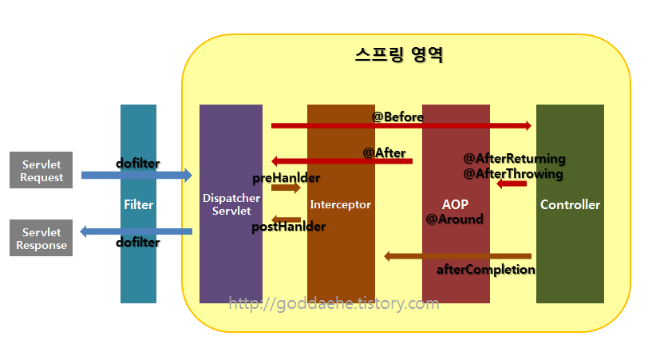
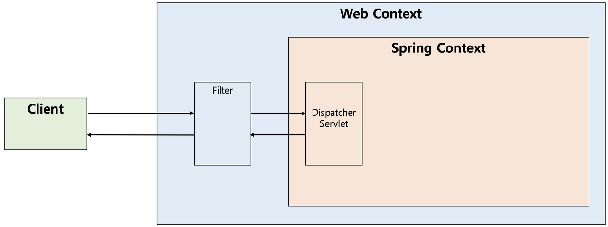
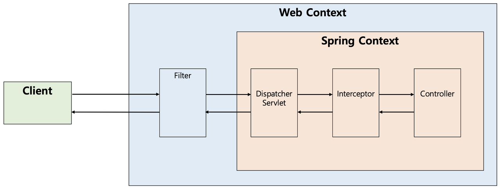
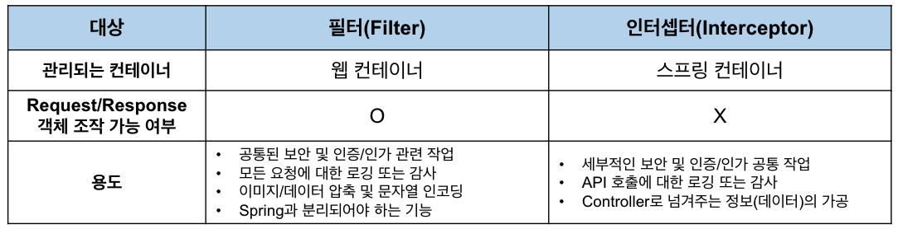

# Filter, Interceptor 차이
2022/07/12

## 1. 포스팅 이유
JWT OAuth 구현을 하면서 filter 에 대해 정리하던 중 실제 mvc 진행 순서에 대해서 알고 싶어졌다.

## 2. 공통 프로세스
스프링 개발을 하다보면 대표적으로 인가(Authorization) 과 같이 request 마다 권한 설정을 할 때는 공통적으로 처리를 해주어야 한다.<br>
공통 프로세스 코드를 모든 페이지 마다 작성한다면 중복된 코드가 증가하게 될것이고, 유지보수에도 좋지않다.<br>
이러한 공통 부분을 따로 빼서 관하기 위해서 3가지를 활용할 수 있다.<br>

1. Filter
2. Interceptor
3. AOP

## 3. Filter, Interceptor, AOP 의 흐름

- 다음 그림을 보면 `Filter` 가 가장 밖에 있고, 그안에 `Interceptor` 그 다음에 `AOP` 가 있는 형태이다.
- `Request` 에 `Filter` -> `Interceptor` -> `AOP` -> `Interceptor` -> `Filter` 순서이다.
- `Interceptor` 와 `Filter` 는 `Servlet` 단위로 실행되고 `AOP` 는 메소드 앞에 `Proxy` 패턴의 형태로 실행된다.

1. 서버를 실행시켜 서블릿이 올라오는 동안 `init` 이 실행되고, 그 후 `doFilter` 가 실행된다.
2. 컨트롤러에 들어가기 전에 `preHandler` 가 실행된다.
3. 컨트롤러에서 나와 `postHandler`,` after Completion`, `doFilter` 순으로 진행이 된다.
4. 서블릿 종료 시 `destroy` 가 실행된다.

흐름을 파악했으니 각 요소에 대해 더 자세히 알아보자

## 4. Fiter

- J2EE 표준 스펙 기능으로 디스패처 서블릿(Dispatcher Servlet)에 요청이 전달되기 전/후에 url 패턴에 맞는 모든 요청에 대해 부가작업을 처리할 수 있는 기능을 제공한다
- 디스패처 서블릿은 스프링의 가장 앞단에 존재하는 프론트 컨트롤러이므로, 필터는 스프링 범위 밖에서 처리가 되는 것이다.
- 따라서 스프링 컨테이너가 아닌 톰캣과 같은 서블릿 콘테이너에서 관리가 된다.(스프링 빈으로 등록은 된다.)
- 즉 디스패처 서블릿 전/후 에 처리하는 것이다.

### Filter 메서드
```java
public interface Filter {

    public default void init(FilterConfig filterConfig) throws ServletException {}

    public void doFilter(ServletRequest request, ServletResponse response,
            FilterChain chain) throws IOException, ServletException;

    public default void destroy() {}
}
```
### init 메소드
- init 메소드는 필터 객체를 초기화하고 서비스에 추가하기 위한 메소드이다. 
- 웹 컨테이너가 1회 init 메소드를 호출하여 필터 객체를 초기화하면 이후의 요청들은 doFilter를 통해 처리된다.


### doFilter 메소드
- doFilter 메소드는 url-pattern에 맞는 모든 HTTP 요청이 디스패처 서블릿으로 전달되기 전에 웹 컨테이너에 의해 실행되는 메소드이다. 
- doFilter의 파라미터로는 FilterChain이 있는데, FilterChain의 doFilter 통해 다음 대상으로 요청을 전달하게 된다. 
- chain.doFilter() 전/후에 우리가 필요한 처리 과정을 넣어줌으로써 원하는 처리를 진행할 수 있다.


### destroy 메소드
- destroy 메소드는 필터 객체를 서비스에서 제거하고 사용하는 자원을 반환하기 위한 메소드이다. 
-  이는 웹 컨테이너에 의해 1번 호출되며 이후에는 이제 doFilter에 의해 처리되지 않는다.

## 5. Interceptor

(실제로는 Interceptor가 Controller로 요청을 위임하지는 않는다. 아래의 그림은 처리 순서를 도식화한 것으로만 이해하면 된다.)


- 인터셉터(Interceptor)는 J2EE 표준 스펙인 필터(Filter)와 달리 **Spring이 제공하는 기술로써, 디스패처 서블릿(Dispatcher Servlet)이 컨트롤러를 호출하기 전과 후에 요청과 응답을 참조하거나 가공할 수 있는 기능을 제공**한다
- 즉, 웹 컨테이너에서 동작하는 필터와 달리 인터셉터는 스프링 컨텍스트에서 동작을 하는 것이다.
- 디스패처 서블릿은 핸들러 매핑을 통해 적절한 컨트롤러를 찾도록 요청하는데, 그 결과로 실행 체인(HandlerExecutionChain)을 돌려준다.
- 그래서 이 실행 체인은 1개 이상의 인터셉터가 등록되어 있다면 순차적으로 인터셉터들을 거쳐 컨트롤러가 실행되도록 하고, 인터셉터가 없다면 바로 컨트롤러를 실행한다.
- 인터셉터는 스프링 컨테이너 내에서 동작하므로 필터를 거쳐 프론트 컨트롤러인 디스패처 서블릿이 요청을 받은 이후에 동작하게 된다.

### Interceptor 메서드
```java
public interface HandlerInterceptor {

    default boolean preHandle(HttpServletRequest request, HttpServletResponse response, Object handler)
        throws Exception {
        
        return true;
    }

    default void postHandle(HttpServletRequest request, HttpServletResponse response, Object handler,
        @Nullable ModelAndView modelAndView) throws Exception {
    }

    default void afterCompletion(HttpServletRequest request, HttpServletResponse response, Object handler,
        @Nullable Exception ex) throws Exception {
    }
}
```
### preHandle 메소드
- preHandle 메소드는 컨트롤러가 호출되기 전에 실행된다. 
- 그렇기 때문에 컨트롤러 이전에 처리해야 하는 전처리 작업이나 요청 정보를 가공하거나 추가하는 경우에 사용할 수 있다.
- preHandle의 3번째 파라미터인 handler 파라미터는 핸들러 매핑이 찾아준 컨트롤러 빈에 매핑되는 HandlerMethod라는 새로운 타입의 객체로써, @RequestMapping이 붙은 메소드의 정보를 추상화한 객체이다.
- 또한 preHandle의 반환 타입은 boolean인데 반환값이 true이면 다음 단계로 진행이 되지만, false라면 작업을 중단하여 이후의 작업(다음 인터셉터 또는 컨트롤러)은 진행되지 않는다.

### postHandle 메소드
- postHandle 메소드는 컨트롤러를 호출된 후에 실행된다. 
- 그렇기 때문에 컨트롤러 이후에 처리해야 하는 후처리 작업이 있을 때 사용할 수 있다. 
- 이 메소드에는 컨트롤러가 반환하는 ModelAndView 타입의 정보가 제공되는데, 최근에는 Json 형태로 데이터를 제공하는 RestAPI 기반의 컨트롤러(@RestController)를 만들면서 자주 사용되지는 않는다.

### afterCompletion 메소드
- afterCompletion 메소드는 이름 그대로 모든 뷰에서 최종 결과를 생성하는 일을 포함해 모든 작업이 완료된 후에 실행된다. 
- 요청 처리 중에 사용한 리소스를 반환할 때 사용하기에 적합하다.

## 6. 필터와 인터셉터 차이

- 필터(Filter)가 스프링 빈으로 등록되지 못하며, 빈을 주입 받을 수도 없다고 하는데, 이는 잘못된 설명이다. 
- 이는 매우 옛날의 이야기이며, 필터는 현재 스프링 빈으로 등록이 가능하며, 다른 곳에 주입되거나 다른 빈을 주입받을 수도 있다.

### 필터(Filter)의 용도 및 예시

- 공통된 보안 및 인증/인가 관련 작업
- 모든 요청에 대한 로깅 또는 감사
- 이미지/데이터 압축 및 문자열 인코딩
- Spring과 분리되어야 하는 기능

필터에서는 기본적으로 스프링과 무관하게 전역적으로 처리해야 하는 작업들을 처리할 수 있다.

대표적으로 보안 공통 작업이 있다. <br>
필터는 인터셉터보다 앞단에서 동작하므로 전역적으로 해야하는 보안 검사(XSS 방어 등)를 하여 올바른 요청이 아닐 경우 차단을 할 수 있다. <br>
그러면 스프링 컨테이너까지 요청이 전달되지 못하고 차단되므로 안정성을 더욱 높일 수 있다.

또한 필터는 이미지나 데이터의 압축이나 문자열 인코딩과 같이 웹 애플리케이션에 전반적으로 사용되는 기능을 구현하기에 적당하다.<br>
Filter는 다음 체인으로 넘기는 ServletRequest/ServletResponse 객체를 조작할 수 있다는 점에서 Interceptor보다 훨씬 강력한 기술이다.


### 인터셉터(Interceptor)의 용도 및 예시

- 세부적인 보안 및 인증/인가 공통 작업
- API 호출에 대한 로깅 또는 감사
- Controller로 넘겨주는 정보(데이터)의 가공

인터셉터에서는 클라이언트의 요청과 관련되어 전역적으로 처리해야 하는 작업들을 처리할 수 있다.<br>
대표적으로 세부적으로 적용해야 하는 인증이나 인가와 같이 클라이언트 요청과 관련된 작업 등이 있다.<br>
예를 들어 특정 그룹의 사용자는 어떤 기능을 사용하지 못하는 경우가 있는데, 이러한 작업들은 컨트롤러로 넘어가기 전에 검사해야 하므로 인터셉터가 처리하기에 적합하다.

또한 인터셉터는 필터와 다르게 HttpServletRequest나 HttpServletResponse 등과 같은 객체를 제공받으므로 객체 자체를 조작할 수는 없다. <br>
대신 해당 객체가 내부적으로 갖는 값은 조작할 수 있으므로 컨트롤러로 넘겨주기 위한 정보를 가공하기에 용이하다. <br>
예를 들어 JWT 토큰 정보를 파싱해서 컨트롤러에게 사용자의 정보를 제공하도록 가공할 수 있는 것이다.

그 외에도 우리는 다양한 목적으로 API 호출에 대한 정보들을 기록해야 할 수 있다. <br>
이러한 경우에 HttpServletRequest나 HttpServletResponse를 제공해주는 인터셉터는 클라이언트의 IP나 요청 정보들을 포함해 기록하기에 용이하다.


---
대표적으로 필터(Filter)를 인증과 인가에 사용하는 도구로는 SpringSecurity가 있다. SpringSecurity의 특징 중 하나는 Spring MVC에 종속적이지 않다는 것인데, 이러한 이유로는 필터 기반으로 인증/인가 처리를 하기 때문이다.

## 7. 인터셉터(Interceptor)와 AOP의 비교
인터셉터 대신에 컨트롤러들에 적용할 부가기능을 어드바이스로 만들어 AOP(Aspect Oriented Programming, 관점 지향 프로그래밍)를 적용할 수도 있다. <br>
하지만 다음과 같은 이유들로 컨트롤러의 호출 과정에 적용되는 부가기능들은 인터셉터를 사용하는 편이 낫다.

1. Spring의 컨트롤러는 타입과 실행 메소드가 모두 제각각이라 포인트컷(적용할 메소드 선별)의 작성이 어렵다. 
2. Spring의 컨트롤러는 파라미터나 리턴 값이 일정하지 않다.

즉, 타입이 일정하지 않고 호출 패턴도 정해져 있지 않기 때문에 컨트롤러에 AOP를 적용하려면 번거로운 부가 작업들이 생기게 된다.

## 출처 사이트 
https://mangkyu.tistory.com/173