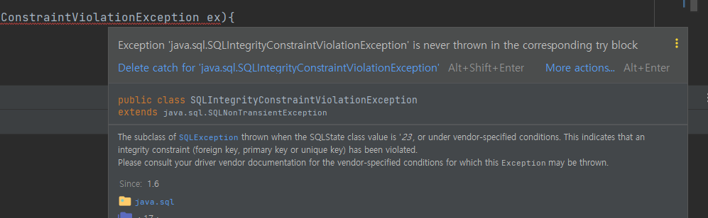
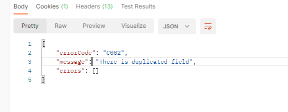

# 유니크 제약 조건 예외처리
2022/07/31

## 1. 포스팅 이유
프로젝트 진행중 유니크 제약 조건에 대한 예외처리에 대해 고민하고 알아보다 알아낸 것들을 정리해보자

## 2. 유니크 제약 조건 예외처리 어떻게 처리하는게 좋을까?
```java
@Entity
@Getter
@NoArgsConstructor(access = AccessLevel.PROTECTED)
public class Member extends BaseTimeEntity {

	@Id
	@GeneratedValue(strategy = GenerationType.IDENTITY)
	@Column(name = "member_id", unique = true, nullable = false, updatable = false)
	private Long id;

	@Column(name = "email", length = 40, unique = true, nullable = false)
	private String email;

	@Column(name = "nick_name", length = 30, unique = true, nullable = false)
	private String nickName;

	@Column(name = "profile_image_url", length = 150, unique = true, nullable = false)
	private String profileImageUrl;
```
- 현재 멤버에는 email, nickname, profile image url(id 제외) 3개의 유니크 값들이 존재한다.
- 만약 로직적으로 유니크 값을 체크하게 된다면 select 를 통해 필드의 unique 값을 체크해 주어야 한다.
- 불필요하게 select 문을 내보는 것과 이미 에러 코드를 통한 커스텀 예외처리를 진행하기 때문에 
- save 로직에서 예외를 잡아 해당 필들를 프론트로 예외를 던져주고 싶었다.

[비슷한 고민을 한 질문에 대한 김영한 센세의 답변](https://www.inflearn.com/questions/59250)

## 3, SQLIntegrityConstraintViolationException
- unique 문제에 대해 스프링 은 SQLIntegrityConstraintViolationException 예외를 던진다.
- 따라서 MemberService 의 메서드에서 try catch 를 처리할려고 시도하였다(SQLIntegrityConstraintViolationException 는 checked 예외입니다.)

```java
	@Transactional
	public Member signup(MemberDto memberDto, TemporaryMember temporaryMember) {
		Member member = null;
		try{
			member = memberRepository.save(Member.builder()
				.email(memberDto.email())
				.nickName(memberDto.nickname())
				.field(memberDto.field())
				.career(memberDto.career())
				.profileImageUrl(temporaryMember.getImageUrl())
				.mbti(memberDto.MBTI())
				.memberRole(MemberRole.ROLE_MEMBER)
				.build());
		}catch (SQLIntegrityConstraintViolationException ex){
			//처리
		}
		return member;
	}

```

- 하지만 다음과 같은 문제를 보게된다



- 원인은 다음과 같다
  - DB에 의해서 SQLException이 발생하지만, 스프링은 오류나봤자 어찌할 도리가 없는 DB에러에 대해 try catch로 도배되는것을 막기위해, 의식적으로 처리할 필요가 없는 RuntimeException으로 랩핑하여 re throw하는 방식을 취한다.
  - 제약조건 위반시 DataIntegrityViolationException이, 좀 더 포괄적으로는 DataAccessException이 발생합니다.
  - 따라서 DataIntegrityViolationException 으로 교체하면 된다.
- 따라서 다음과 같은 문제를 인지하고 SQLException이 을 DataIntegrityViolationException 로 수정하였다.

## 4. RollbackException 예외 발생
- 하지만 DataIntegrityViolationException 사용 하였더니 이번에는 RollbackException 문제가 발생하였다.
- 이는 transaction 내부에서 예외가 발생하면 default 로 rollback 을 처리하게 되고 이과정에서 RollbackException 이 발생하는 문제이다.
- 예외처리를 위해 해당 옵션을 바꾸는 것은 좋은 방법이 아니다. 따라서 다르게 문제를 해결해야했다.

## 5. transactional 안에서 예외처리?
[응? 이게 왜 롤백되는거지?](https://techblog.woowahan.com/2606/)

- 다음 글을 보면 4번 의문에 대한 많은 이야기들이있다.
- 인상깊은 말은 마지막이다.**"그런데, 트랜잭션 안에서 RuntimeException은 왜 잡으려고 했나요?"**
- 예외처리를 하기 위해 트랜잭션을 망치고, 전체적인 비즈니스 로직에 영향을 끼치는 것이 과연 바람직할까?
- 아니라고 생각한다. 예외에 대한 책임을 예외가 발생하는 지점에 한정하여 철저한 책임분리를 하고 싶었지만
- 트레이드 오프 관점에서 트랜잭션 내부의 예외는 throw 로 던지게 밖에서 잡는 것이 더 바람직하다 결론 내렸다.

## 6. throws 후 외부 예외 처리 후 custom 처리
- 결론적으로 해당 예외를 throws 처리하고 해당 메서드를 사용하는 위치에서 try catch 로 예외를 잡았다.
```java
	@Transactional
	public Member signup(MemberDto memberDto, TemporaryMember temporaryMember) throws DataIntegrityViolationException{
		Member member = memberRepository.save(Member.builder()
			.email(memberDto.email())
			.nickName(memberDto.nickname())
			.field(memberDto.field())
			.career(memberDto.career())
			.profileImageUrl(temporaryMember.getImageUrl())
			.mbti(memberDto.MBTI())
			.memberRole(MemberRole.ROLE_MEMBER)
			.build());
		return member;
	}

```
```java
		try{
			member = memberService.signup(memberDto, temporaryMember);
		}catch (DataIntegrityViolationException ex){
			throw SqlDuplicatedException.SQL_DUPLICATED_EXCEPTION.get();
		}

```
```java
public class SqlDuplicatedException  extends BusinessException {

	public SqlDuplicatedException(ErrorCode errorCode, String message) {
		super(errorCode, message);
	}

	public static final Supplier<InputValueException> SQL_DUPLICATED_EXCEPTION = () -> {
		throw new InputValueException(ErrorCode.SQL_DUPLICATED_EXCEPTION, "unique 위반");
	};
}

```



- 하지만 문제는 unique 위반에 해당하는 필드를 가지고 오는것은 실패하였다.
- unique 값이 1개만 존재한다면 해당 unique 값을 프론트와 공유할 수 있지만
- 2개 이상이 존재한다면 포괄적인 예외를 던질수밖에 없다.
- 하지만 만약 해당 unique 필드를 프론트에 던져주고 싶다면 checked 에러로 해결하는 것이 아닌(제가 방법을 못찾은 거일 수도 있습니다..)
- 비즈니스적으로 처음에 한번 select 를 한 후 처리해 주는것이 더 바람직하다고 생각한다.
- 김영한 선생님의 말처럼 한번의 select 가 크게 성능 문제가 없다면 selet 후 해당 필드도 같이 커스텀에 전달하여 처리하는 것도 하나의 방법이 될 수 있을것같다.
  - 근데 unique 값이 3,4 개이면 select 도 3,4 번 나가는거 아닌가?

## 7. (220926)해당 방법의 치명적 문제
- 위와 같이 throws 로 외부로 던지게 되면 테스트 코드 작성시 의존성이 추가되야 한다. 
- 즉 독립적인 환경에서의 테스트 진행이 불가능하게 된다.
- 따라서 해당 엔티티 내부에서 한번의 select 를 통해 중복체크를 진행하는것이 바람직할거 같다.
- select 가 아닌 insert 에서의 쿼리 1개 추가는 크게 성능상 문제가 되지 않는다.
```java
	@Transactional
	public MemberResponse signupMember(MemberSignUpRequest memberSignUpRequest) {
		checkDuplicatedEmail(memberSignUpRequest.email());
		checkDuplicatedNickName(memberSignUpRequest.nickname());
		Member member = memberRepository.save(MemberConverter.toMember(memberSignUpRequest));

		return MemberConverter.toMemberResponse(member);
	}

	private void checkDuplicatedEmail(String email) {
		memberRepository.findByEmail(email).ifPresent(member -> {
			throw MemberException.emailDuplication(email);
		});
	}
```


## 참고 사이트
https://okky.kr/article/444878

https://techblog.woowahan.com/2606/

https://www.inflearn.com/questions/59250
